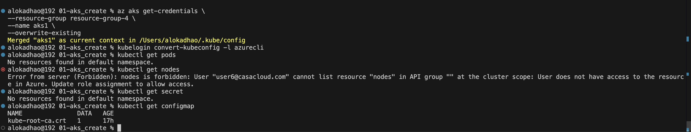
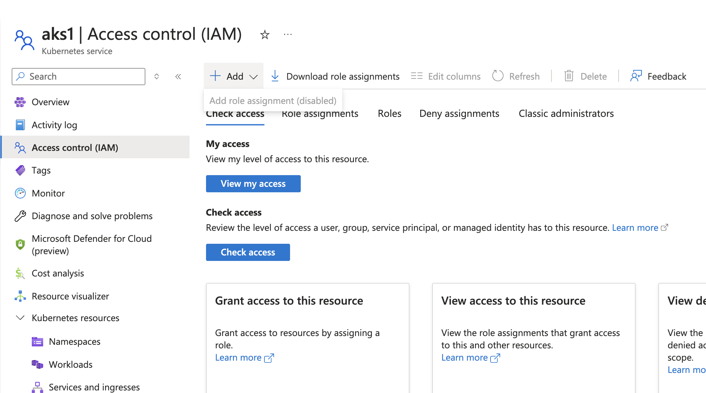
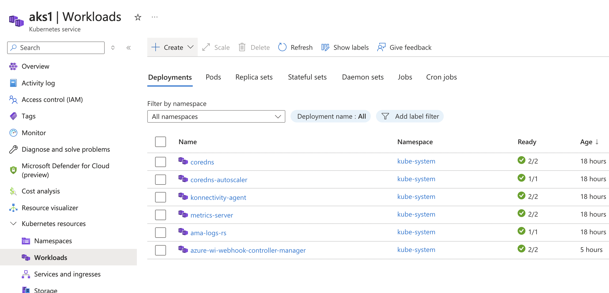
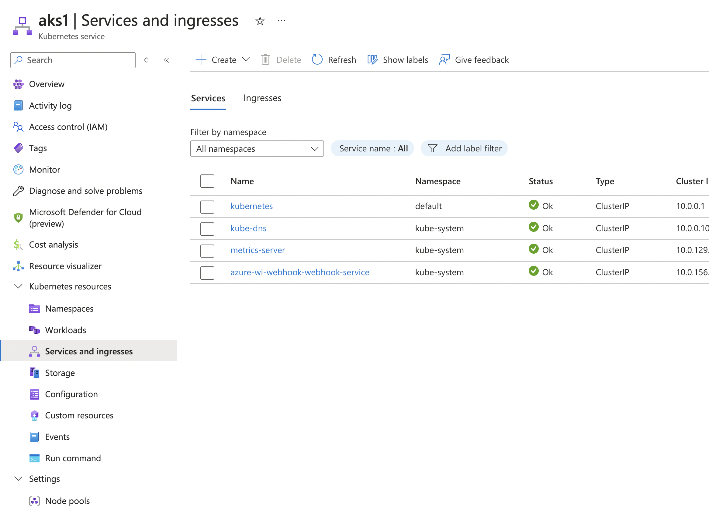
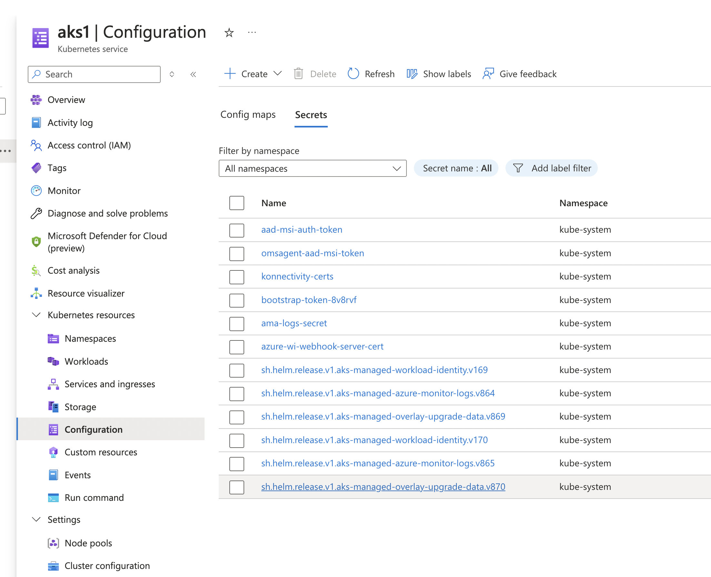
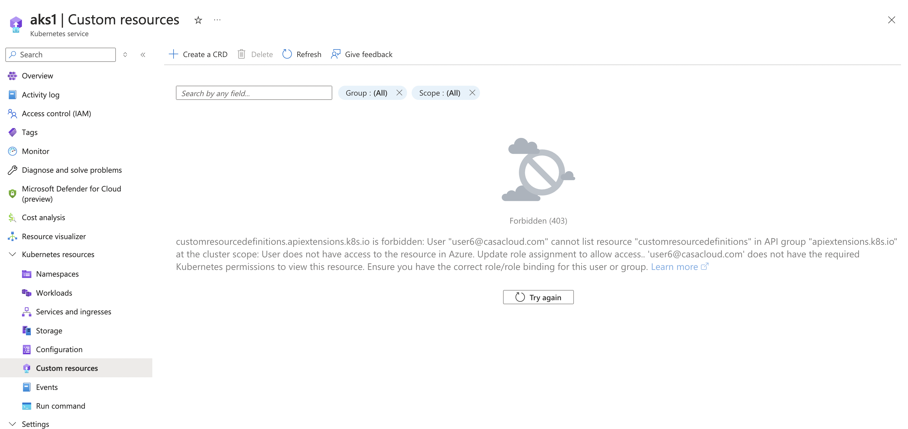
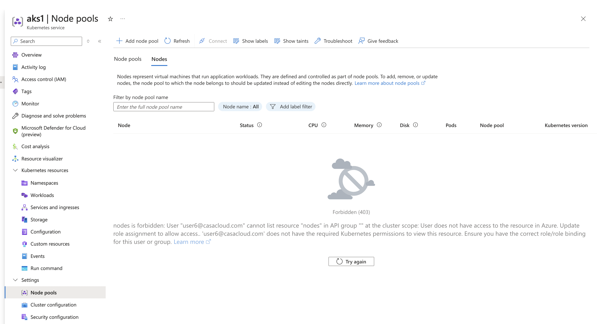

# Azure Kubernetes Service RBAC Writer

Description: Allows read/write access to most objects in a namespace.This role does not allow viewing or modifying roles or role bindings. However, this role allows accessing Secrets and running Pods as any ServiceAccount in the namespace, so it can be used to gain the API access levels of any ServiceAccount in the namespace. Applying this role at cluster scope will give access across all namespaces.

```
"permissions": [
{
    "actions": [
        "Microsoft.Authorization/*/read",
        "Microsoft.Resources/subscriptions/operationresults/read",
        "Microsoft.Resources/subscriptions/read",
        "Microsoft.Resources/subscriptions/resourceGroups/read"
    ],
    "notActions": [],
    "dataActions": [
        "Microsoft.ContainerService/managedClusters/apps/controllerrevisions/read",
        "Microsoft.ContainerService/managedClusters/apps/daemonsets/*",
        "Microsoft.ContainerService/managedClusters/apps/deployments/*",
        "Microsoft.ContainerService/managedClusters/apps/replicasets/*",
        "Microsoft.ContainerService/managedClusters/apps/statefulsets/*",
        "Microsoft.ContainerService/managedClusters/autoscaling/horizontalpodautoscalers/*",
        "Microsoft.ContainerService/managedClusters/batch/cronjobs/*",
        "Microsoft.ContainerService/managedClusters/coordination.k8s.io/leases/read",
        "Microsoft.ContainerService/managedClusters/coordination.k8s.io/leases/write",
        "Microsoft.ContainerService/managedClusters/coordination.k8s.io/leases/delete",
        "Microsoft.ContainerService/managedClusters/discovery.k8s.io/endpointslices/read",
        "Microsoft.ContainerService/managedClusters/batch/jobs/*",
        "Microsoft.ContainerService/managedClusters/configmaps/*",
        "Microsoft.ContainerService/managedClusters/endpoints/*",
        "Microsoft.ContainerService/managedClusters/events.k8s.io/events/read",
        "Microsoft.ContainerService/managedClusters/events/*",
        "Microsoft.ContainerService/managedClusters/extensions/daemonsets/*",
        "Microsoft.ContainerService/managedClusters/extensions/deployments/*",
        "Microsoft.ContainerService/managedClusters/extensions/ingresses/*",
        "Microsoft.ContainerService/managedClusters/extensions/networkpolicies/*",
        "Microsoft.ContainerService/managedClusters/extensions/replicasets/*",
        "Microsoft.ContainerService/managedClusters/limitranges/read",
        "Microsoft.ContainerService/managedClusters/metrics.k8s.io/pods/read",
        "Microsoft.ContainerService/managedClusters/metrics.k8s.io/nodes/read",
        "Microsoft.ContainerService/managedClusters/namespaces/read",
        "Microsoft.ContainerService/managedClusters/networking.k8s.io/ingresses/*",
        "Microsoft.ContainerService/managedClusters/networking.k8s.io/networkpolicies/*",
        "Microsoft.ContainerService/managedClusters/persistentvolumeclaims/*",
        "Microsoft.ContainerService/managedClusters/pods/*",
        "Microsoft.ContainerService/managedClusters/policy/poddisruptionbudgets/*",
        "Microsoft.ContainerService/managedClusters/replicationcontrollers/*",
        "Microsoft.ContainerService/managedClusters/resourcequotas/read",
        "Microsoft.ContainerService/managedClusters/secrets/*",
        "Microsoft.ContainerService/managedClusters/serviceaccounts/*",
        "Microsoft.ContainerService/managedClusters/services/*"
    ],
    "notDataActions": []
}
]
```

## ✅ What It Can Do
| **Capability** | **✅ Allowed?** | **Reason (Based on Permissions)** |
|---------------|----------------|----------------------------------|
| **Read Azure Authorization Policies** | ✅ Yes | `Microsoft.Authorization/*/read` |
| **View Azure Subscription Details** | ✅ Yes | `Microsoft.Resources/subscriptions/read` |
| **View Resource Groups** | ✅ Yes | `Microsoft.Resources/subscriptions/resourceGroups/read` |
| **View AKS Cluster Subscription Operations** | ✅ Yes | `Microsoft.Resources/subscriptions/operationresults/read` |
| **Manage Deployments, ReplicaSets, StatefulSets** | ✅ Yes | `Microsoft.ContainerService/managedClusters/apps/deployments/*` |
| **Manage DaemonSets and ControllerRevisions** | ✅ Yes | `Microsoft.ContainerService/managedClusters/apps/daemonsets/*` |
| **Manage Horizontal Pod Autoscalers** | ✅ Yes | `Microsoft.ContainerService/managedClusters/autoscaling/horizontalpodautoscalers/*` |
| **Manage CronJobs and Jobs** | ✅ Yes | `Microsoft.ContainerService/managedClusters/batch/cronjobs/*` |
| **Manage ConfigMaps and Endpoints** | ✅ Yes | `Microsoft.ContainerService/managedClusters/configmaps/*` |
| **Manage Events and Logs** | ✅ Yes | `Microsoft.ContainerService/managedClusters/events/*` |
| **View Namespaces** | ✅ Yes | `Microsoft.ContainerService/managedClusters/namespaces/read` |
| **Manage Ingress Controllers and Network Policies** | ✅ Yes | `Microsoft.ContainerService/managedClusters/extensions/ingresses/*` |
| **Manage Pods and Persistent Volume Claims (PVCs)** | ✅ Yes | `Microsoft.ContainerService/managedClusters/pods/*` |
| **Manage Secrets** | ✅ Yes | `Microsoft.ContainerService/managedClusters/secrets/*` |
| **Manage Service Accounts and Services** | ✅ Yes | `Microsoft.ContainerService/managedClusters/serviceaccounts/*` |
| **Access API as Any Service Account in Namespace** | ✅ Yes | Role description states this capability. |

## ❌ What It CANNOT Do
| **Capability** | **❌ Not Allowed?** | **Reason (Missing Permissions)** |
|---------------|--------------------|----------------------------------|
| **Modify Azure RBAC Roles (Assign Permissions)** | ❌ No | No `Microsoft.Authorization/roleAssignments/write` permission. |
| **Manage Other Azure Resources (Non-AKS)** | ❌ No | No `Microsoft.Resources/*` write permissions. |
| **Delete or Modify Resource Groups** | ❌ No | Only `read` permission for resource groups. |
| **Modify Kubernetes RBAC RoleBindings and ClusterRoles** | ❌ No | Role description explicitly states it cannot modify RBAC roles. |
| **Modify Resource Quotas in AKS** | ❌ No | Only `Microsoft.ContainerService/managedClusters/resourcequotas/read` is allowed. |
| **Create, Delete, or Modify Namespaces** | ❌ No | `Microsoft.ContainerService/managedClusters/namespaces/write` is missing. |

## 📌 Summary
| **Category** | **✅ Can Do?** | **❌ Cannot Do?** |
|-------------|--------------|------------------|
| **View Azure Authorization & Resources** | ✅ Yes | ❌ Cannot modify RBAC or resource groups. |
| **Manage Kubernetes Workloads (Pods, Deployments, Namespaces)** | ✅ Yes | ❌ Cannot create or delete namespaces. |
| **Manage Network Policies & Ingress Controllers** | ✅ Yes | ❌ Cannot assign Kubernetes RBAC roles. |
| **Modify Secrets, ConfigMaps, and Persistent Volumes** | ✅ Yes | ❌ Cannot modify cluster-wide quotas. |
| **Modify Kubernetes RBAC Roles & RoleBindings** | ❌ No | Needs additional role for RBAC management. |

## Console login and test















```
alokadhao@192 01-aks_create % kubectl get roles              
Error from server (Forbidden): roles.rbac.authorization.k8s.io is forbidden: User "user6@casacloud.com" cannot list resource "roles" in API group "rbac.authorization.k8s.io" in the namespace "default": User does not have access to the resource in Azure. Update role assignment to allow access.
alokadhao@192 01-aks_create % kubectl get clusterroles 
Error from server (Forbidden): clusterroles.rbac.authorization.k8s.io is forbidden: User "user6@casacloud.com" cannot list resource "clusterroles" in API group "rbac.authorization.k8s.io" at the cluster scope: User does not have access to the resource in Azure. Update role assignment to allow access.
```

