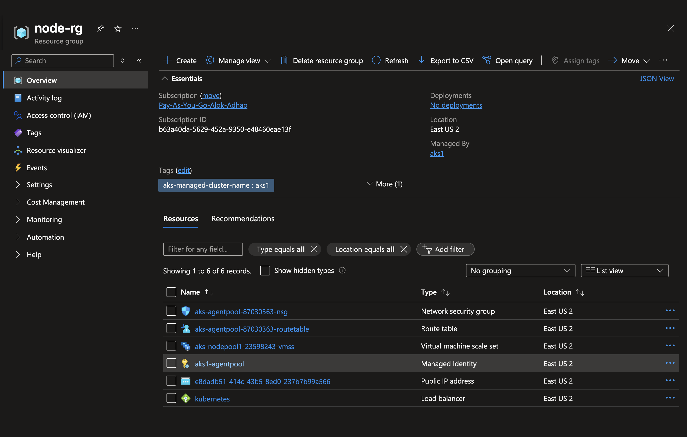
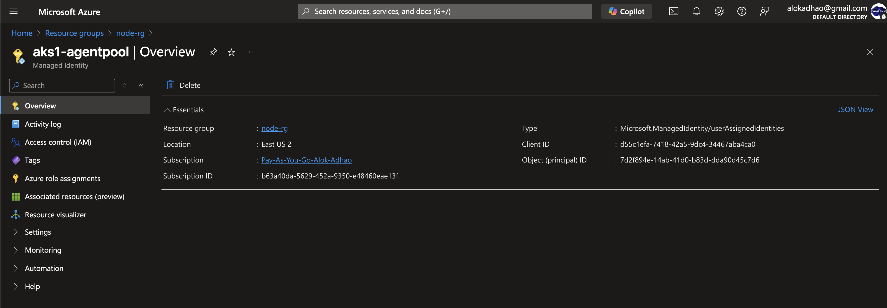

# Azure Container Registry

# First we need to create a resource group
```
az group create -l eastus -n casacloud_rg1
```

## Create ACR 

### Schema
```
az acr create \
--resource-group <ResourceGroupName> \
--name <RegistryName> \
--sku <SKU> \
--location <Location>
```

```
az acr create \
--resource-group casacloud_rg1 \
 --name casaacr01 \
 --sku Standard \
 --location eastus
```

## ACR RBAC roles / permissions 

| **Role Name**        | **Can Login** | **Can Push Images** | **Can Pull Images** |
|----------------------|---------------|----------------------|----------------------|
| `AcrPull`            | ✅            | ❌                   | ✅                   |
| `AcrPush`            | ✅            | ✅                   | ✅                   |
| `AcrDelete`          | ✅            | ❌                   | ❌                   |
| `Owner/Contributor`  | ✅            | ✅                   | ✅                   |

## Tipical Usecase

| **Use Case**                        | **Recommended Role** |
|-------------------------------------|------------------------|
| CI/CD pipeline (push + pull)        | `AcrPush`              |
| Runtime service (pull only)         | `AcrPull`              |
| Admin managing the registry         | `Contributor`          |


## login to ACR 

```
az acr login --name casaacr01
Login Succeeded
```

## Get ACR server URL

```
az acr show --name casaacr01 --query loginServer --output tsv

Output:- 
Result
--------------------
casaacr01.azurecr.io
```

Now, as we already have our Nodejs MS Image

```
docker image ls 
REPOSITORY                 TAG       IMAGE ID       CREATED      SIZE
casacloud/nodejstemplate   v1.0.0    071c78f94cdb   2 days ago   1.7GB
```

## Tag it to push to ACR

```
docker tag casacloud/nodejstemplate:v1.0.0 casaacr01.azurecr.io/nodejstemplate:v1.0.0
```

## Check the tag created
```
docker image ls
REPOSITORY                            TAG       IMAGE ID       CREATED      SIZE
casaacr01.azurecr.io/nodejstemplate   v1.0.0    071c78f94cdb   2 days ago   1.7GB
casacloud/nodejstemplate              v1.0.0    071c78f94cdb   2 days ago   1.7GB
```

## Push image to ACR 

```
docker push casaacr01.azurecr.io/nodejstemplate:v1.0.0
The push refers to repository [casaacr01.azurecr.io/nodejstemplate]
ca40eb2cc73f: Pushed 
b941ee2050ee: Pushed 
545aa82ec479: Pushed 
4378a6c11dea: Pushed 
bb93ae7f4157: Pushed 
2beda0b59754: Pushed 
393b8c4241d6: Pushed 
5b7e218105bf: Pushed 
38239d1c4e71: Pushed 
d8e77eeb24ad: Pushed 
741f818d784d: Pushed 
aa8c81564288: Pushed 
f5dd139e905c: Pushed 
1d9d474cce08: Pushed 
cef1896c5ff1: Pushed 
4d53f446d6aa: Pushed 
0bc2c36fb01d: Pushed 
ccb04af356d0: Pushed 
0f7716873fd1: Pushed 
4a1d4d1677e5: Pushed 
140d15be2fea: Pushed 
eaefe43eb0ea: Pushed 
v1.0.0: digest: sha256:071c78f94cdb1bc855d04026c961d3edb4777fa34b443243972da36539570cdd size: 856
```

## Check of Image is present in ACR 
```
az acr repository list --name casaacr01
[
  "nodejstemplate"
]
```

## Show the repository 
```
az acr repository show --name casaacr01 --repository nodejstemplate
{
  "changeableAttributes": {
    "deleteEnabled": true,
    "listEnabled": true,
    "readEnabled": true,
    "writeEnabled": true
  },
  "createdTime": "2025-04-09T14:59:48.7546763Z",
  "imageName": "nodejstemplate",
  "lastUpdateTime": "2025-04-09T14:59:50.3720327Z",
  "manifestCount": 3,
  "registry": "casaacr01.azurecr.io",
  "tagCount": 1
}
```

## Show all the tags for perticular repository
```
az acr repository show-tags \
--name casaacr01 \
--repository nodejstemplate

Output
[
  "v1.0.0"
]
```

## Create another image tag and push 
```
docker tag casacloud/nodejstemplate:v1.0.0 casaacr01.azurecr.io/nodejstemplate:v1.0.1
```

```
docker push casaacr01.azurecr.io/nodejstemplate:v1.0.1
```

## Delete a perticular image tag

```
az acr repository untag -n casaacr01 --image nodejstemplate:v1.0.1
```

## Verify tags 

```
az acr repository show-tags \                                     
--name casaacr01 \
--repository nodejstemplate
[
  "v1.0.0"
]
```

## Delete a repository from an Azure Container Registry.

```
az acr repository delete -n casaacr01 --repository nodejstemplate
Are you sure you want to delete the repository 'nodejstemplate' and all images under it? (y/n): y
{
  "manifestsDeleted": [
    "sha256:071c78f94cdb1bc855d04026c961d3edb4777fa34b443243972da36539570cdd",
    "sha256:27d41776655eb21790007b595783d792e973a2c19175ef355f20323b0de83ee2",
    "sha256:407ae02c46bb0a02556228e2b3f75037c8723380f49a3eef8424a4cd4a0cb8fd"
  ],
  "tagsDeleted": [
    "v1.0.0"
  ]
}
```

## Pricing SKU


https://azure.microsoft.com/en-us/pricing/details/container-registry/


| **Feature**                   | **Basic**        | **Standard**     | **Premium**       |
|------------------------------|------------------|------------------|-------------------|
| Webhooks                     | ✅                | ✅                | ✅                 |
| Geo-replication              | ❌                | ❌                | ✅                 |
| Private link support         | ❌                | ❌                | ✅                 |
| Content trust                | ❌                | ❌                | ✅                 |
| Customer-managed keys        | ❌                | ❌                | ✅                 |
| Throughput                   | Low               | Medium            | High              |
| Storage (included)           | 10 GB             | 100 GB            | 500 GB            |
| Max webhooks                 | 2                 | 10                | 100               |
| **Estimated Price (USD/month)** | ~$0.167/day (~$5) | ~$0.667/day (~$20) | ~$2.33/day (~$70) |

###  Which one you should consider 
| **SKU**       | **Description**                                                   | **Use Case**                          |
|---------------|-------------------------------------------------------------------|----------------------------------------|
| `Basic`       | Entry-level, cost-effective registry with limited throughput      | Dev/test, personal projects            |
| `Standard`    | Balanced performance and cost, suitable for most production use   | Production, moderate usage             |
| `Premium`     | High throughput, geo-replication, private link, content trust     | Enterprise, geo-distributed systems    |


# Azure container registry Attach to AKS

Once the ACR is created using the create-acr-yml

## ✅ Verify AKS and ACR integration - should fail
```
az aks check-acr --name $AKS_CLUSTER_NAME --resource-group $AKS_RESOURCE_GROUP --acr $ACR_NAME

EG:- az aks check-acr --name aks1 --resource-group resource-group-4 --acr casaacr01

Output:- 


The login server endpoint suffix '.azurecr.io' is automatically appended.
Merged "aks1" as current context in /var/folders/ln/b6ptrqqd59g9c_t3j7m7gtrh0000gn/T/tmp5_kow9wy
[2025-04-13T06:43:08Z] Checking host name resolution (casaacr01.azurecr.io): SUCCEEDED
[2025-04-13T06:43:08Z] Canonical name for ACR (casaacr01.azurecr.io): r0307eus2-az.eastus2.cloudapp.azure.com.
[2025-04-13T06:43:08Z] ACR location: eastus2
[2025-04-13T06:43:08Z] Checking managed identity...
[2025-04-13T06:43:08Z] Kubelet managed identity client ID: d55c1efa-7418-42a5-9dc4-34467aba4ca0
[2025-04-13T06:43:08Z] Validating managed identity existance: SUCCEEDED
[2025-04-13T06:43:08Z] Validating image pull permission: FAILED
[2025-04-13T06:43:08Z] ACR casaacr01.azurecr.io rejected token exchange: ACR token exchange endpoint returned error status: 401. body: 
```

## We need to get the ACR ID 
This gives you the full ACR resource ID.
```
ACR_ID=$(az acr show --name $ACR_NAME --query "id" --output tsv)
echo $ACR_ID

ACR_ID=$(az acr show --name casaacr01 --query "id" --output tsv)
echo $ACR_ID

Output:- 
/subscriptions/b63a40da-5629-452a-9350-e48460eae13f/resourceGroups/resource-group-4/providers/Microsoft.ContainerRegistry/registries/casaacr01
```

## Get AKS cluster's managed identity ID
```

CLIENT_ID=$(az aks show --resource-group $AKS_RESOURCE_GROUP --name $AKS_CLUSTER_NAME --query "identityProfile.kubeletidentity.clientId" --output tsv)

Example:-
CLIENT_ID=$(az aks show --resource-group resource-group-4 --name aks1 --query "identityProfile.kubeletidentity.clientId" --output tsv)
echo $CLIENT_ID

Output:- 
d55c1efa-7418-42a5-9dc4-34467aba4ca0

```
This Identity is attached to the Agent pool, all the worker nodes 




## Assign AcrPull role to the AKS managed identity
```
az role assignment create --assignee $CLIENT_ID --role "AcrPull" --scope $ACR_ID

Eg:- 
az role assignment create --assignee d55c1efa-7418-42a5-9dc4-34467aba4ca0 --role "AcrPull" --scope /subscriptions/b63a40da-5629-452a-9350-e48460eae13f/resourceGroups/resource-group-4/providers/Microsoft.ContainerRegistry/registries/casaacr01

Output:- 
{
  "condition": null,
  "conditionVersion": null,
  "createdBy": null,
  "createdOn": "2025-04-13T06:54:35.111666+00:00",
  "delegatedManagedIdentityResourceId": null,
  "description": null,
  "id": "/subscriptions/b63a40da-5629-452a-9350-e48460eae13f/resourceGroups/resource-group-4/providers/Microsoft.ContainerRegistry/registries/casaacr01/providers/Microsoft.Authorization/roleAssignments/df7e6832-c6dd-46ea-954f-18eff6099a38",
  "name": "df7e6832-c6dd-46ea-954f-18eff6099a38",
  "principalId": "7d2f894e-14ab-41d0-b83d-dda90d45c7d6",
  "principalType": "ServicePrincipal",
  "resourceGroup": "resource-group-4",
  "roleDefinitionId": "/subscriptions/b63a40da-5629-452a-9350-e48460eae13f/providers/Microsoft.Authorization/roleDefinitions/7f951dda-4ed3-4680-a7ca-43fe172d538d",
  "scope": "/subscriptions/b63a40da-5629-452a-9350-e48460eae13f/resourceGroups/resource-group-4/providers/Microsoft.ContainerRegistry/registries/casaacr01",
  "type": "Microsoft.Authorization/roleAssignments",
  "updatedBy": "5b6a6b5b-2c8d-47f1-8327-8f6e1a7d3dd1",
  "updatedOn": "2025-04-13T06:54:35.350807+00:00"
}

```
## ✅ Verify AKS and ACR integration
```
az aks check-acr --name $AKS_CLUSTER_NAME --resource-group $AKS_RESOURCE_GROUP --acr $ACR_NAME

EG:- az aks check-acr --name aks1 --resource-group resource-group-4 --acr casaacr01

Output:- 
The login server endpoint suffix '.azurecr.io' is automatically appended.
Merged "aks1" as current context in /var/folders/ln/b6ptrqqd59g9c_t3j7m7gtrh0000gn/T/tmpdi6wsn_f
[2025-04-13T06:56:39Z] Checking host name resolution (casaacr01.azurecr.io): SUCCEEDED
[2025-04-13T06:56:39Z] Canonical name for ACR (casaacr01.azurecr.io): r0307eus2-az.eastus2.cloudapp.azure.com.
[2025-04-13T06:56:39Z] ACR location: eastus2
[2025-04-13T06:56:39Z] Checking managed identity...
[2025-04-13T06:56:39Z] Kubelet managed identity client ID: d55c1efa-7418-42a5-9dc4-34467aba4ca0
[2025-04-13T06:56:39Z] Validating managed identity existance: SUCCEEDED
[2025-04-13T06:56:39Z] Validating image pull permission: SUCCEEDED
[2025-04-13T06:56:39Z] 
Your cluster can pull images from casaacr01.azurecr.io!
```

## If you check the AKS JSON you will see 2 different Identities, which to use?
```
what is the difference between 

 "identityProfile": {
            "kubeletidentity": {
                "resourceId": "/subscriptions/b63a40da-5629-452a-9350-e48460eae13f/resourcegroups/node-rg/providers/Microsoft.ManagedIdentity/userAssignedIdentities/aks1-agentpool",
                "clientId": "d55c1efa-7418-42a5-9dc4-34467aba4ca0",
                "objectId": "7d2f894e-14ab-41d0-b83d-dda90d45c7d6"
            }
        },

and 

"identity": {
    "type": "SystemAssigned",
    "principalId": "a7283972-89ef-4ce1-a630-3925cb926d3c",
    "tenantId": "4abb5e5e-af15-4a34-b3c2-18f4a9303ee4"
},
```

### identity
This represents the Cluster Control Plane Identity.

```
"identity": {
    "type": "SystemAssigned",
    "principalId": "a7283972-89ef-4ce1-a630-3925cb926d3c",
    "tenantId": "4abb5e5e-af15-4a34-b3c2-18f4a9303ee4"
}
```
Explanation:

* The identity here is the System-assigned Managed Identity for the AKS control plane (the Kubernetes master components managed by Azure).

* It's created automatically at AKS cluster creation.

* This identity is used by the control plane to manage Azure resources related to cluster management, like updating resources in Azure, managing node pools, load balancers, and other Azure integrations.

### identityProfile.kubeletidentity
This represents the Kubelet Identity (also known as the Agent Pool identity):
```
"identityProfile": {
  "kubeletidentity": {
    "resourceId": "/subscriptions/.../providers/Microsoft.ManagedIdentity/userAssignedIdentities/aks1-agentpool",
    "clientId": "d55c1efa-7418-42a5-9dc4-34467aba4ca0",
    "objectId": "7d2f894e-14ab-41d0-b83d-dda90d45c7d6"
  }
}
```

Explanation:

* The Kubelet Identity is the identity used by AKS node pools (worker nodes) to interact with Azure resources.

* It's typically a User-assigned Managed Identity, specifically used by Kubernetes kubelet and container runtime to pull images from Azure Container Registry (ACR), use Azure Key Vault, or interact with other Azure resources from worker nodes.

* AKS creates and assigns this identity automatically during the cluster/node-pool provisioning, particularly when the cluster has node pools using Azure-managed identities.

## Short difference between Identity and kubeletidentity
| Attribute           | Cluster Control Plane (`identity`)                             | Kubelet Identity (`identityProfile.kubeletidentity`)                |
|---------------------|----------------------------------------------------------------|----------------------------------------------------------------------|
| **Purpose**         | Used by AKS control plane for cluster management               | Used by kubelet/node pools for runtime operations                   |
| **Identity Type**   | System-assigned Managed Identity                               | User-assigned Managed Identity (AKS-managed)                         |
| **Scope**           | Cluster control plane                                          | Node (worker node/pod) level                                         |
| **Examples of Use** | AKS cluster management, load balancers, Azure integrations     | Pull images from ACR, Azure Key Vault access, Azure storage access   |
| **Lifecycle**       | Managed automatically by Azure                                 | Created and managed automatically per cluster/node pool              |
