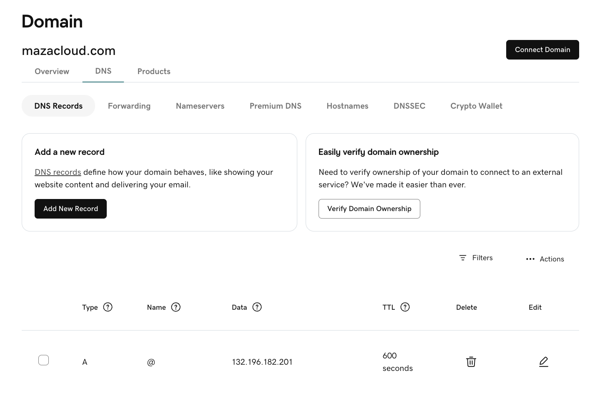
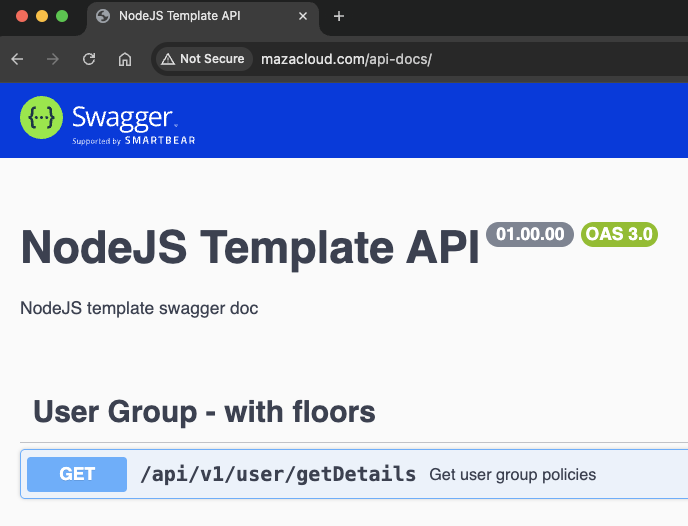

# Single Host Single Env Ingress

## Step 1: Install (if not already) the NGINX Ingress Controller
```
kubectl apply -f https://raw.githubusercontent.com/kubernetes/ingress-nginx/main/deploy/static/provider/cloud/deploy.yaml
```

```
kubectl get svc -n ingress-nginx

NAME                                 TYPE           CLUSTER-IP     EXTERNAL-IP      PORT(S)                      AGE
ingress-nginx-controller             LoadBalancer   10.0.115.145   132.196.182.201   80:32400/TCP,443:30343/TCP   2m19s
ingress-nginx-controller-admission   ClusterIP      10.0.222.143   <none>           443/TCP                      2m18s
```


## 🛠 Step 2: Create Ingress YAML
# This works with http://mazacloud.com/api-docs/  I get Swagger DOC
```
apiVersion: networking.k8s.io/v1
kind: Ingress
metadata:
  name: mazacloud-ingress
  annotations:
    kubernetes.io/ingress.class: "nginx"
spec:
  ingressClassName: nginx
  rules:
  - host: mazacloud.com
    http:
      paths:
      - path: /
        pathType: Prefix
        backend:
          service:
            name: nodejstemplate
            port:
              number: 80
```

```
kubectl apply -f 01-single-host-single-env-ingress.yaml
```


## 🛠 Step 3: Verify
Check the Ingress resource:

```
kubectl get ingress
```

## 🛠 Step 4: Set DNS A Record
Go to your DNS provider (Azure DNS / GoDaddy / etc.)
Create an A record:
Name: @
Type: A
IP: The EXTERNAL-IP you got in Step 1



## IMPORTANT to flush DNS locally if you want fast testing
```
sudo dscacheutil -flushcache; sudo killall -HUP mDNSResponder
```

## 🛠 Step 5: Final Testing
Once DNS is ready (~2-5 minutes for propagation),

👉 Open your browser:
```
http://mazacloud.com/api-docs
```

