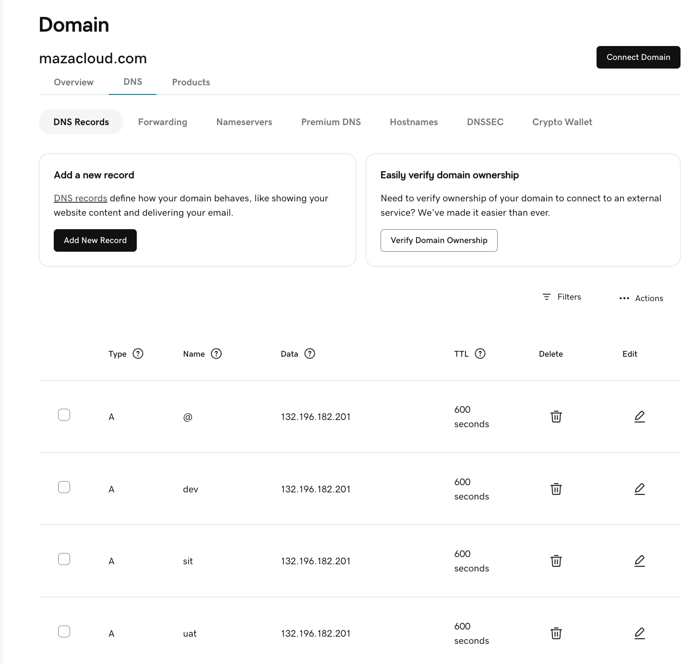
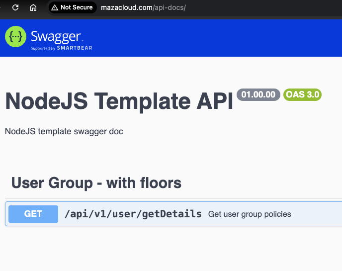
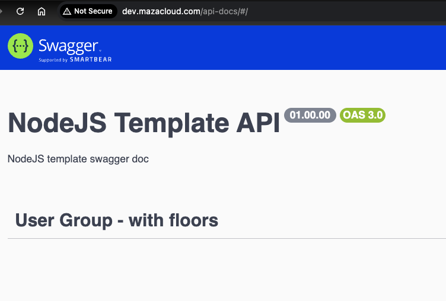
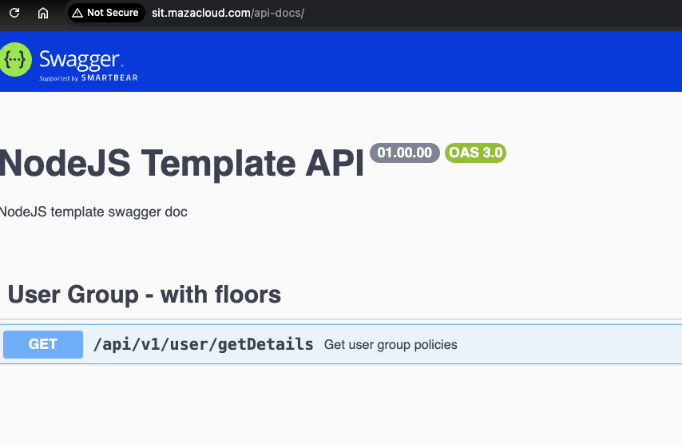

# Single Host Multi Env Ingress
## Step 1: Install (if not already) the NGINX Ingress Controller
```
kubectl apply -f https://raw.githubusercontent.com/kubernetes/ingress-nginx/main/deploy/static/provider/cloud/deploy.yaml
```

```
kubectl get svc -n ingress-nginx

NAME                                 TYPE           CLUSTER-IP     EXTERNAL-IP      PORT(S)                      AGE
ingress-nginx-controller             LoadBalancer   10.0.115.145   132.196.182.201   80:32400/TCP,443:30343/TCP   2m19s
ingress-nginx-controller-admission   ClusterIP      10.0.222.143   <none>           443/TCP                      2m18s
```


# Step 2:Single Host multi ENV ingress

02-single-host-multi-env-ingress.yaml
```
# This works with http://mazacloud.com/api-docs/  I get Swagger DOC
apiVersion: networking.k8s.io/v1
kind: Ingress
metadata:
  name: mazacloud-ingress
  annotations:
    kubernetes.io/ingress.class: "nginx"
spec:
  ingressClassName: nginx
  rules:
  - host: mazacloud.com
    http:
      paths:
      - path: /
        pathType: Prefix
        backend:
          service:
            name: nodejstemplate
            port:
              number: 80
  - host: dev.mazacloud.com
    http:
      paths:
      - path: /
        pathType: Prefix
        backend:
          service:
            name: nodejstemplate
            port:
              number: 80
  - host: sit.mazacloud.com
    http:
      paths:
      - path: /
        pathType: Prefix
        backend:
          service:
            name: nodejstemplate
            port:
              number: 80
  - host: uat.mazacloud.com
    http:
      paths:
      - path: /
        pathType: Prefix
        backend:
          service:
            name: nodejstemplate
            port:
              number: 80
```

```
kubectl apply -f 02-single-host-multi-env-ingress.yaml
```

## Step 3:- Add the A records for all 4 ENV


## Step 4:- IMPORTANT to flush DNS locally if you want fast testing
```
sudo dscacheutil -flushcache; sudo killall -HUP mDNSResponder
```

## Step:- 5 Verify








