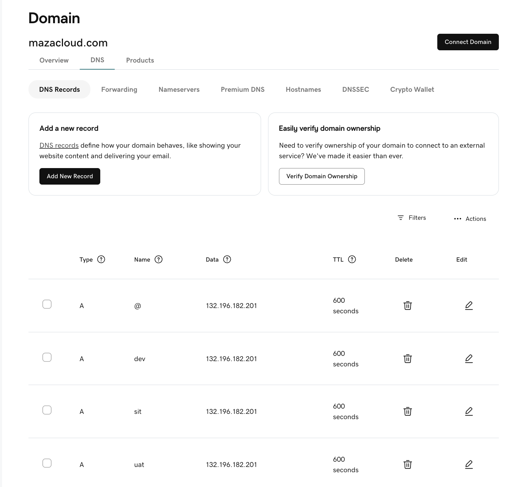

# Imagin Cloud with TLS
## Your Setup Architecture (Final)


```
+------------------------+
|   Browser (HTTP/HTTPS)  |
+-----------+------------+
            |
            v
+------------------------+
|  Azure Load Balancer   |
|    (Public IP)         |
+-----------+------------+
            |
            v
+----------------------------+
|  NGINX Ingress Controller  |
|         (Port 443)         |
+-----------+----------------+
            |
            v
+--------------------------------------------+
|  Ingress Rule (mazacloud-ingress)          |
+-----------+--------------------------------+
            |
            v
+------------------------+
| Kubernetes Service     |
+-----------+------------+
            |
            v
+------------------------+
| Node.js Application Pod |
+------------------------+

```

## 📋 Step 1A: Install (if not already) the NGINX Ingress Controller
```
kubectl apply -f https://raw.githubusercontent.com/kubernetes/ingress-nginx/main/deploy/static/provider/cloud/deploy.yaml
```

## 📋 Step 1B: Check Service created
```
kubectl get svc -n ingress-nginx
```
```
Output:-
NAME                                 TYPE           CLUSTER-IP     EXTERNAL-IP      PORT(S)                      AGE
ingress-nginx-controller             LoadBalancer   10.0.115.145   132.196.182.201   80:32400/TCP,443:30343/TCP   2m19s
ingress-nginx-controller-admission   ClusterIP      10.0.222.143   <none>           443/TCP                      2m18s
```

## 📋 Step 2: Update DNS 



## 📋 Step 3A: Install cert-manager on AKS

Install cert-manager (latest stable version)
```
kubectl apply -f https://github.com/cert-manager/cert-manager/releases/download/v1.14.2/cert-manager.yaml
```

## 📋 Step 3B: After Running, Check cert-manager Pods
```
kubectl get pods --namespace cert-manager
```
```
Output:-
kubectl get pods --namespace cert-manager
NAME                                       READY   STATUS    RESTARTS   AGE
cert-manager-748d86b5f7-2gzq7              1/1     Running   0          75s
cert-manager-cainjector-758769998d-6kr7t   1/1     Running   0          76s
cert-manager-webhook-78659f8-ds5ls         1/1     Running   0          74s
```

## 📋 Step 4A: Create ClusterIssuers - mazacloud (for Let's Encrypt)

04.clusterissuer-mazacloud.yaml
```
apiVersion: cert-manager.io/v1
kind: ClusterIssuer
metadata:
  name: letsencrypt-mazacloud
spec:
  acme:
    email: alokadhao@gmail.com
    server: https://acme-v02.api.letsencrypt.org/directory
    privateKeySecretRef:
      name: letsencrypt-mazacloud
    solvers:
    - http01:
        ingress:
          class: nginx
```

## 🚀 Step 4B: Apply Both ClusterIssuers
```
kubectl apply -f 04.clusterissuer-mazacloud.yaml
```
```
Output:-
clusterissuer.cert-manager.io/letsencrypt-mazacloud created
```

## 🔥 Step 4C: Verify ClusterIssuers

```
kubectl get clusterissuers
```
```
Output:-
kubectl get clusterissuers
NAME                      READY   AGE
letsencrypt-mazacloud     True    60s
```

## Step 5A: Updated Ingress YAML: mazacloud-ingress
08-mazacloud-with-tls-ingress-redirect.yaml
```
apiVersion: networking.k8s.io/v1
kind: Ingress
metadata:
  name: mazacloud-ingress
  annotations:
    kubernetes.io/ingress.class: "nginx"
    cert-manager.io/cluster-issuer: "letsencrypt-mazacloud"
    nginx.ingress.kubernetes.io/ssl-redirect: "true" # Added  this line
spec:
  ingressClassName: nginx
  tls:
  - hosts:
    - mazacloud.com
    - dev.mazacloud.com
    - sit.mazacloud.com
    - uat.mazacloud.com
    secretName: mazacloud-tls
  rules:
  - host: mazacloud.com
    http:
      paths:
      - path: /
        pathType: Prefix
        backend:
          service:
            name: nodejstemplate
            port:
              number: 80
  - host: dev.mazacloud.com
    http:
      paths:
      - path: /
        pathType: Prefix
        backend:
          service:
            name: nodejstemplate
            port:
              number: 80
  - host: sit.mazacloud.com
    http:
      paths:
      - path: /
        pathType: Prefix
        backend:
          service:
            name: nodejstemplate
            port:
              number: 80
  - host: uat.mazacloud.com
    http:
      paths:
      - path: /
        pathType: Prefix
        backend:
          service:
            name: nodejstemplate
            port:
              number: 80
```


## Step 5B: Updated Ingress YAML: 09-imagincloud-with-tls-ingress_redirect.yaml

```
kubectl apply -f 08-mazacloud-with-tls-ingress-redirect.yaml
```
```
Output:- 
ingress.networking.k8s.io/imagincloud-ingress configured
```

## Step 5C:- Check Ingress Crated
```
kubectl get ingress
```
```
NAME                        CLASS    HOSTS                                                                 ADDRESS   PORTS     AGE
cm-acme-http-solver-228hl   <none>   uat.imagincloud.com                                                             80        14s
cm-acme-http-solver-bbrmj   <none>   sit.imagincloud.com                                                             80        14s
cm-acme-http-solver-bf87s   <none>   dev.imagincloud.com                                                             80        14s
cm-acme-http-solver-q7z6b   <none>   imagincloud.com                                                                 80        14s
imagincloud-ingress         nginx    imagincloud.com,dev.imagincloud.com,sit.imagincloud.com + 1 more...             80, 443   16s
```

## Step 5D:- Check certificate Created
```
kubectl get certificates
```
```
NAME              READY   SECRET            AGE
mazacloud-tls     True    mazacloud-tls     87s
```
## Step 4E:- Check Secret Created
```
kubectl get secrets
```
```
NAME                                   TYPE                 DATA   AGE
mazacloud-tls                          kubernetes.io/tls    2      90s
```

## 📋Step 6: Final Things You Can Test Now


