# Nginx Controller 
production-grade Kubernetes Ingress setup:

* ✅ Multiple custom domains (mazacloud.com, imagincloud.com)
* ✅ Multiple subdomains (dev, sit, uat)
* ✅ Single AKS Load Balancer handling all traffic
* ✅ Single nodejstemplate service serving all domains cleanly
* ✅ Swagger UI works naturally at /api-docs without any hacks
* ✅ All fully routed with clean Ingress rules

## RBAC needed 

```
# Update your role to "Admin" on the cluster
az role assignment create \
  --assignee <your-user-object-id> \
  --role "Azure Kubernetes Service Cluster Admin Role" \
  --scope $(az aks show --resource-group <your-resource-group> --name <your-cluster-name> --query id -o tsv)
```

## Step 1: Install (if not already) the NGINX Ingress Controller

```
 kubectl apply -f https://raw.githubusercontent.com/kubernetes/ingress-nginx/main/deploy/static/provider/cloud/deploy.yaml

namespace/ingress-nginx created
serviceaccount/ingress-nginx created
serviceaccount/ingress-nginx-admission created
role.rbac.authorization.k8s.io/ingress-nginx created
role.rbac.authorization.k8s.io/ingress-nginx-admission created
clusterrole.rbac.authorization.k8s.io/ingress-nginx created
clusterrole.rbac.authorization.k8s.io/ingress-nginx-admission created
rolebinding.rbac.authorization.k8s.io/ingress-nginx created
rolebinding.rbac.authorization.k8s.io/ingress-nginx-admission created
clusterrolebinding.rbac.authorization.k8s.io/ingress-nginx created
clusterrolebinding.rbac.authorization.k8s.io/ingress-nginx-admission created
configmap/ingress-nginx-controller created
service/ingress-nginx-controller created
service/ingress-nginx-controller-admission created
deployment.apps/ingress-nginx-controller created
job.batch/ingress-nginx-admission-create created
job.batch/ingress-nginx-admission-patch created
ingressclass.networking.k8s.io/nginx created
validatingwebhookconfiguration.admissionregistration.k8s.io/ingress-nginx-admission created
```

```
kubectl get svc -n ingress-nginx

NAME                                 TYPE           CLUSTER-IP     EXTERNAL-IP      PORT(S)                      AGE
ingress-nginx-controller             LoadBalancer   10.0.115.145   135.237.211.17   80:32400/TCP,443:30343/TCP   2m19s
ingress-nginx-controller-admission   ClusterIP      10.0.222.143   <none>           443/TCP                      2m18s
```

## 🛠 Step 2: Set DNS A Record
Go to your DNS provider (Azure DNS / GoDaddy / etc.)
Create an A record:
Name: @
Type: A
IP: The EXTERNAL-IP you got in Step 1
This will map mazacloud.com ➔ your AKS ingress controller.
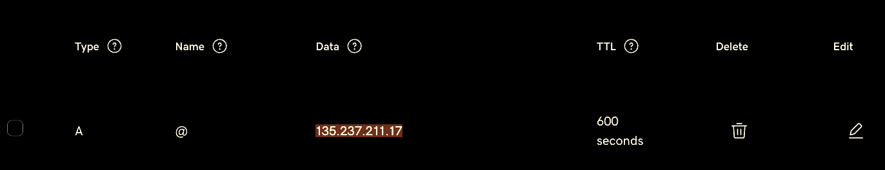

## 🛠 Step 3: Create Ingress YAML
Now create an Ingress resource to map /nodejstemplate path.

Here’s your Ingress YAML (casacloud-ingress.yaml):

01-casacloud-ingress.yaml
```
# This works with http://mazacloud.com/api-docs/  I get Swagger DOC
apiVersion: networking.k8s.io/v1
kind: Ingress
metadata:
  name: casacloud-ingress
  annotations:
    kubernetes.io/ingress.class: "nginx"
spec:
  ingressClassName: nginx
  rules:
  - host: mazacloud.com
    http:
      paths:
      - path: /
        pathType: Prefix
        backend:
          service:
            name: nodejstemplate
            port:
              number: 80
```

```
kubectl apply -f casacloud-ingress.yaml
```

## 🛠 Step 4: Verify
Check the Ingress resource:

```
kubectl get ingress
```

## IMPORTANT to flush DNS locally if you want fast testing
```
sudo dscacheutil -flushcache; sudo killall -HUP mDNSResponder
```

## 🛠 Step 5: Final Testing
Once DNS is ready (~2-5 minutes for propagation),

👉 Open your browser:
```
http://mazacloud.com/api-docs
```

# Single Host multi ENV ingress

02-single-host-multi-env-ingress.yaml
```
# This works with http://mazacloud.com/api-docs/  I get Swagger DOC
apiVersion: networking.k8s.io/v1
kind: Ingress
metadata:
  name: casacloud-ingress
  annotations:
    kubernetes.io/ingress.class: "nginx"
spec:
  ingressClassName: nginx
  rules:
  - host: mazacloud.com
    http:
      paths:
      - path: /
        pathType: Prefix
        backend:
          service:
            name: nodejstemplate
            port:
              number: 80
  - host: dev.mazacloud.com
    http:
      paths:
      - path: /
        pathType: Prefix
        backend:
          service:
            name: nodejstemplate
            port:
              number: 80
  - host: sit.mazacloud.com
    http:
      paths:
      - path: /
        pathType: Prefix
        backend:
          service:
            name: nodejstemplate
            port:
              number: 80
  - host: uat.mazacloud.com
    http:
      paths:
      - path: /
        pathType: Prefix
        backend:
          service:
            name: nodejstemplate
            port:
              number: 80
```

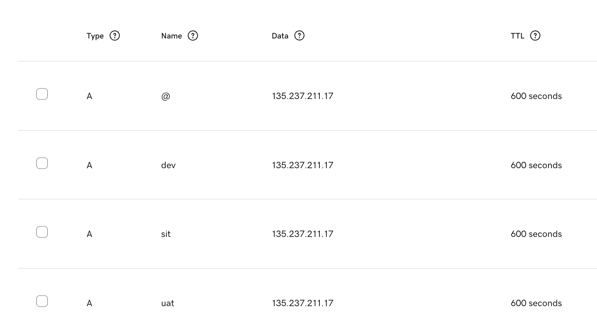

## IMPORTANT to flush DNS locally if you want fast testing
```
sudo dscacheutil -flushcache; sudo killall -HUP mDNSResponder
```


# Multi Host multi ENV ingress
03-multi-host-multi-env-ingress.yaml

```
# This works with http://mazacloud.com/api-docs/  I get Swagger DOC
apiVersion: networking.k8s.io/v1
kind: Ingress
metadata:
  name: casacloud-ingress
  annotations:
    kubernetes.io/ingress.class: "nginx"
spec:
  ingressClassName: nginx
  rules:
  - host: mazacloud.com
    http:
      paths:
      - path: /
        pathType: Prefix
        backend:
          service:
            name: nodejstemplate
            port:
              number: 80
  - host: dev.mazacloud.com
    http:
      paths:
      - path: /
        pathType: Prefix
        backend:
          service:
            name: nodejstemplate
            port:
              number: 80
  - host: sit.mazacloud.com
    http:
      paths:
      - path: /
        pathType: Prefix
        backend:
          service:
            name: nodejstemplate
            port:
              number: 80
  - host: uat.mazacloud.com
    http:
      paths:
      - path: /
        pathType: Prefix
        backend:
          service:
            name: nodejstemplate
            port:
              number: 80
  - host: imagincloud.com
    http:
      paths:
      - path: /
        pathType: Prefix
        backend:
          service:
            name: nodejstemplate
            port:
              number: 80
  - host: dev.imagincloud.com
    http:
      paths:
      - path: /
        pathType: Prefix
        backend:
          service:
            name: nodejstemplate
            port:
              number: 80
  - host: sit.imagincloud.com
    http:
      paths:
      - path: /
        pathType: Prefix
        backend:
          service:
            name: nodejstemplate
            port:
              number: 80
  - host: uat.imagincloud.com
    http:
      paths:
      - path: /
        pathType: Prefix
        backend:
          service:
            name: nodejstemplate
            port:
              number: 80
```

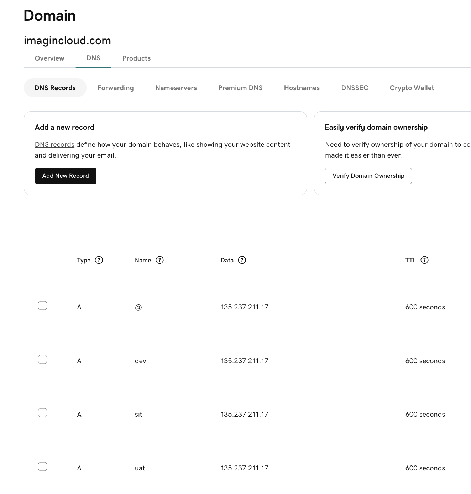

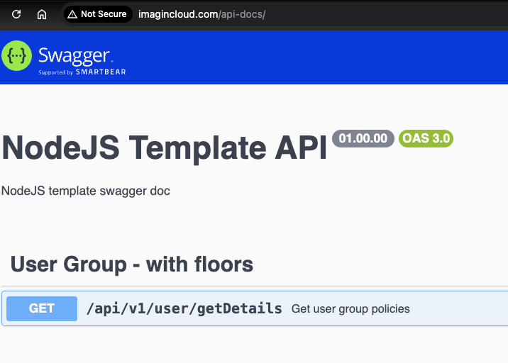

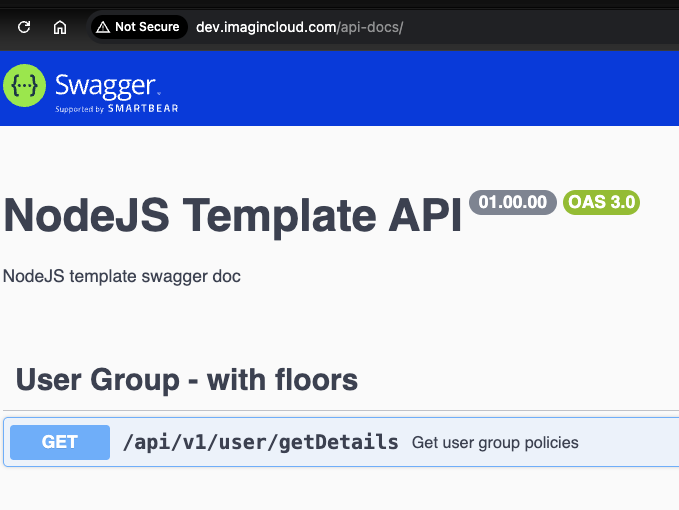

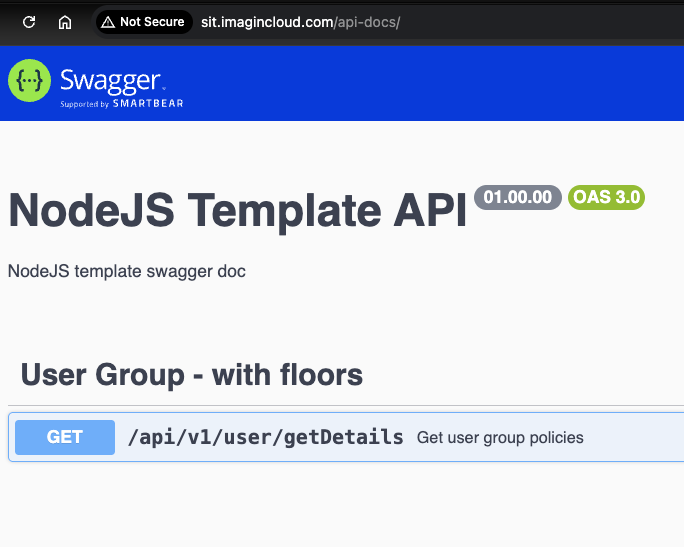

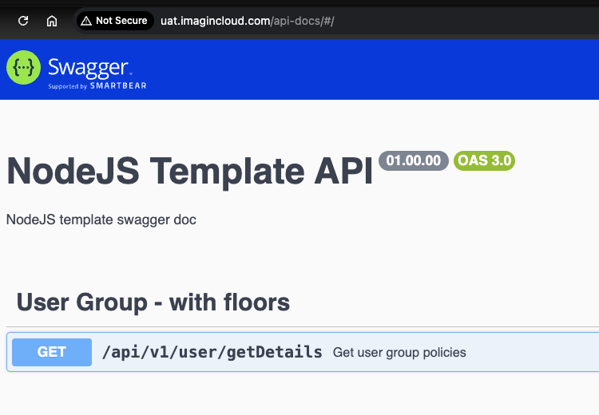

# HTTPS using cert-manager

## 📋 Step 1: Install cert-manager on AKS
cert-manager is a Kubernetes addon that:

Requests SSL certificates (e.g., from Let's Encrypt)

Manages certificate renewal automatically

Integrates with your Ingress controllers (like NGINX)

✅ We'll install cert-manager using official YAML.

Install cert-manager (latest stable version)
```
kubectl apply -f https://github.com/cert-manager/cert-manager/releases/download/v1.14.2/cert-manager.yaml

Output:-
namespace/cert-manager created
customresourcedefinition.apiextensions.k8s.io/certificaterequests.cert-manager.io created
customresourcedefinition.apiextensions.k8s.io/certificates.cert-manager.io created
customresourcedefinition.apiextensions.k8s.io/challenges.acme.cert-manager.io created
customresourcedefinition.apiextensions.k8s.io/clusterissuers.cert-manager.io created
customresourcedefinition.apiextensions.k8s.io/issuers.cert-manager.io created
customresourcedefinition.apiextensions.k8s.io/orders.acme.cert-manager.io created
serviceaccount/cert-manager-cainjector created
serviceaccount/cert-manager created
serviceaccount/cert-manager-webhook created
clusterrole.rbac.authorization.k8s.io/cert-manager-cainjector created
clusterrole.rbac.authorization.k8s.io/cert-manager-controller-issuers created
clusterrole.rbac.authorization.k8s.io/cert-manager-controller-clusterissuers created
clusterrole.rbac.authorization.k8s.io/cert-manager-controller-certificates created
clusterrole.rbac.authorization.k8s.io/cert-manager-controller-orders created
clusterrole.rbac.authorization.k8s.io/cert-manager-controller-challenges created
clusterrole.rbac.authorization.k8s.io/cert-manager-controller-ingress-shim created
clusterrole.rbac.authorization.k8s.io/cert-manager-cluster-view created
clusterrole.rbac.authorization.k8s.io/cert-manager-view created
clusterrole.rbac.authorization.k8s.io/cert-manager-edit created
clusterrole.rbac.authorization.k8s.io/cert-manager-controller-approve:cert-manager-io created
clusterrole.rbac.authorization.k8s.io/cert-manager-controller-certificatesigningrequests created
clusterrole.rbac.authorization.k8s.io/cert-manager-webhook:subjectaccessreviews created
clusterrolebinding.rbac.authorization.k8s.io/cert-manager-cainjector created
clusterrolebinding.rbac.authorization.k8s.io/cert-manager-controller-issuers created
clusterrolebinding.rbac.authorization.k8s.io/cert-manager-controller-clusterissuers created
clusterrolebinding.rbac.authorization.k8s.io/cert-manager-controller-certificates created
clusterrolebinding.rbac.authorization.k8s.io/cert-manager-controller-orders created
clusterrolebinding.rbac.authorization.k8s.io/cert-manager-controller-challenges created
clusterrolebinding.rbac.authorization.k8s.io/cert-manager-controller-ingress-shim created
clusterrolebinding.rbac.authorization.k8s.io/cert-manager-controller-approve:cert-manager-io created
clusterrolebinding.rbac.authorization.k8s.io/cert-manager-controller-certificatesigningrequests created
clusterrolebinding.rbac.authorization.k8s.io/cert-manager-webhook:subjectaccessreviews created
role.rbac.authorization.k8s.io/cert-manager-cainjector:leaderelection created
role.rbac.authorization.k8s.io/cert-manager:leaderelection created
role.rbac.authorization.k8s.io/cert-manager-webhook:dynamic-serving created
rolebinding.rbac.authorization.k8s.io/cert-manager-cainjector:leaderelection created
rolebinding.rbac.authorization.k8s.io/cert-manager:leaderelection created
rolebinding.rbac.authorization.k8s.io/cert-manager-webhook:dynamic-serving created
service/cert-manager created
service/cert-manager-webhook created
deployment.apps/cert-manager-cainjector created
deployment.apps/cert-manager created
deployment.apps/cert-manager-webhook created
mutatingwebhookconfiguration.admissionregistration.k8s.io/cert-manager-webhook created
validatingwebhookconfiguration.admissionregistration.k8s.io/cert-manager-webhook created
```


## 🔥 After Running, Check cert-manager Pods
```
kubectl get pods --namespace cert-manager

Output:-
kubectl get pods --namespace cert-manager
NAME                                       READY   STATUS    RESTARTS   AGE
cert-manager-748d86b5f7-2gzq7              1/1     Running   0          75s
cert-manager-cainjector-758769998d-6kr7t   1/1     Running   0          76s
cert-manager-webhook-78659f8-ds5ls         1/1     Running   0          74s
```

## 📋 Step 2: Create ClusterIssuers (for Let's Encrypt)
✅ We will create two ClusterIssuers — one for each domain:

```
ClusterIssuer Name	Domains Covered	Email Used
letsencrypt-mazacloud	mazacloud.com and subdomains	alokadhao@gmail.com
letsencrypt-imagincloud	imagincloud.com and subdomains	alokadhao@outlook.com
```

## 🛠 2.1 Create clusterissuer-mazacloud.yaml
✅ Important:
Replace alokadhao@gmail.com with your real email for mazacloud notifications.

04.clusterissuer-mazacloud.yaml
```
apiVersion: cert-manager.io/v1
kind: ClusterIssuer
metadata:
  name: letsencrypt-mazacloud
spec:
  acme:
    email: alokadhao@gmail.com
    server: https://acme-v02.api.letsencrypt.org/directory
    privateKeySecretRef:
      name: letsencrypt-mazacloud
    solvers:
    - http01:
        ingress:
          class: nginx
```
## 🛠 2.2 Create clusterissuer-imagincloud.yaml
✅ Important:
Replace alokadhao@outlook.com with your real email for mazacloud notifications.

05.clusterissuer-imagincloud.yaml
```
apiVersion: cert-manager.io/v1
kind: ClusterIssuer
metadata:
  name: letsencrypt-imagincloud
spec:
  acme:
    email: alokadhao@outlook.com
    server: https://acme-v02.api.letsencrypt.org/directory
    privateKeySecretRef:
      name: letsencrypt-imagincloud
    solvers:
    - http01:
        ingress:
          class: nginx
```

## 🚀 Step 2A: Apply Both ClusterIssuers
```
kubectl apply -f 04.clusterissuer-mazacloud.yaml
kubectl apply -f 05.clusterissuer-imagincloud.yaml

Output:-
clusterissuer.cert-manager.io/letsencrypt-mazacloud created
clusterissuer.cert-manager.io/letsencrypt-imagincloud created
```

## 🔥 Step 2B: Verify ClusterIssuers

```
kubectl get clusterissuers

Output:-
kubectl get clusterissuers
NAME                      READY   AGE
letsencrypt-imagincloud   True    41s
letsencrypt-mazacloud     True    60s
```

## 📋 Step 3: Update and Apply Ingress with TLS Sections
✅ Now we will modify your Ingress to:

* Add TLS blocks for mazacloud.com and imagincloud.com
* Request certificates automatically via the correct ClusterIssuers
* Bind Ingress to the TLS secrets

### Visual Diagram 
```
mazacloud-ingress.yaml ➔ ClusterIssuer: letsencrypt-mazacloud ➔ mazacloud-tls
imagincloud-ingress.yaml ➔ ClusterIssuer: letsencrypt-imagincloud ➔ imagincloud-tls
```

## 🛠 Updated Ingress YAML: mazacloud-ingress.yaml
06-mazacloud-with-tls-ingress.yaml
```
apiVersion: networking.k8s.io/v1
kind: Ingress
metadata:
  name: mazacloud-ingress
  annotations:
    kubernetes.io/ingress.class: "nginx"
    cert-manager.io/cluster-issuer: "letsencrypt-mazacloud"
spec:
  ingressClassName: nginx
  tls:
  - hosts:
    - mazacloud.com
    - dev.mazacloud.com
    - sit.mazacloud.com
    - uat.mazacloud.com
    secretName: mazacloud-tls
  rules:
  - host: mazacloud.com
    http:
      paths:
      - path: /
        pathType: Prefix
        backend:
          service:
            name: nodejstemplate
            port:
              number: 80
  - host: dev.mazacloud.com
    http:
      paths:
      - path: /
        pathType: Prefix
        backend:
          service:
            name: nodejstemplate
            port:
              number: 80
  - host: sit.mazacloud.com
    http:
      paths:
      - path: /
        pathType: Prefix
        backend:
          service:
            name: nodejstemplate
            port:
              number: 80
  - host: uat.mazacloud.com
    http:
      paths:
      - path: /
        pathType: Prefix
        backend:
          service:
            name: nodejstemplate
            port:
              number: 80

```

✅ Things to notice:

* We have two tls: blocks — each with appropriate hosts grouped together.
* Secret names: mazacloud-tls and imagincloud-tls.
* ClusterIssuer will automatically pick based on domain + challenge.

## 🚀 Step 3A: Apply mazacloud Updated Ingress

```
kubectl apply -f 06-mazacloud-with-tls-ingress.yaml

Output:-
ingress.networking.k8s.io/mazacloud-ingress created
```

## 🛠 Updated Ingress YAML: imagincloud-ingress.yaml
07-imagincloud-with-tls-ingress.yaml

```
apiVersion: networking.k8s.io/v1
kind: Ingress
metadata:
  name: imagincloud-ingress
  annotations:
    kubernetes.io/ingress.class: "nginx"
    cert-manager.io/cluster-issuer: "letsencrypt-imagincloud"
spec:
  ingressClassName: nginx
  tls:
  - hosts:
    - imagincloud.com
    - dev.imagincloud.com
    - sit.imagincloud.com
    - uat.imagincloud.com
    secretName: imagincloud-tls
  rules:
  - host: imagincloud.com
    http:
      paths:
      - path: /
        pathType: Prefix
        backend:
          service:
            name: nodejstemplate
            port:
              number: 80
  - host: dev.imagincloud.com
    http:
      paths:
      - path: /
        pathType: Prefix
        backend:
          service:
            name: nodejstemplate
            port:
              number: 80
  - host: sit.imagincloud.com
    http:
      paths:
      - path: /
        pathType: Prefix
        backend:
          service:
            name: nodejstemplate
            port:
              number: 80
  - host: uat.imagincloud.com
    http:
      paths:
      - path: /
        pathType: Prefix
        backend:
          service:
            name: nodejstemplate
            port:
              number: 80
```
## 🚀 Step 3B: Apply imagincloud Updated Ingress

```
kubectl apply -f 07-imagincloud-with-tls-ingress.yaml

Output:-
ingress.networking.k8s.io/imagincloud-ingress created
```

## Check certificates and secret created 
```
kubectl get certificates --all-namespaces       

NAMESPACE   NAME            READY   SECRET          AGE
default     mazacloud-tls   True    mazacloud-tls   48s
alokadhao@192 04.nginx-controller % kubectl apply -f 07-imagincloud-with-tls-ingress.yaml
ingress.networking.k8s.io/imagincloud-ingress created
alokadhao@192 04.nginx-controller % kubectl get certificate
NAME              READY   SECRET            AGE
imagincloud-tls   True    imagincloud-tls   34s
mazacloud-tls     True    mazacloud-tls     3m27s
alokadhao@192 04.nginx-controller % kubectl get ingress
NAME                  CLASS   HOSTS                                                                 ADDRESS          PORTS     AGE
imagincloud-ingress   nginx   imagincloud.com,dev.imagincloud.com,sit.imagincloud.com + 1 more...   135.237.211.17   80, 443   39s
mazacloud-ingress     nginx   mazacloud.com,dev.mazacloud.com,sit.mazacloud.com + 1 more...         135.237.211.17   80, 443   3m32s
alokadhao@192 04.nginx-controller % kubectl get secret -A
NAMESPACE       NAME                                                       TYPE                            DATA   AGE
cert-manager    cert-manager-webhook-ca                                    Opaque                          3      39m
cert-manager    letsencrypt-imagincloud                                    Opaque                          1      23m
cert-manager    letsencrypt-mazacloud                                      Opaque                          1      23m
default         imagincloud-tls                                            kubernetes.io/tls               2      29s
default         mazacloud-tls                                              kubernetes.io/tls               2      3m9s
default         sh.helm.release.v1.nodejstemplate.v1                       helm.sh/release.v1              1      13h
ingress-nginx   ingress-nginx-admission                                    Opaque                          3      14h
```

## 📋 Final Things You Can Test Now


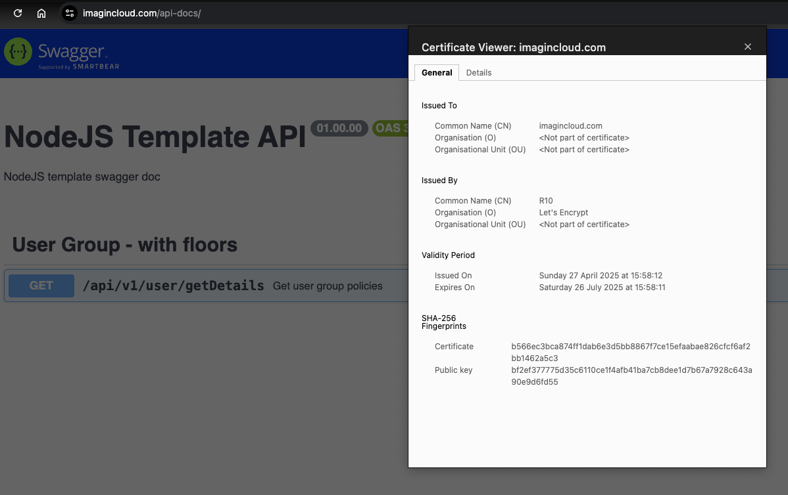

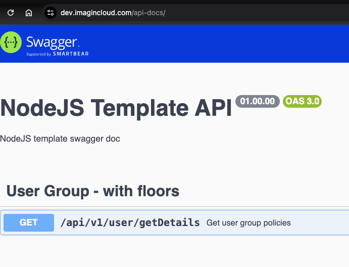

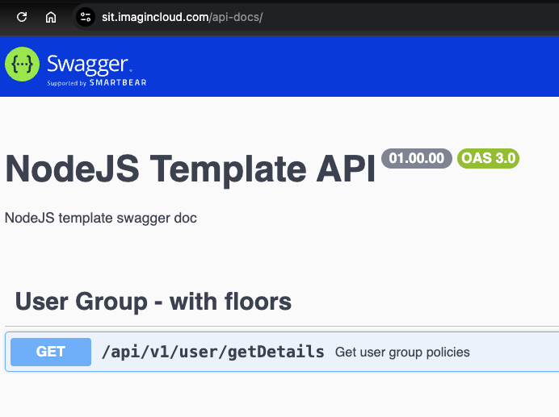

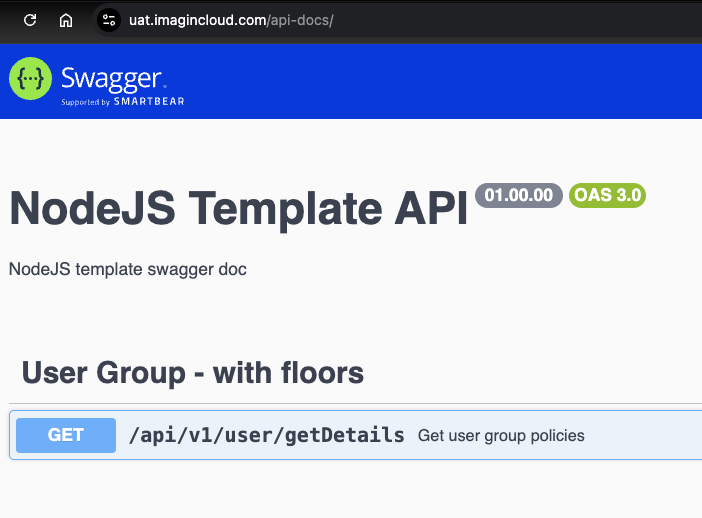

## 🎁 Bonus: Useful Commands for Future Monitoring

Purpose	Command
### Check all certificates	
```
kubectl get certificates -A
```
### Check cert-manager logs	
```
kubectl logs -n cert-manager -l app=cert-manager --follow
```
### Check Ingress resources	
```
kubectl get ingress
```
### View Secret details	
```
kubectl describe secret mazacloud-tls
```
### Force renew certificate	
```
kubectl delete certificate <name> (cert-manager will re-issue)
```

# Add automatic HTTP → HTTPS redirect now — cleanly and professionally 🚀
This is important because:
* 👉 Even if users accidentally type http://mazacloud.com,
* 👉 They should immediately be redirected to https://mazacloud.com 🔒.

✅ In NGINX Ingress, we can simply add an annotation:
```
nginx.ingress.kubernetes.io/ssl-redirect: "true"
```

✅ This tells NGINX:
* "Always redirect HTTP traffic to HTTPS if TLS is configured."
* ✅ No need to modify your app!
* ✅ It's a behavior at the Ingress level itself!

🛠 What We'll Do
👉 Add this annotation to both your Ingress resources:

08-mazacloud-with-tls-ingress-redirect.yaml
```
apiVersion: networking.k8s.io/v1
kind: Ingress
metadata:
  name: mazacloud-ingress
  annotations:
    kubernetes.io/ingress.class: "nginx"
    cert-manager.io/cluster-issuer: "letsencrypt-mazacloud"
    nginx.ingress.kubernetes.io/ssl-redirect: "true" # Added  this line
spec:
  ingressClassName: nginx
```

09-imagincloud-with-tls-ingress_redirect.yaml
```
apiVersion: networking.k8s.io/v1
kind: Ingress
metadata:
  name: imagincloud-ingress
  annotations:
    kubernetes.io/ingress.class: "nginx"
    cert-manager.io/cluster-issuer: "letsencrypt-imagincloud"
    nginx.ingress.kubernetes.io/ssl-redirect: "true" ## Added this line
spec:
  ingressClassName: nginx
```

```
kubectl apply -f 08-mazacloud-with-tls-ingress-redirect.yaml
kubectl apply -f 09-imagincloud-with-tls-ingress_redirect.yaml

Output:- 
ingress.networking.k8s.io/mazacloud-ingress configured
ingress.networking.k8s.io/imagincloud-ingress configured
```

## NOW AUTOMATIC REDIRECTION WILL HAPPEN SUCCESSFULLY
Test by visiting http://mazacloud.com → should auto-redirect to https://mazacloud.com

| Feature | Status |
|:---|:---|
| HTTPS Access Working | ✅ |
| HTTP → HTTPS Auto-Redirect | ✅ |
| SSL Certificates (Let's Encrypt) Issued | ✅ |
| Certificates Auto-Renewal Configured | ✅ |
| Separate Domains & Subdomains | ✅ |
| NGINX Ingress Handling Everything | ✅ |
| Production Grade Kubernetes Setup | ✅ |

## Your Setup Architecture (Final)

```
+------------------------+
|   Browser (HTTP/HTTPS)  |
+-----------+------------+
            |
            v
+------------------------+
|  Azure Load Balancer   |
|    (Public IP)         |
+-----------+------------+
            |
            v
+----------------------------+
|  NGINX Ingress Controller  |
|         (Port 443)         |
+-----------+----------------+
            |
            v
+--------------------------------------------+
|  Ingress Rule (mazacloud-ingress /          |
|                imagincloud-ingress)         |
+-----------+--------------------------------+
            |
            v
+------------------------+
| Kubernetes Service     |
+-----------+------------+
            |
            v
+------------------------+
| Node.js Application Pod |
+------------------------+

```

## Where TLS Breaks in Our Current Architecture
✅ Right now, TLS (HTTPS) is terminated at NGINX Ingress Controller.
After that, traffic between:

Ingress ➔ Service ➔ Pod

is in plain HTTP (unencrypted) inside the Kubernetes cluster.


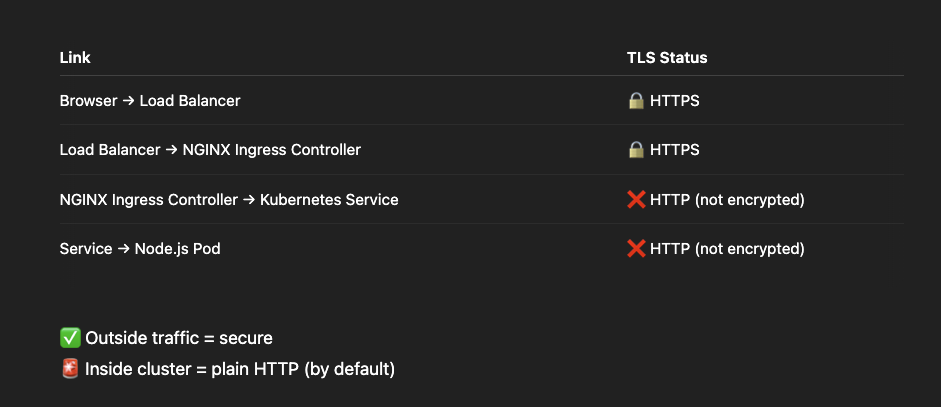

✅ But in highly secure environments (banks, healthcare),
they want TLS everywhere, even inside Kubernetes.

👉 That's called mTLS (Mutual TLS inside the cluster).