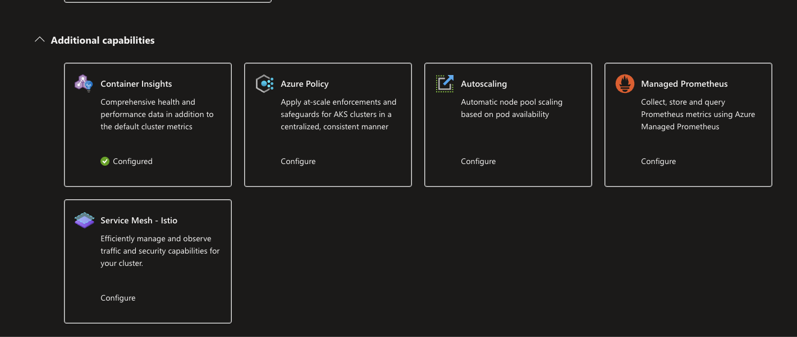
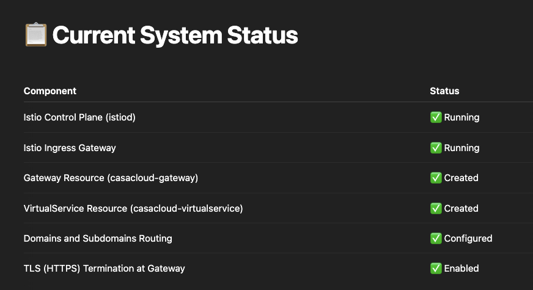
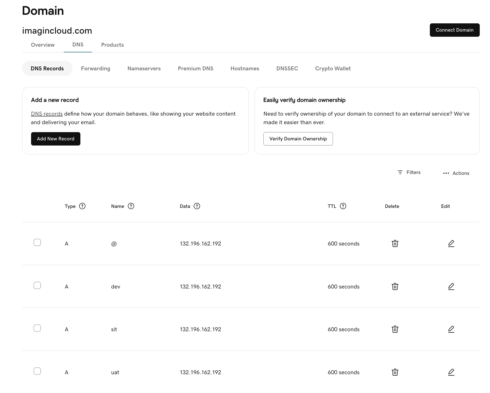
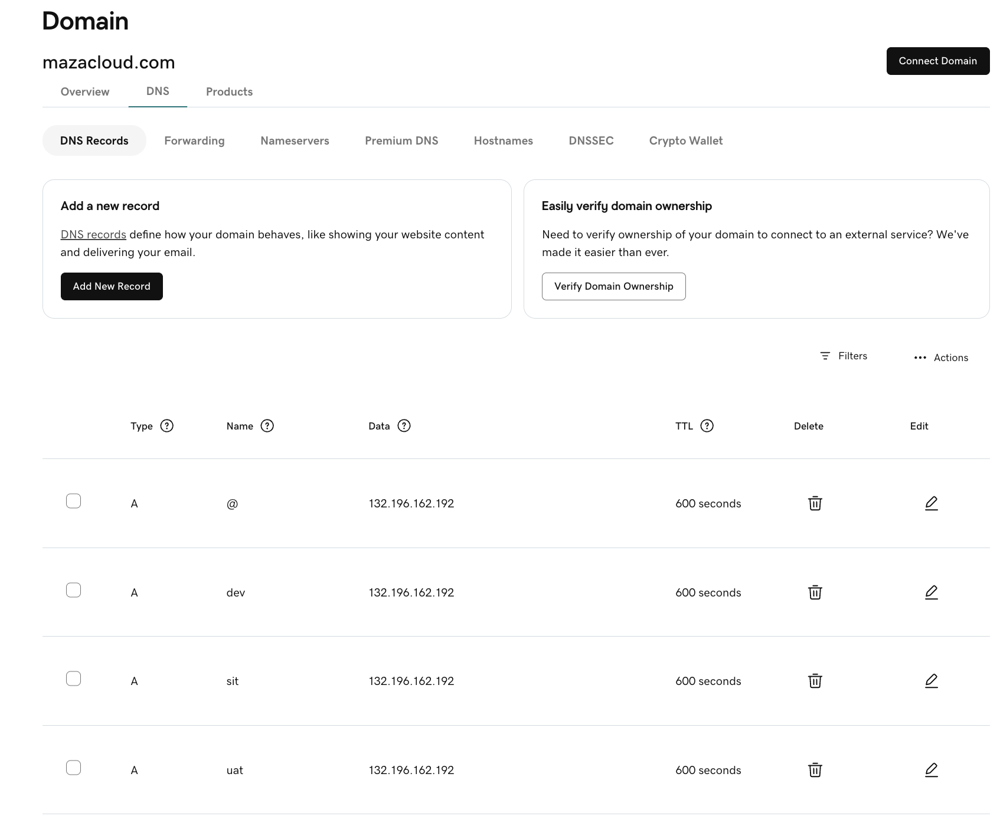
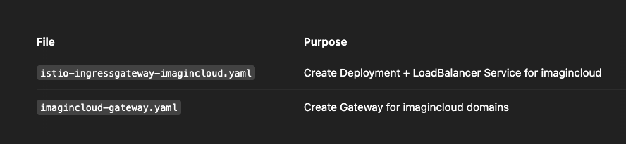

# Istio service mesh

## 📋 Step 1: Install istioctl CLI Tool on LINUX
1️⃣ Download the latest stable version of Istio:
```
curl -L https://istio.io/downloadIstio | sh -
```

2️⃣ Move into the Istio directory (it auto-detects latest version):
```
cd istio-*
```

3️⃣ Add istioctl to your system PATH (so it becomes available globally):
```
export PATH=$PWD/bin:$PATH
```
4️⃣ Verify istioctl is installed:
```
istioctl version

Output:-
istioctl version
Istio is not present in the cluster: no running Istio pods in namespace "istio-system"
client version: 1.25.2
```

### Step:- Install istioctl CLI tool on MAC

```
brew install istioctl
```

## Step 2: Install Istio into AKS Cluster

Before installation 




We’ll install it using a clean, safe, beginner-friendly profile first (called demo profile),
which includes:

Istio IngressGateway

Istio Pilot (control plane)

Envoy sidecars auto-injection setup

Prometheus, Grafana, Jaeger (basic observability)

### 1️⃣  Commands to Install Istio
```
istioctl install --set profile=demo -y

Output:-


        |\          
        | \         
        |  \        
        |   \       
      /||    \      
     / ||     \     
    /  ||      \    
   /   ||       \   
  /    ||        \  
 /     ||         \ 
/______||__________\
____________________
  \__       _____/  
     \_____/        

✔ Istio core installed ⛵️                                                                                                                                                                                                     
✔ Istiod installed 🧠                                                                                                                                                                                                         
✔ Egress gateways installed 🛫                                                                                                                                                                                                
✔ Ingress gateways installed 🛬                                                                                                                                                                                               
✔ Installation complete 

```

✅ What this does:

Creates namespace istio-system

Deploys Istio core components into your cluster

Deploys one Ingress Gateway (public facing)

Deploys sidecar injection webhook

### 2️⃣ Verify Istio installation:
```
kubectl get pods -n istio-system

Output:-
kubectl get pods -n istio-system

NAME                                    READY   STATUS    RESTARTS   AGE
istio-egressgateway-5579bf584f-67w2p    1/1     Running   0          2m18s
istio-ingressgateway-65c9ccf645-xqd5q   1/1     Running   0          2m18s
istiod-7584fc4fd6-2xdd7                 1/1     Running   0          2m29s
```

## 📋 What we are going to create:

| Resource       | Purpose                                                      |
|----------------|---------------------------------------------------------------|
| Gateway        | Defines external LoadBalancer listening on HTTPS for your domains |
| VirtualService | Routes based on host/path to your Kubernetes Service (`nodejstemplate`) |

## 🛠 Istio Gateway YAML (for your domains)
01.istio-gateway.yaml

```
apiVersion: networking.istio.io/v1beta1
kind: Gateway
metadata:
  name: casacloud-gateway
  namespace: default
spec:
  selector:
    istio: ingressgateway # this selects istio-ingressgateway pod
  servers:
  - port:
      number: 443
      name: https
      protocol: HTTPS
    tls:
      mode: SIMPLE
      credentialName: mazacloud-tls # matches your Kubernetes TLS secret name
    hosts:
    - mazacloud.com
    - dev.mazacloud.com
    - sit.mazacloud.com
    - uat.mazacloud.com
  - port:
      number: 443
      name: https-2
      protocol: HTTPS
    tls:
      mode: SIMPLE
      credentialName: imagincloud-tls
    hosts:
    - imagincloud.com
    - dev.imagincloud.com
    - sit.imagincloud.com
    - uat.imagincloud.com
```
✅ Explanation:

Listening on port 443 (HTTPS).

credentialName: refers to your TLS secrets (mazacloud-tls, imagincloud-tls).

Each hosts: array binds specific domains to the right TLS certificate.

## 🛠 Istio VirtualService YAML (for your application)

02.istio-virtualservice.yaml
```
apiVersion: networking.istio.io/v1beta1
kind: VirtualService
metadata:
  name: casacloud-virtualservice
  namespace: default
spec:
  hosts:
  - mazacloud.com
  - dev.mazacloud.com
  - sit.mazacloud.com
  - uat.mazacloud.com
  - imagincloud.com
  - dev.imagincloud.com
  - sit.imagincloud.com
  - uat.imagincloud.com
  gateways:
  - casacloud-gateway
  http:
  - match:
    - uri:
        prefix: /
    route:
    - destination:
        host: nodejstemplate
        port:
          number: 80
```
✅ Explanation:

Matches all / requests for the listed domains.

Forwards traffic to the nodejstemplate Kubernetes service on port 80 (your Node.js app).

Fully managed routing via Istio.
```
kubectl apply -f 01.istio-gateway.yaml
kubectl apply -f 02.istio-virtualservice.yaml

Output:-

gateway.networking.istio.io/casacloud-gateway created
virtualservice.networking.istio.io/casacloud-virtualservice created
```

✅ Once applied, your traffic will flow: Browser (HTTPS) ➡️ Istio Gateway ➡️ VirtualService ➡️ Service ➡️ Pod
With full TLS termination and Service Mesh in place!



##  Application Flow 

https://mazacloud.com/api-docs

Browser (HTTPS)

    ↓

Azure Load Balancer (Public IP)

    ↓

Istio Ingress Gateway (Port 443 TLS termination)

    ↓

VirtualService Rule (matches Host and Path)

    ↓

Service (nodejstemplate)

    ↓

Pod (Node.js Application)

## 🔥 Quick Testing Commands You Can Run Now

```
kubectl get svc istio-ingressgateway -n istio-system

NAME                   TYPE           CLUSTER-IP    EXTERNAL-IP       PORT(S)                                                                      AGE
istio-ingressgateway   LoadBalancer   10.0.87.137   132.196.162.192   15021:32602/TCP,80:32483/TCP,443:32693/TCP,31400:31424/TCP,15443:32625/TCP   20m
```

## Update the A records for all the domain and subdomain 





### Clear Domain Cache 

```
sudo dscacheutil -flushcache; sudo killall -HUP mDNSResponder 
```

not working

Recreated new file 
01.istio-ingressgateway-imagincloud.yaml
```
# Create Deployment for imagincloud Gateway
apiVersion: apps/v1
kind: Deployment
metadata:
  name: istio-ingressgateway-imagincloud
  namespace: istio-system
spec:
  replicas: 1
  selector:
    matchLabels:
      app: istio-ingressgateway-imagincloud
      istio: ingressgateway-imagincloud
  template:
    metadata:
      labels:
        app: istio-ingressgateway-imagincloud
        istio: ingressgateway-imagincloud
    spec:
      serviceAccountName: istio-ingressgateway-service-account
      containers:
      - name: istio-proxy
        image: docker.io/istio/proxyv2:1.22.0  # Adjust if you use another version
        ports:
        - containerPort: 8080
        - containerPort: 8443
        - containerPort: 15021
        args:
        - proxy
        - router
        - --domain
        - $(POD_NAMESPACE).svc.cluster.local
        - --serviceCluster
        - istio-ingressgateway-imagincloud
        env:
        - name: POD_NAME
          valueFrom:
            fieldRef:
              fieldPath: metadata.name
        - name: POD_NAMESPACE
          valueFrom:
            fieldRef:
              fieldPath: metadata.namespace
        resources:
          requests:
            cpu: 100m
            memory: 128Mi
          limits:
            cpu: 2000m
            memory: 1024Mi

---

# Create LoadBalancer Service for imagincloud Gateway
apiVersion: v1
kind: Service
metadata:
  name: istio-ingressgateway-imagincloud
  namespace: istio-system
spec:
  type: LoadBalancer
  selector:
    istio: ingressgateway-imagincloud
  ports:
  - name: http2
    port: 80
    targetPort: 8080
  - name: https
    port: 443
    targetPort: 8443

```

## Apply it
```
kubectl apply -f 01.istio-ingressgateway-imagincloud.yaml

OUTPUT:-

deployment.apps/istio-ingressgateway-imagincloud created
service/istio-ingressgateway-imagincloud created
```

## 📋 Full File 2: imagincloud-gateway.yaml

02.imagincloud-gateway.yaml
```
apiVersion: networking.istio.io/v1beta1
kind: Gateway
metadata:
  name: imagincloud-gateway
  namespace: default
spec:
  selector:
    istio: ingressgateway-imagincloud
  servers:
  - port:
      number: 443
      name: https
      protocol: HTTPS
    tls:
      mode: SIMPLE
      credentialName: imagincloud-tls
    hosts:
    - imagincloud.com
    - dev.imagincloud.com
    - sit.imagincloud.com
    - uat.imagincloud.com
```

### Apply it 

```
kubectl apply -f 02.imagincloud-gateway.yaml

Output:-
gateway.networking.istio.io/imagincloud-gateway created
```


