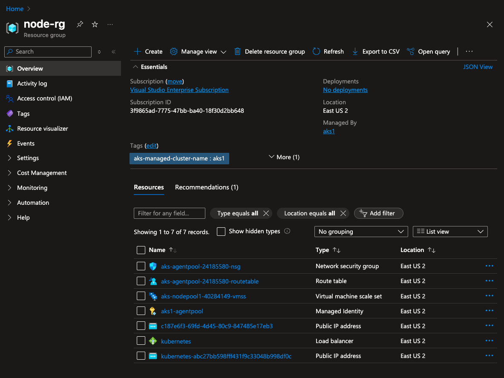

## 📚 Table of Contents

- [What is AKS Nodepools](#what-is-aks-nodepools)
- [Limitation](#limitation)
- [Add Nodepool during AKS create](#add-nodepool-during-aks-create)
- [List AKS NodePools](#list-aks-nodepools)
- [What other things are created](#what-other-things-are-created)
- [Get app pods present in a particular nodepool](#get-app-pods-present-in-a-particular-nodepool)
- [Add User Nodepool](#add-user-nodepool)
- [Get list of taints on each nodes](#get-list-of-taints-on-each-nodes)
- [Add Taint to system nodepool](#add-taint-to-system-nodepool)
- [Scale the deployment to 3 replicas](#scale-the-deployment-to-3-replicas)
- [Get the selector](#get-the-selector)
- [List all pods of that selector](#list-all-pods-of-that-selector)
- [Remove the nodepool](#remove-the-nodepool)  
  - [Step 1:- cordon nodepool's node independently](#step-1--cordon-nodepools-node-independently)  
  - [Step 2:- drain the pods from the node](#step-2--drain-the-pods-from-the-node)  
  - [Step 3:- Remove the nodepool](#step-3--remove-the-nodepool)
- [Get current pod status](#get-current-pod-status)
- [Remove the taint from the nodepool](#remove-the-taint-from-the-nodepool)


# What is AKS Nodepools
In Azure Kubernetes Service (AKS), nodes of the same configuration are grouped  
together into node pools.

# Limitation
* The name of a node pool may only contain lowercase alphanumeric characters and must begin with a lowercase letter.
* For Linux node pools, the length must be between 1-12 characters.
* For Windows node pools, the length must be between 1-6 characters.
* All node pools must reside in the same virtual network.

# Add Nodepool during AKS create
```
 az aks create \
    --name aks1 \
    --resource-group resource-group-4 \
    --tier free
    --node-count 1 \
    --node-resource-group node-rg \
    --node-vm-size Standard_B2als_v2 \
    --nodepool-name nodepool1 \
    .
    .
```

# List AKS NodePools 
```
az aks nodepool list \
--resource-group=resource-group-4 \
--cluster-name=aks1 \
-o table
```
## List all nodes inside the nodepool
```
kubectl get nodes -l agentpool=nodepool1
```

# What other things are created


## Get app pods present in a particular nodepool
```
kubectl get pods -A -o wide | grep aks-nodepool1
```

## Add User Nodepool
```
az aks nodepool add \
  --resource-group resource-group-4 \
  --cluster-name aks1 \
  --name userpool1 \
  --node-count 1 \
  --node-vm-size Standard_B2als_v2 \
  --mode User
```

 ## Get list of taints on each nodes 
```
kubectl get nodes -o custom-columns=NAME:.metadata.name,TAINTS:.spec.taints
```

## Add Taint to system nodepool
```
az aks nodepool update \
  --resource-group myResourceGroup \
  --cluster-name myAKSCluster \
  --name nodepool1 \
  --node-taints CriticalAddonsOnly=true:NoSchedule
```

## Scale the deployment to 3 replicas
kubectl scale deployment casacloubackend-casacloud-backend --replicas=3 -n dev

## Get the selector 
```
kubectl get deployment casacloubackend-casacloud-backend -n dev -o jsonpath="{.spec.selector.matchLabels}"
```

# List all pods of that selector 
```
kubectl get pods -n dev -l app=casacloud-backend -o wide 
```

# Remove the nodepool
## Step 1:- cordon nodepool's node independently 
```
kubectl get nodes -l agentpool=userpool1
```
```
kubectl cordon <node name>
```

## Step 2:- drain the pods from the node
```
kubectl drain <node-name> --ignore-daemonsets --delete-emptydir-data
```
```
az aks nodepool delete \
  --resource-group resource-group-4 \
  --cluster-name aks1 \
  --name userpool1
```

## Step 3:- Remove the nodepool
```
az aks nodepool delete \
  --resource-group resource-group-4 \
  --cluster-name aks1 \
  --name userpool1
```

# Get current pod status 
```
kubectl get pods -A -o wide
```
Expect pending pods

## Remove the taint from the nodepool
```
az aks nodepool update \
--resource-group resource-group-4 \
--cluster-name aks1 \
--name nodepool1 \
--node-taints ""
```