# Demo Managed Disk

## Step 1 Prereqs (once)
```
# Make sure you're on the right cluster
az aks get-credentials -g <RESOURCE_GROUP> -n <CLUSTER_NAME> --overwrite-existing
kubectl get nodes
```

## Step 2 Create a namespace
```bash
kubectl create ns demo-disk || true
kubectl config set-context --current --namespace=demo-disk
```

## Step 3:- Inspect Available Disk Storage
```
kubectl get storageclass
```
Output:- 
| **Name**                  | **Provisioner**      | **Reclaim Policy** | **Volume Binding Mode** | **Allow Volume Expansion** | **Age** |
| ------------------------- | -------------------- | ------------------ | ----------------------- | -------------------------- | ------- |
| **azurefile**             | `file.csi.azure.com` | Delete             | Immediate               | true                       | 8d      |
| **azurefile-csi**         | `file.csi.azure.com` | Delete             | Immediate               | true                       | 8d      |
| **azurefile-csi-premium** | `file.csi.azure.com` | Delete             | Immediate               | true                       | 8d      |
| **azurefile-premium**     | `file.csi.azure.com` | Delete             | Immediate               | true                       | 8d      |
| **default (default)**     | `disk.csi.azure.com` | Delete             | WaitForFirstConsumer    | true                       | 8d      |
| **managed**               | `disk.csi.azure.com` | Delete             | WaitForFirstConsumer    | true                       | 8d      |
| **managed-csi**           | `disk.csi.azure.com` | Delete             | WaitForFirstConsumer    | true                       | 8d      |
| **managed-csi-premium**   | `disk.csi.azure.com` | Delete             | WaitForFirstConsumer    | true                       | 8d      |
| **managed-premium**       | `disk.csi.azure.com` | Delete             | WaitForFirstConsumer    | true                       | 8d      |

Create a PVC 

01-pvc-disk.yaml
```yaml
# 01-pvc-disk.yaml
apiVersion: v1
kind: PersistentVolumeClaim
metadata:
  name: pvc-azuredisk
spec:
  accessModes: ["ReadWriteOnce"]         # RWO = 1 node at a time
  storageClassName: managed-csi          # change to managed-csi-premium if you prefer
  resources:
    requests:
      storage: 128Gi
```

Apply 

```bash
kubectl apply -f 01-pvc-disk.yaml
kubectl get pvc pvc-azuredisk -w
```
Output
```
kubectl apply -f 07-aks-storage/01-managed-disk/01-pvc-disk.yaml 
persistentvolumeclaim/pvc-azuredisk created
alokadhao@192 azure % kubectl get pvc pvc-azuredisk -w
NAME            STATUS    VOLUME   CAPACITY   ACCESS MODES   STORAGECLASS   VOLUMEATTRIBUTESCLASS   AGE
pvc-azuredisk   Pending                                      managed-csi    <unset>                 8s
```

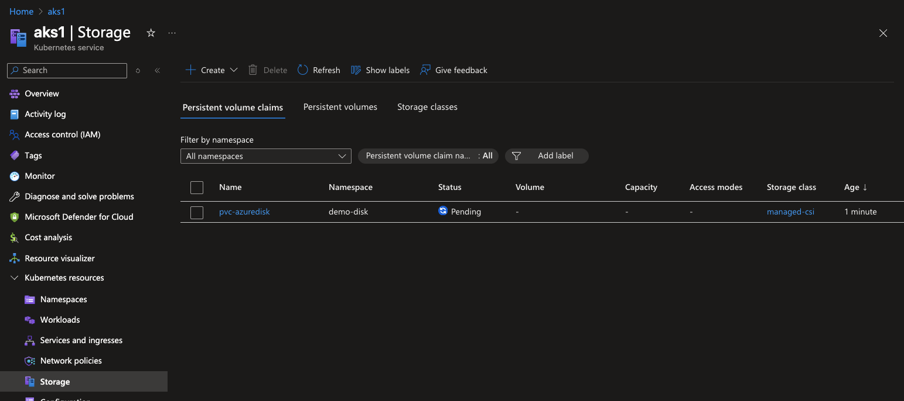

## You can see th Disk is really created and attached to one of the VMSS VM 


### We’ll run a simple Ubuntu pod that writes a file to the mounted disk.

02-deploy-disk.yaml
```yaml
# deploy-disk.yaml
apiVersion: apps/v1
kind: Deployment
metadata:
  name: disk-writer
spec:
  replicas: 1
  selector:
    matchLabels: { app: disk-writer }
  template:
    metadata:
      labels: { app: disk-writer }
    spec:
      containers:
        - name: writer
          image: ubuntu:22.04
          command: ["/bin/bash","-c"]
          args:
            - |
              while true; do
                date | tee -a /data/hello.txt;
                sleep 5;
              done
          volumeMounts:
            - name: data
              mountPath: /data
      volumes:
        - name: data
          persistentVolumeClaim:
            claimName: pvc-azuredisk
```
### Apply the deployment
```bash
kubectl apply -f 02-deploy-disk.yaml
kubectl rollout status deploy/disk-writer
kubectl get pods -o wide
```

Output:- 
```bash
kubectl apply -f 07-aks-storage/01-managed-disk/02-deploy-disk.yaml
deployment.apps/disk-writer created
alokadhao@192 azure % kubectl rollout status deploy/disk-writer
deployment "disk-writer" successfully rolled out
```

### Verify the disk is writable & data persists

```bash
# Get pod name
POD=$(kubectl get pod -l app=disk-writer -n demo-disk -o jsonpath='{.items[0].metadata.name}')

# Watch file grow as the container writes timestamps
kubectl exec -n demo-disk -it "$POD" -- sh -lc 'tail -f /data/hello.txt'
```
Output:- 

```bash
POD=$(kubectl get pod -l app=disk-writer -n demo-disk -o jsonpath='{.items[0].metadata.name}')

# Watch file grow as the container writes timestamps
kubectl exec -n demo-disk -it "$POD" -- sh -lc 'tail -f /data/hello.txt'
zsh: command not found: #
Sat Nov  8 17:16:41 UTC 2025
Sat Nov  8 17:16:46 UTC 2025
Sat Nov  8 17:16:51 UTC 2025
Sat Nov  8 17:16:56 UTC 2025
Sat Nov  8 17:17:01 UTC 2025
Sat Nov  8 17:17:06 UTC 2025
Sat Nov  8 17:17:11 UTC 2025
Sat Nov  8 17:17:16 UTC 2025
Sat Nov  8 17:17:21 UTC 2025
Sat Nov  8 17:17:26 UTC 2025
Sat Nov  8 17:17:31 UTC 2025
Sat Nov  8 17:17:36 UTC 2025
Sat Nov  8 17:17:41 UTC 2025
```

### Prove persistence across pod restarts
```bash
# Delete the pod (Deployment will recreate it)
kubectl delete pod "$POD" -n demo-disk

# Wait for the new pod, then check the file again
NEWPOD=$(kubectl get pod -l app=disk-writer -n demo-disk -o jsonpath='{.items[0].metadata.name}')
kubectl exec -n demo-disk -it "$NEWPOD" -- sh -lc 'tail -n20 /data/hello.txt'
```

Output:- 
```bash
 kubectl delete pod "$POD" -n demo-disk
pod "disk-writer-76fc9895bb-747pd" deleted
alokadhao@192 azure % NEWPOD=$(kubectl get pod -l app=disk-writer -n demo-disk -o jsonpath='{.items[0].metadata.name}')
kubectl exec -n demo-disk -it "$NEWPOD" -- sh -lc 'tail -n20 /data/hello.txt'
Sat Nov  8 17:18:41 UTC 2025
Sat Nov  8 17:18:46 UTC 2025
Sat Nov  8 17:18:51 UTC 2025
Sat Nov  8 17:18:56 UTC 2025
Sat Nov  8 17:19:01 UTC 2025
Sat Nov  8 17:19:06 UTC 2025
Sat Nov  8 17:19:06 UTC 2025
Sat Nov  8 17:19:11 UTC 2025
Sat Nov  8 17:19:11 UTC 2025
Sat Nov  8 17:19:16 UTC 2025
Sat Nov  8 17:19:16 UTC 2025
Sat Nov  8 17:19:21 UTC 2025
Sat Nov  8 17:19:21 UTC 2025
Sat Nov  8 17:19:26 UTC 2025
Sat Nov  8 17:19:26 UTC 2025
```

You should still see the earlier lines → data persisted on the disk.

## Demonstrate ReadWriteOnce (single node) behavior

Try to run two replicas that share the same PVC:

```bash
kubectl scale deploy/disk-writer -n demo-disk --replicas=2
kubectl get pods -n demo-disk -o wide
kubectl describe pod -n demo-disk | grep -i "multi-attach\|attached to a node" -n || true
```

Output:-
```bash
 kubectl scale deploy/disk-writer -n demo-disk --replicas=2
deployment.apps/disk-writer scaled
alokadhao@192 azure % kubectl get pods -n demo-disk -o wide
NAME                           READY   STATUS    RESTARTS   AGE     IP            NODE                                NOMINATED NODE   READINESS GATES
disk-writer-76fc9895bb-7z857   1/1     Running   0          3m18s   10.244.0.39   aks-nodepool1-11014092-vmss000000   <none>           <none>
disk-writer-76fc9895bb-dwr76   1/1     Running   0          18s     10.244.0.40   aks-nodepool1-11014092-vmss000000   <none>           <none>
alokadhao@192 azure % kubectl describe pod -n demo-disk | grep -i "multi-attach\|attached to a node" -n || true
```

I see 2 pods running
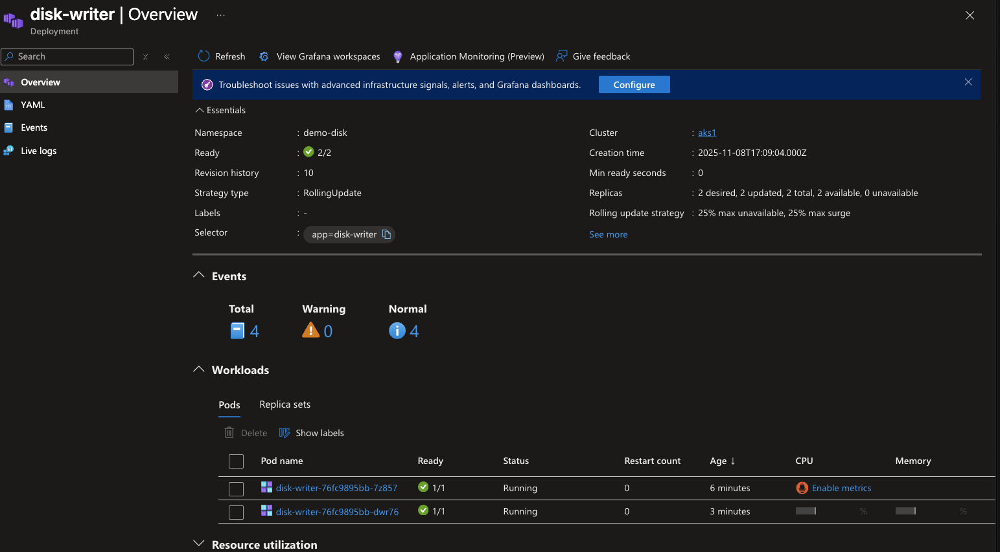

#### Pod1

#### Pod2
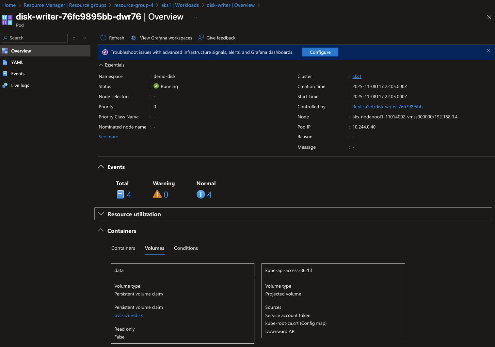

## See the actual Azure Disk

### Create a secret
```bash
kubectl create secret generic fb-admin \
  --from-literal=password='ChangeMe!Strong42' \
  -n demo-disk
```
03-web-browse-disk-files.yaml
```yaml
apiVersion: apps/v1
kind: Deployment
metadata:
  name: filebrowser
  namespace: demo-disk
spec:
  replicas: 1
  selector:
    matchLabels: { app: filebrowser }
  template:
    metadata:
      labels: { app: filebrowser }
    spec:
      securityContext:
        runAsUser: 1000
        runAsGroup: 1000
        fsGroup: 1000
        fsGroupChangePolicy: "OnRootMismatch"
      containers:
        - name: fb
          image: filebrowser/filebrowser:latest
          args: ["--port","8080","--address","0.0.0.0","--root","/srv",
                 "--database","/database/filebrowser.db"]
          ports: [{ containerPort: 8080 }]
          volumeMounts:
            - { name: data, mountPath: /srv }
            - { name: data, mountPath: /database, subPath: fb-db }
      volumes:
        - name: data
          persistentVolumeClaim:
            claimName: pvc-azuredisk
```
Execute
```bash


kubectl port-forward deploy/filebrowser 8080:80
```
Output:-
```bash
apply -f 07-aks-storage/01-managed-disk/03-web-browse-disk-files.yaml
deployment.apps/filebrowser configured
alokadhao@192 azure % kubectl rollout status deploy/filebrowser

deployment "filebrowser" successfully rolled out
kubectl logs deploy/filebrowser -n demo-disk --tail=50

2025/11/08 17:57:10 Warning: filebrowser.db can't be found. Initialing in /database/
2025/11/08 17:57:10 Using database: /database/filebrowser.db
2025/11/08 17:57:10 Using config file: /config/settings.json
2025/11/08 17:57:10 Performing quick setup
2025/11/08 17:57:10 User 'admin' initialized with randomly generated password: Hzz2-qd4_Sch3aJB
2025/11/08 17:57:10 Listening on [::]:8080
alokadhao@192 azure % kubectl port-forward deploy/filebrowser -n demo-disk 8080:8080

Forwarding from 127.0.0.1:8080 -> 8080
Forwarding from [::1]:8080 -> 8080
Handling connection for 8080
```
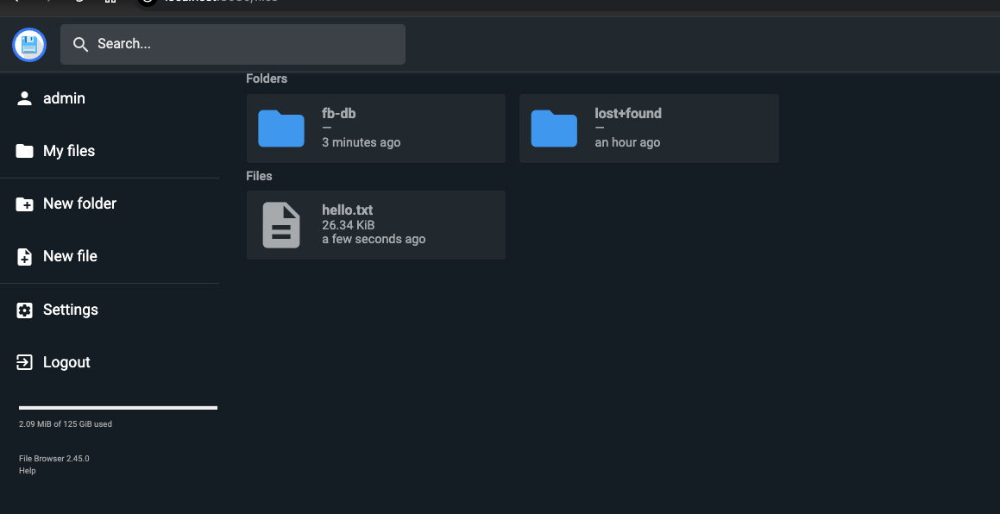

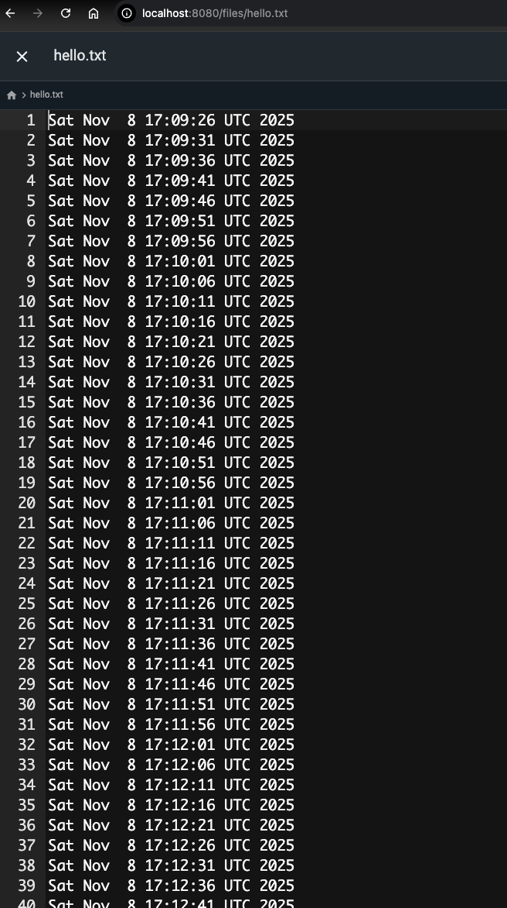

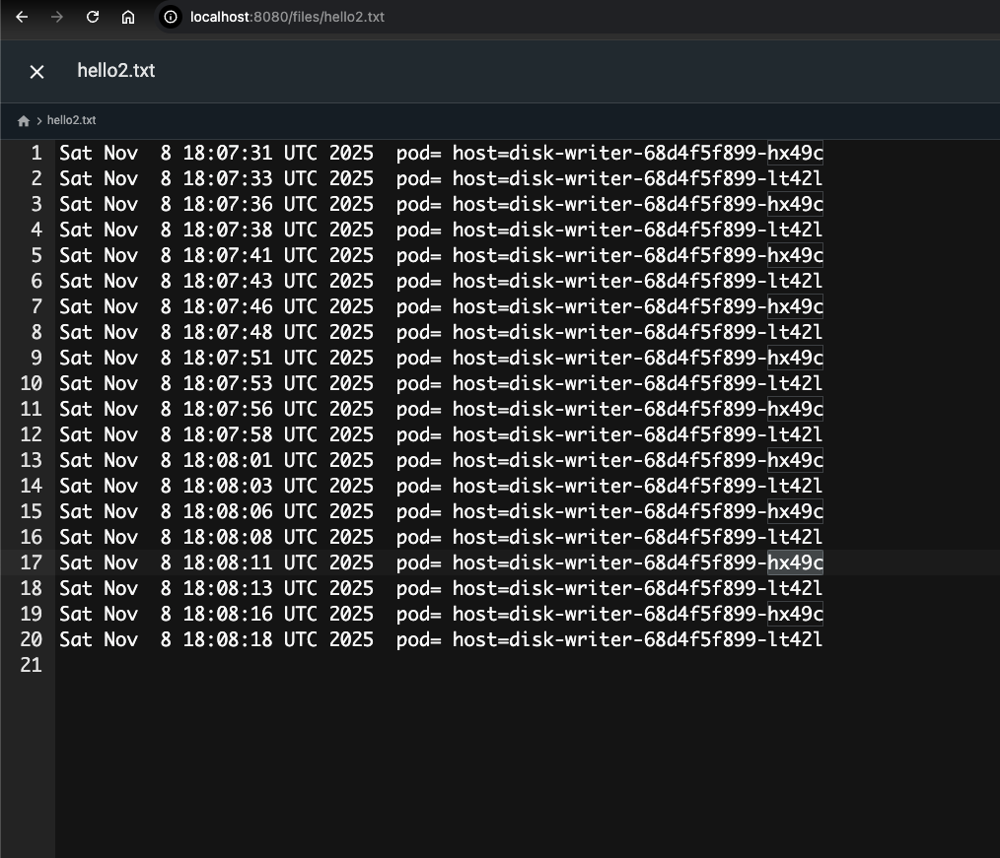

## How to confirm node placement 
```bash
kubectl get pods -l app=disk-writer -o wide -n demo-disk
```

| **Name**                     | **Ready** | **Status** | **Restarts** | **Age** | **IP**      | **Node**                          | **Nominated Node** | **Readiness Gates** |
| ---------------------------- | --------- | ---------- | ------------ | ------- | ----------- | --------------------------------- | ------------------ | ------------------- |
| disk-writer-68d4f5f899-hx49c | 1/1       | Running    | 0            | 3m9s    | 10.244.0.54 | aks-nodepool1-11014092-vmss000000 | <none>             | <none>              |
| disk-writer-68d4f5f899-lt42l | 1/1       | Running    | 0            | 3m8s    | 10.244.0.55 | aks-nodepool1-11014092-vmss000000 | <none>             | <none>              |

| **Behavior**                                | **Explanation**                                                                                                                              |
| ------------------------------------------- | -------------------------------------------------------------------------------------------------------------------------------------------- |
| **Both pods writing to `/data/hello2.txt`** | They are co-located on the same node and share the mounted PVC (`pvc-azuredisk`).                                                            |
| **Alternating pod names in output**         | The `echo "$(date) pod=$POD_NAME host=$HOSTNAME"` line writes each pod’s identity to the shared file.                                        |
| **Azure Disk still RWO**                    | If the scheduler had placed the second pod on another node, you’d see a *multi-attach error*, and one pod would remain in **Pending** state. |

## To verify the content of each pod 

```bash
# From first pod
kubectl exec -n demo-disk disk-writer-68d4f5f899-hx49c -- tail -n5 /data/hello2.txt

# From second pod
kubectl exec -n demo-disk disk-writer-68d4f5f899-lt42l -- tail -n5 /data/hello2.txt
```
output:- 
```bash
kubectl exec -n demo-disk disk-writer-68d4f5f899-hx49c -- tail -n5 /data/hello2.txt
Sat Nov  8 18:14:47 UTC 2025  pod= host=disk-writer-68d4f5f899-hx49c
Sat Nov  8 18:14:48 UTC 2025  pod= host=disk-writer-68d4f5f899-lt42l
Sat Nov  8 18:14:52 UTC 2025  pod= host=disk-writer-68d4f5f899-hx49c
Sat Nov  8 18:14:53 UTC 2025  pod= host=disk-writer-68d4f5f899-lt42l
Sat Nov  8 18:14:57 UTC 2025  pod= host=disk-writer-68d4f5f899-hx49c
```

Output:- pod 2
```bash
kubectl exec -n demo-disk disk-writer-68d4f5f899-lt42l -- tail -n5 /data/hello2.txt
Sat Nov  8 18:15:12 UTC 2025  pod= host=disk-writer-68d4f5f899-hx49c
Sat Nov  8 18:15:13 UTC 2025  pod= host=disk-writer-68d4f5f899-lt42l
Sat Nov  8 18:15:17 UTC 2025  pod= host=disk-writer-68d4f5f899-hx49c
Sat Nov  8 18:15:18 UTC 2025  pod= host=disk-writer-68d4f5f899-lt42l
Sat Nov  8 18:15:22 UTC 2025  pod= host=disk-writer-68d4f5f899-hx49c
```

## 1️⃣ Impact on deleting Pod - If you delete only the Pod(s)

| Component                       | Behavior                                                                                                                        |
| ------------------------------- | ------------------------------------------------------------------------------------------------------------------------------- |
| **Pods**                        | Deleted immediately, and since they’re part of a Deployment, Kubernetes **automatically recreates** them.                       |
| **PVC (PersistentVolumeClaim)** | ✅ **Remains intact** — not deleted.                                                                                             |
| **PV (PersistentVolume)**       | ✅ **Remains intact** — still bound to the same PVC.                                                                             |
| **Azure Disk**                  | ✅ **Stays attached** to the node (and reused when the new Pod starts).                                                          |
| **File Content**                | ✅ **Persists** — `/data/hello.txt` remains unchanged because it’s stored on the Azure Disk, not in the pod’s ephemeral storage. |
Result:
→ The recreated pod mounts the same disk and sees the same file data.

## 2️⃣ If you delete the Deployment

```bash
kubectl delete deploy disk-writer -n demo-disk
```

| Component      | Behavior                                                           |
| -------------- | ------------------------------------------------------------------ |
| **Deployment** | ❌ Deleted (so no new pods will be created).                        |
| **Pods**       | ❌ All managed pods are terminated.                                 |
| **PVC**        | ✅ **Still remains**, since PVCs are separate Kubernetes resources. |
| **PV**         | ✅ Still exists and **remains bound** to the PVC.                   |
| **Azure Disk** | ✅ Still exists in Azure (visible in your Resource Group).          |
| **Data**       | ✅ Still safe inside the disk.                                      |

## 3️⃣ If you delete the PVC (PersistentVolumeClaim)
```bash
kubectl delete pvc pvc-azuredisk -n demo-disk
```

Now it depends on the Reclaim Policy of the PV: what happens to data

| NAME                                       | CAPACITY | ACCESS MODES | RECLAIM POLICY | STATUS | CLAIM                     | STORAGECLASS | VOLUMEATTRIBUTESCLASS | REASON | AGE |
|-------------------------------------------|-----------|---------------|----------------|---------|---------------------------|---------------|------------------------|---------|-----|
| pvc-02b34d3b-d9f8-4be2-91b3-ac788ed8500a   | 128Gi     | RWO           | Delete         | Bound   | demo-disk/pvc-azuredisk   | managed-csi   | <unset>                |         |     |

2 reclame policies are there - 
Reclaim Policy: Delete, retain 
| Reclaim Policy | Azure Disk behavior                                                          | Data fate                                                                        |
| -------------- | ---------------------------------------------------------------------------- | -------------------------------------------------------------------------------- |
| **Delete**     | The Azure Disk is deleted automatically by Kubernetes.                       | ❌ Data is lost forever.                                                          |
| **Retain**     | The Azure Disk remains in your Azure Resource Group (e.g., `pvc-xxxx` disk). | ✅ Data is preserved — you can manually reattach or create a new PVC to reuse it. |


## Summary:- 

| Action                      | PVC    | PV     | Azure Disk | Data      |
| --------------------------- | ------ | ------ | ---------- | --------- |
| Delete Pod(s)               | ✅ Keep | ✅ Keep | ✅ Keep     | ✅ Persist |
| Delete Deployment           | ✅ Keep | ✅ Keep | ✅ Keep     | ✅ Persist |
| Delete PVC (Reclaim=Delete) | ❌ Gone | ❌ Gone | ❌ Deleted  | ❌ Lost    |
| Delete PVC (Reclaim=Retain) | ❌ Gone | ✅ Keep | ✅ Keep     | ✅ Persist |
| Delete PV manually          | ❌ Gone | ❌ Gone | ❌ Deleted  | ❌ Lost    |


# Safely retain the disk and delete everthing else now. 

## 1. Switch the PV to Retain

```bash 
PV=pvc-02b34d3b-d9f8-4be2-91b3-ac788ed8500a
kubectl patch pv $PV -p '{"spec":{"persistentVolumeReclaimPolicy":"Retain"}}'
kubectl get pv $PV -o custom-columns=NAME:.metadata.name,RECLAIM:.spec.persistentVolumeReclaimPolicy
```

Output:-
```bash
persistentvolume/pvc-02b34d3b-d9f8-4be2-91b3-ac788ed8500a patched
NAME                                       RECLAIM
pvc-02b34d3b-d9f8-4be2-91b3-ac788ed8500a   Retain
```

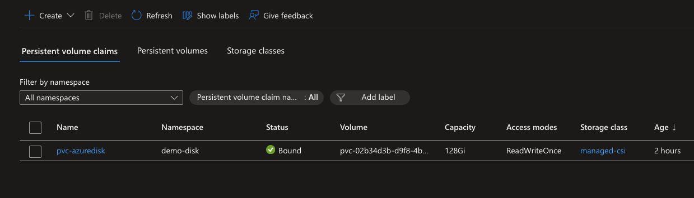
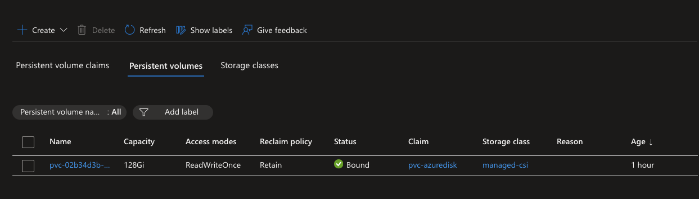

## Stop workloads, then delete the PVC (data stays)

```bash
kubectl delete deploy disk-writer -n demo-disk --ignore-not-found
kubectl delete deploy filebrowser -n demo-disk --ignore-not-found

kubectl delete pvc pvc-azuredisk -n demo-disk
kubectl get pv $PV

```

Output

```bash
deployment.apps "disk-writer" deleted
deployment.apps "filebrowser" deleted
persistentvolumeclaim "pvc-azuredisk" deleted

| **NAME**                                 | **CAPACITY** | **ACCESS MODES** | **RECLAIM POLICY** | **STATUS** | **CLAIM**               | **STORAGECLASS** | **VOLUMEATTRIBUTESCLASS** | **REASON** | **AGE** |
| ---------------------------------------- | ------------ | ---------------- | ------------------ | ---------- | ----------------------- | ---------------- | ------------------------- | ---------- | ------- |
| pvc-02b34d3b-d9f8-4be2-91b3-ac788ed8500a | 128Gi        | RWO              | **Retain**         | Released   | demo-disk/pvc-azuredisk | managed-csi      | <unset>                   |            | 89m     |
```

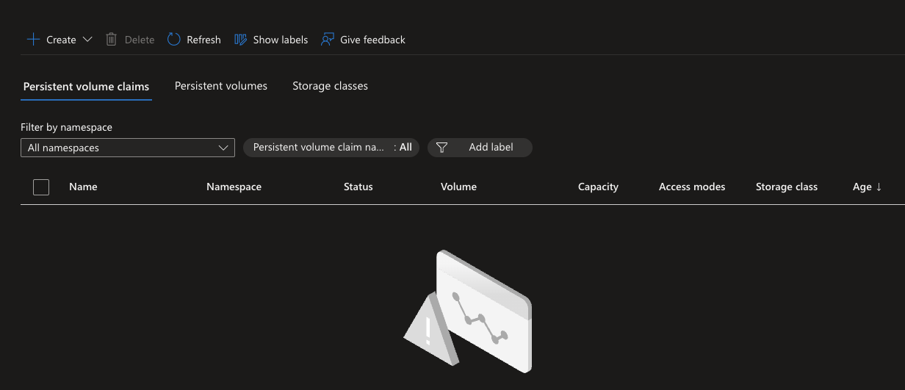
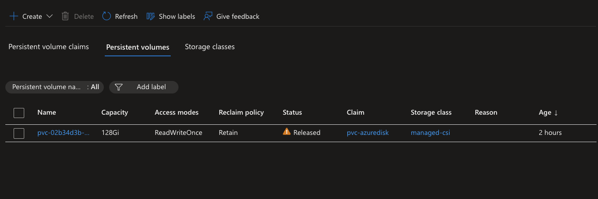

> PVC moved to Released state and Disk is still there 

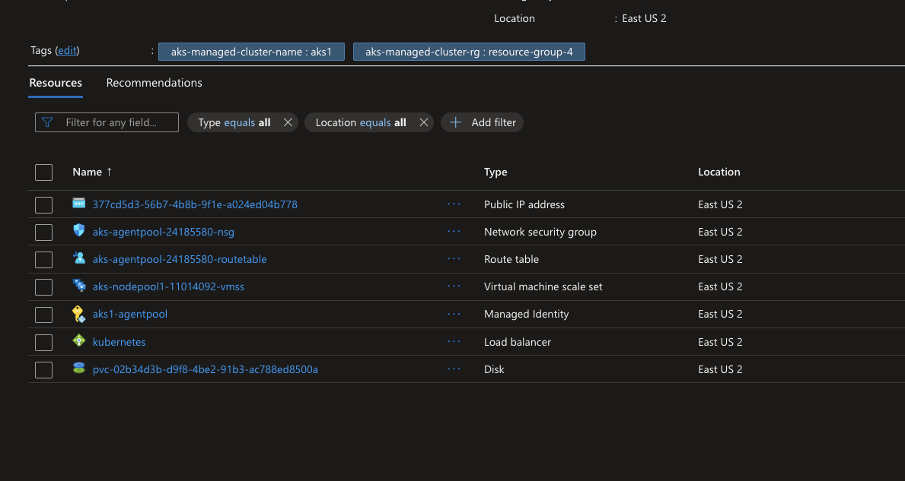

## Make the PV reusable (remove old claimRef)
```bash
kubectl patch pv $PV --type json \
  -p='[{"op":"remove","path":"/spec/claimRef"}]'

kubectl get pv $PV
```

Output:- 

```bash
persistentvolume/pvc-02b34d3b-d9f8-4be2-91b3-ac788ed8500a patched
NAME                                       CAPACITY   ACCESS MODES   RECLAIM POLICY   STATUS      CLAIM   STORAGECLASS   VOLUMEATTRIBUTESCLASS   REASON   AGE
pvc-02b34d3b-d9f8-4be2-91b3-ac788ed8500a   128Gi      RWO            Retain           Available           managed-csi    <unset>                          94m
```

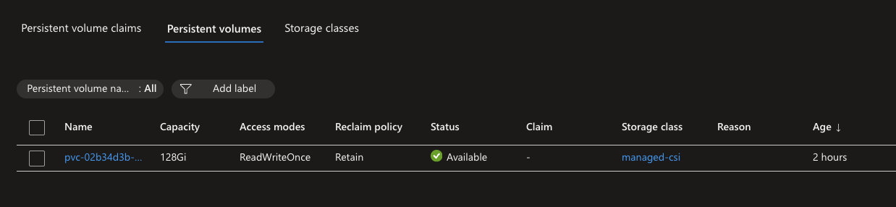


## If you dont do release clame 

| Behavior         | Description                                                                                                                             |
| ---------------- | --------------------------------------------------------------------------------------------------------------------------------------- |
| `kubectl get pv` | PV shows **`Released`** — not reusable.                                                                                                 |
| New PVC status   | **`Pending`** — it waits forever, never binds.                                                                                          |
| Event messages   | You’ll see something like:<br>`Warning  ProvisioningFailed  ...  no volume plugin matched for PVC...` or `volume still has a claimRef`. |
| Azure Disk       | ✅ Still exists in Azure (data safe).                                                                                                    |
| PVC Binding      | ❌ Fails automatically — must be manually bound.                                                                                         |

## Create a new PVC that binds to the same PV
04-pvc-reuse.yaml
```bash
# 04-pvc-reuse.yaml
apiVersion: v1
kind: PersistentVolumeClaim
metadata:
  name: pvc-azuredisk-reuse
  namespace: demo-disk
spec:
  accessModes: [ "ReadWriteOnce" ]
  resources:
    requests:
      storage: 128Gi            # must be <= PV capacity
  storageClassName: managed-csi # match PV's storageClass
  volumeName: pvc-02b34d3b-d9f8-4be2-91b3-ac788ed8500a # match PV's volumeName
```

```bash
kubectl apply -f 07-aks-storage/01-managed-disk/04-pvc-reuse.yaml
kubectl get pvc -n demo-disk pvc-azuredisk-reuse
kubectl get pv $PV
```

Output:-
```bash
kubectl apply -f 07-aks-storage/01-managed-disk/04-pvc-reuse.yaml
persistentvolumeclaim/pvc-azuredisk-reuse created
```

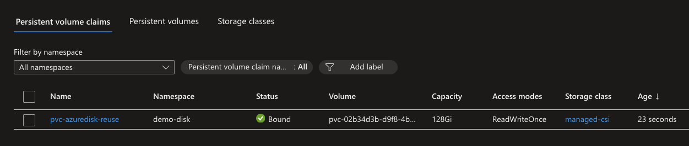

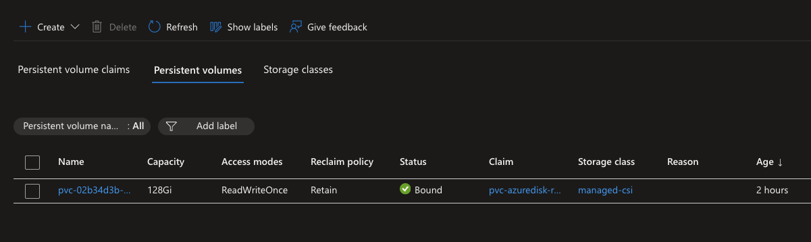

```bash
kubectl get pvc -n demo-disk pvc-azuredisk-reuse
NAME                  STATUS   VOLUME                                     CAPACITY   ACCESS MODES   STORAGECLASS   VOLUMEATTRIBUTESCLASS   AGE
pvc-azuredisk-reuse   Bound    pvc-02b34d3b-d9f8-4be2-91b3-ac788ed8500a   128Gi      RWO            managed-csi    <unset>                 110s
```

```bash
get pv $PV
NAME                                       CAPACITY   ACCESS MODES   RECLAIM POLICY   STATUS   CLAIM                           STORAGECLASS   VOLUMEATTRIBUTESCLASS   REASON   AGE
pvc-02b34d3b-d9f8-4be2-91b3-ac788ed8500a   128Gi      RWO            Retain           Bound    demo-disk/pvc-azuredisk-reuse   managed-csi    <unset>                          102m
```

## Redeploy a pod and verify the data is still there
05-web-brower-disk-files-reclaim.yaml

```yaml
apiVersion: apps/v1
kind: Deployment
metadata:
  name: filebrowser
  namespace: demo-disk
spec:
  replicas: 1
  selector:
    matchLabels: { app: filebrowser }
  template:
    metadata:
      labels: { app: filebrowser }
    spec:
      securityContext:
        runAsUser: 1000
        runAsGroup: 1000
        fsGroup: 1000
        fsGroupChangePolicy: "OnRootMismatch"
      containers:
        - name: fb
          image: filebrowser/filebrowser:latest
          args: ["--port","8080","--address","0.0.0.0","--root","/srv",
                 "--database","/database/filebrowser.db"]
          ports: [{ containerPort: 8080 }]
          volumeMounts:
            - { name: data, mountPath: /srv }
            - { name: data, mountPath: /database, subPath: fb-db }
      volumes:
        - name: data
          persistentVolumeClaim:
            claimName: pvc-azuredisk-reuse # Changed PVC name
```


## CLI based Verification 

```yaml
# 06-check-reader.yaml
apiVersion: v1
kind: Pod
metadata:
  name: reader
  namespace: demo-disk
spec:
  containers:
    - name: sh
      image: mcr.microsoft.com/cbl-mariner/base/core:2.0
      command: ["sh","-c","ls -l /data && tail -n 20 /data/hello.txt || true && sleep 3600"]
      volumeMounts:
        - name: data
          mountPath: /data
  volumes:
    - name: data
      persistentVolumeClaim:
        claimName: pvc-azuredisk-reuse
```

Output:- 

```
kubectl apply -f 07-aks-storage/01-managed-disk/06-check-reader.yaml                 
pod/reader created
kubectl exec -n demo-disk reader -- sh -c 'ls -l /data; echo "----"; tail -n 20 /data/hello.txt || true'


kubectl exec -n demo-disk reader -- sh -c 'ls -l /data; echo "----"; tail -n 20 /data/hello.txt || true'

total 92
drwxrwsr-x 2 root 1000  4096 Nov  8 17:57 fb-db
-rw-rw-r-- 1 root 1000 32229 Nov  8 18:08 hello.txt
-rw-r--r-- 1 root 1000 40158 Nov  8 18:31 hello2.txt
drwxrws--- 2 root 1000 16384 Nov  8 17:02 lost+found
----
Sat Nov  8 18:07:26 UTC 2025  pod= host=disk-writer-748f698987-tpxhs
Sat Nov  8 18:07:27 UTC 2025  pod= host=disk-writer-748f698987-dm59r
Sat Nov  8 18:07:29 UTC 2025
Sat Nov  8 18:07:30 UTC 2025
Sat Nov  8 18:07:31 UTC 2025  pod= host=disk-writer-748f698987-tpxhs
Sat Nov  8 18:07:32 UTC 2025  pod= host=disk-writer-748f698987-dm59r
Sat Nov  8 18:07:34 UTC 2025
Sat Nov  8 18:07:35 UTC 2025
Sat Nov  8 18:07:36 UTC 2025  pod= host=disk-writer-748f698987-tpxhs
Sat Nov  8 18:07:37 UTC 2025  pod= host=disk-writer-748f698987-dm59r
Sat Nov  8 18:07:41 UTC 2025  pod= host=disk-writer-748f698987-tpxhs
Sat Nov  8 18:07:42 UTC 2025  pod= host=disk-writer-748f698987-dm59r
Sat Nov  8 18:07:46 UTC 2025  pod= host=disk-writer-748f698987-tpxhs
Sat Nov  8 18:07:47 UTC 2025  pod= host=disk-writer-748f698987-dm59r
Sat Nov  8 18:07:51 UTC 2025  pod= host=disk-writer-748f698987-tpxhs
Sat Nov  8 18:07:52 UTC 2025  pod= host=disk-writer-748f698987-dm59r
Sat Nov  8 18:07:56 UTC 2025  pod= host=disk-writer-748f698987-tpxhs
Sat Nov  8 18:07:57 UTC 2025  pod= host=disk-writer-748f698987-dm59r
Sat Nov  8 18:08:01 UTC 2025  pod= host=disk-writer-748f698987-tpxhs
Sat Nov  8 18:08:02 UTC 2025  pod= host=disk-writer-748f698987-dm59r
```

# Again change the Retain policy to Delete

```bash
PV=pvc-02b34d3b-d9f8-4be2-91b3-ac788ed8500a
kubectl patch pv $PV -p '{"spec":{"persistentVolumeReclaimPolicy":"Delete"}}'
kubectl get pv $PV -o custom-columns=NAME:.metadata.name,RECLAIM:.spec.persistentVolumeReclaimPolicy
```

Output:- 
```bash
get pv $PV -o custom-columns=NAME:.metadata.name,RECLAIM:.spec.persistentVolumeReclaimPolicy
persistentvolume/pvc-02b34d3b-d9f8-4be2-91b3-ac788ed8500a patched
NAME                                       RECLAIM
pvc-02b34d3b-d9f8-4be2-91b3-ac788ed8500a   Delete
```

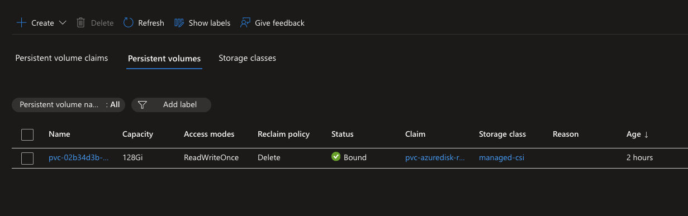

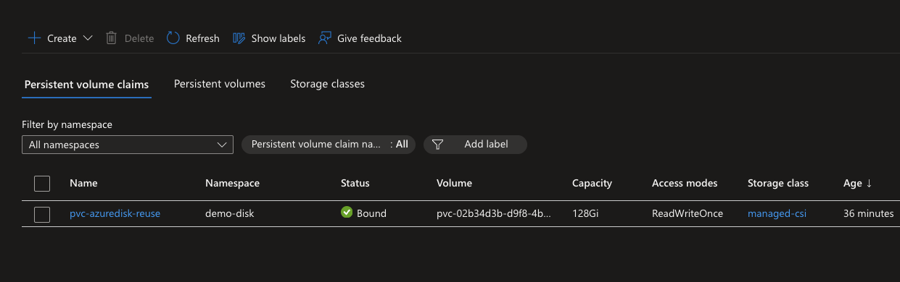


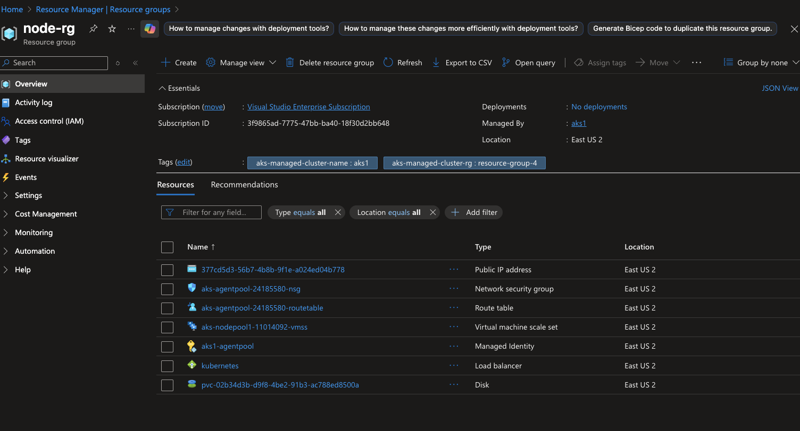

## Now lets delete the PVC 

```bash
kubectl delete deploy disk-writer -n demo-disk --ignore-not-found
kubectl delete deploy filebrowser -n demo-disk --ignore-not-found

kubectl delete pvc pvc-azuredisk-reuse -n demo-disk
kubectl get pv $PV
```

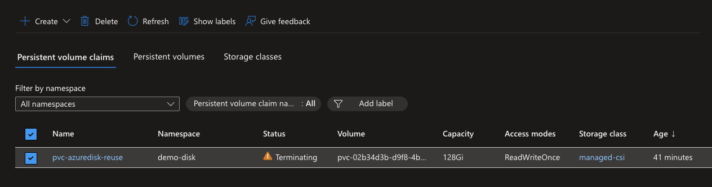

If it stuck like this and not deleting the n
Force remove the finalizer (safe if disk detached)

If the disk is not attached to any node, you can manually remove the finalizer:

```bash
kubectl patch pvc pvc-azuredisk-reuse -n demo-disk -p '{"metadata":{"finalizers":null}}'
```

Output:- 


NAME                                       CAPACITY   ACCESS MODES   RECLAIM POLICY   STATUS     CLAIM                           STORAGECLASS   VOLUMEATTRIBUTESCLASS   REASON   AGE
pvc-02b34d3b-d9f8-4be2-91b3-ac788ed8500a   128Gi      RWO            Delete           Released   demo-disk/pvc-azuredisk-reuse   managed-csi    <unset>                          154m

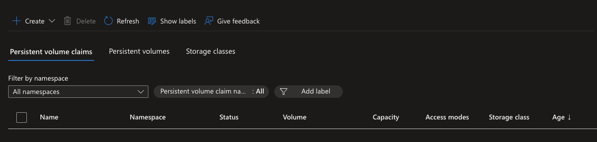

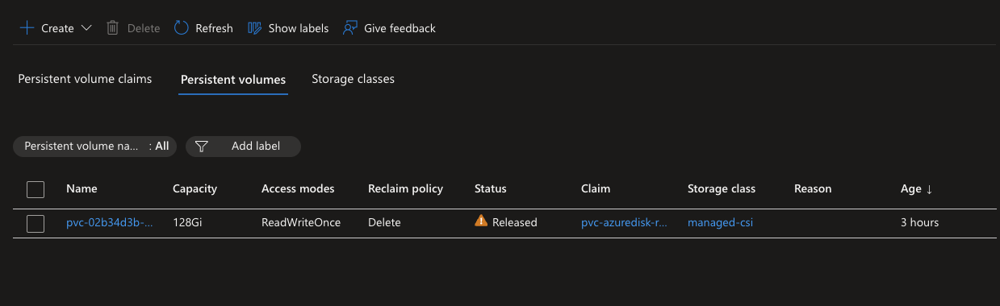

## Now delete the PV 

```
PV=pvc-02b34d3b-d9f8-4be2-91b3-ac788ed8500a
kubectl delete pv $PV
```

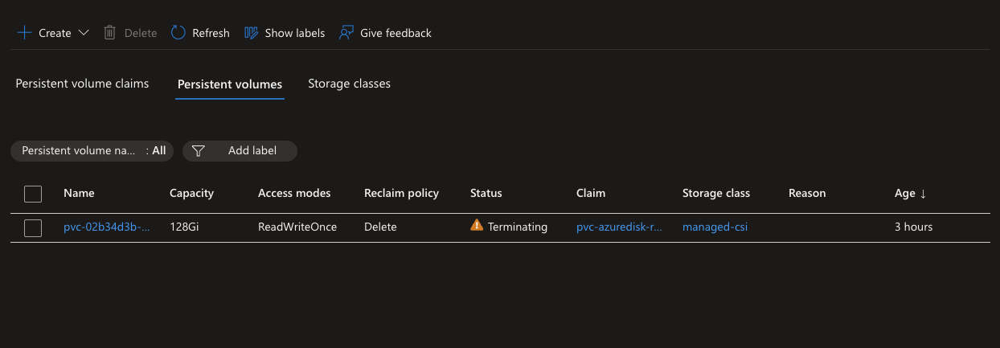


### In prarallel you can check th finalizer 
```bash
kubectl get pv $PV -o jsonpath='{.metadata.finalizers}'

```
When (and when not) to remove finalizers

✅ Use only as a last resort to unblock a stuck “Terminating” PV/PVC, and then delete the Azure Disk manually in Azure.

❌ Don’t remove finalizers if you expect Kubernetes to delete the disk for you.

Recommended flows

Want disk auto-deleted:
Keep finalizers; delete PVC first; ensure StorageClass reclaimPolicy: Delete.

Want to keep data:
Set PV (or StorageClass) reclaimPolicy: Retain. Delete PVC → PV becomes Released → you can safely reuse or manually delete the disk later.


## Remove finalizers (safe if not Bound)
```bash
kubectl patch pv $PV -p '{"metadata":{"finalizers":null}}'
```

```
kubectl delete pv $PV
```

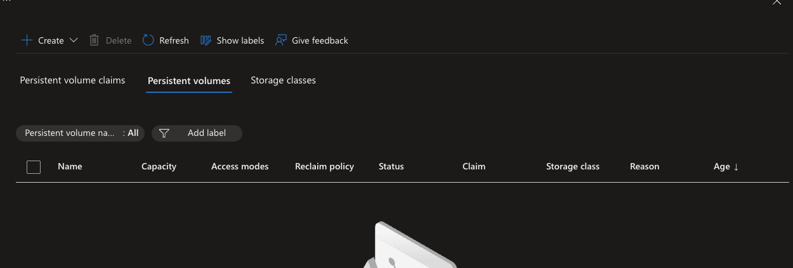

## because used finalizer it did not delete the Disk hence need to detach first from vm then delte it

```bash
# (Optional) confirm instance IDs
az vmss list-instances -g node-rg -n aks-nodepool1-11014092-vmss \
  --query "[].{id:instanceId,name:name}" -o table

# Detach from instance 0 at LUN 0
az vmss disk detach \
  --resource-group node-rg \
  --vmss-name aks-nodepool1-11014092-vmss \
  --instance-id 0 \
  --lun 0

```
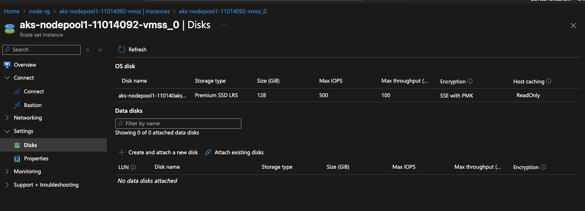


## Verivy 
```
az vmss get-instance-view -g node-rg -n aks-nodepool1-11014092-vmss --instance-id 0 \
  --query "disks" -o table
```

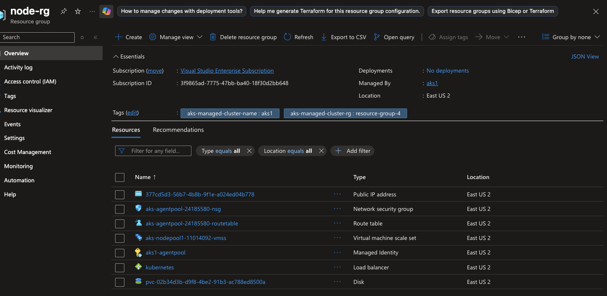

```bash
az disk delete -g node-rg -n pvc-02b34d3b-d9f8-4be2-91b3-ac788ed8500a --yes
```

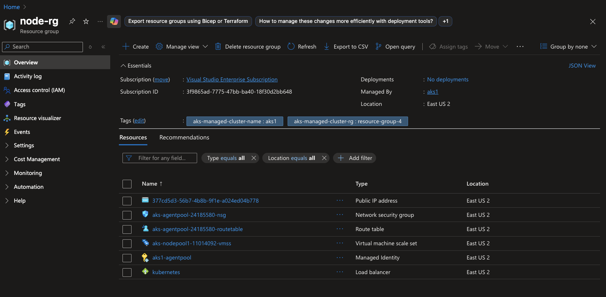

