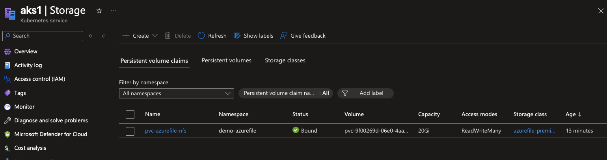
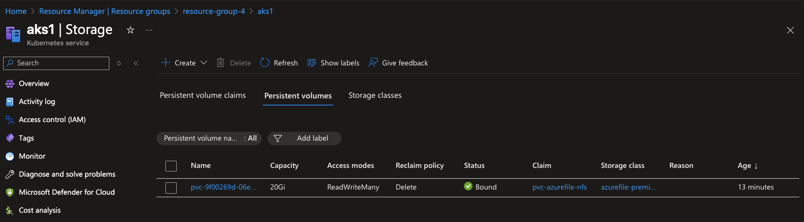
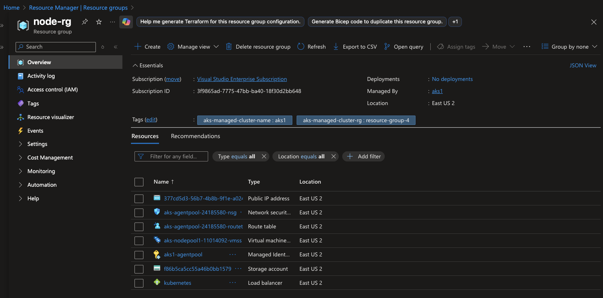
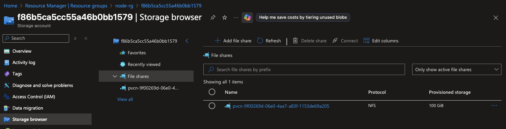
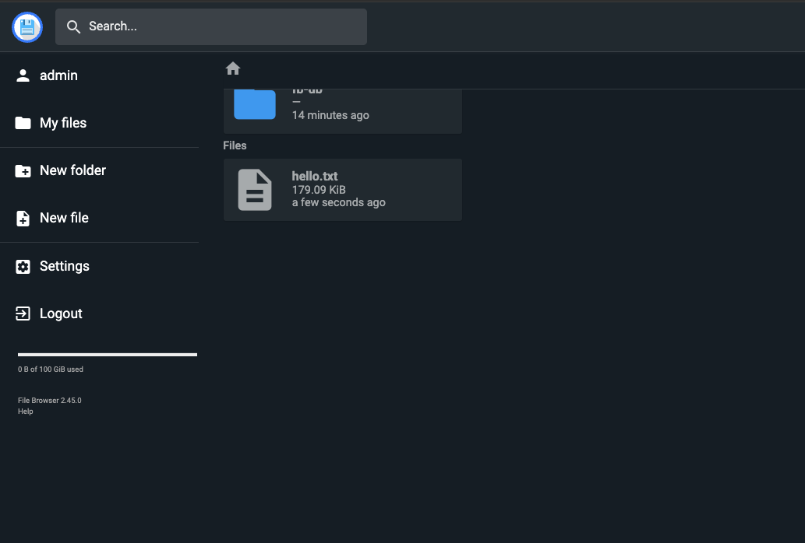
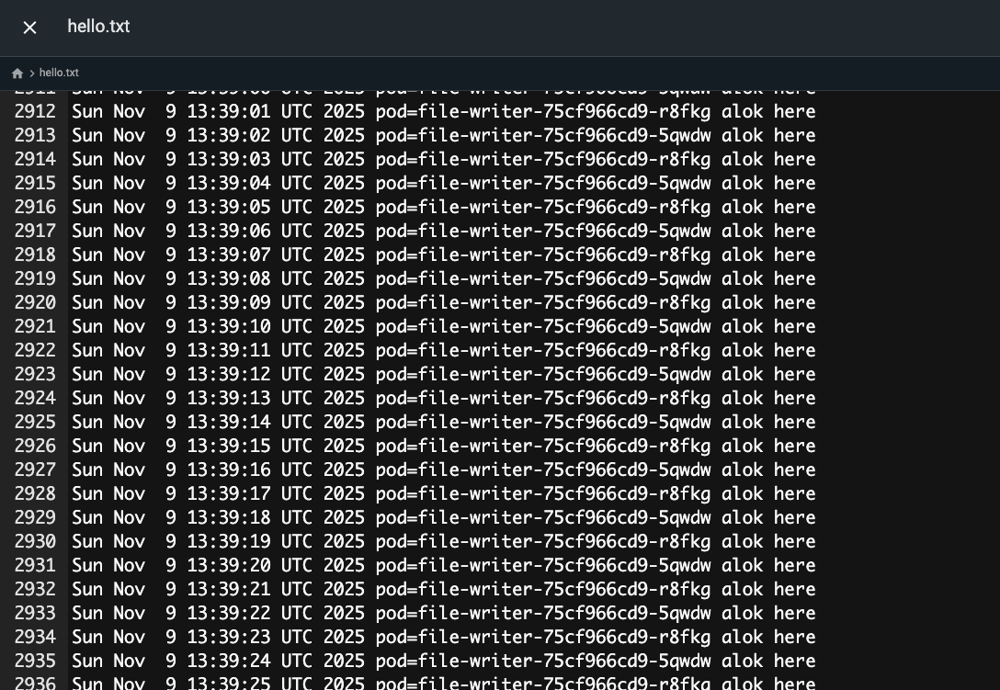

## Prereqs (sanity checks)

```bash
# K8s context points to your AKS cluster
kubectl cluster-info

# CSI driver for Azure File should be there on AKS
kubectl get csidrivers | grep file.csi.azure.com

```

Output:- 

```bash
kubectl get csidrivers | grep file.csi.azure.com
file.csi.azure.com   false            true             false             api://AzureADTokenExchange   false               Persistent,Ephemeral   9d
```

## 1) Create a StorageClass (Premium NFS)

01-sc-azurefile-premium-nfs.yaml
```yaml
apiVersion: storage.k8s.io/v1
kind: StorageClass
metadata:
  name: azurefile-premium-nfs
provisioner: file.csi.azure.com
parameters:
  skuName: Premium_LRS     # Premium files required for NFS
  protocol: nfs            # NFS 3.0
allowVolumeExpansion: true
reclaimPolicy: Delete
volumeBindingMode: Immediate
```

```bash
kubectl apply -f 07-aks-storage/02-file-storage/NFS-based-File-storage/NFS-based-File-storage/NFS-based-File-storage/01-sc-azurefile-premium-nfs.yaml
kubectl get sc
```

Output:-
```bash
 kubectl get sc
NAME                    PROVISIONER          RECLAIMPOLICY   VOLUMEBINDINGMODE      ALLOWVOLUMEEXPANSION   AGE
azurefile               file.csi.azure.com   Delete          Immediate              true                   9d
azurefile-csi           file.csi.azure.com   Delete          Immediate              true                   9d
azurefile-csi-premium   file.csi.azure.com   Delete          Immediate              true                   9d
azurefile-premium       file.csi.azure.com   Delete          Immediate              true                   9d
azurefile-premium-nfs   file.csi.azure.com   Delete          Immediate              true                   7s
default (default)       disk.csi.azure.com   Delete          WaitForFirstConsumer   true                   9d
managed                 disk.csi.azure.com   Delete          WaitForFirstConsumer   true                   9d
managed-csi             disk.csi.azure.com   Delete          WaitForFirstConsumer   true                   9d
managed-csi-premium     disk.csi.azure.com   Delete          WaitForFirstConsumer   true                   9d
managed-premium         disk.csi.azure.com   Delete          WaitForFirstConsumer   true                   9d
```

## Create a namespace

```bash
kubectl create ns demo-azurefile
```

## Create a RWX PVC - 
02-pvc-azurefile-nfs.yaml
```yaml
apiVersion: v1
kind: PersistentVolumeClaim
metadata:
  name: pvc-azurefile-nfs
  namespace: demo-azurefile
spec:
  accessModes: [ "ReadWriteMany" ]
  storageClassName: azurefile-premium-nfs
  resources:
    requests:
      storage: 20Gi
```
### Apply 

```bash
kubectl apply -f 07-aks-storage/02-file-storage/NFS-based-File-storage/NFS-based-File-storage/NFS-based-File-storage/02-pvc-azurefile-nfs.yaml
kubectl get pvc -n demo-azurefile
kubectl describe pvc pvc-azurefile-nfs -n demo-azurefile
```

Output:-
```bash
apply -f 07-aks-storage/02-file-storage/NFS-based-File-storage/NFS-based-File-storage/NFS-based-File-storage/02-pvc-azurefile-nfs.yaml
persistentvolumeclaim/pvc-azurefile-nfs created
alokadhao@192 azure % kubectl get pvc -n demo-azurefile
NAME                STATUS    VOLUME   CAPACITY   ACCESS MODES   STORAGECLASS            VOLUMEATTRIBUTESCLASS   AGE
pvc-azurefile-nfs   Pending                                      azurefile-premium-nfs   <unset>                 6s
alokadhao@192 azure % kubectl describe pvc pvc-azurefile-nfs -n demo-azurefile
Name:          pvc-azurefile-nfs
Namespace:     demo-azurefile
StorageClass:  azurefile-premium-nfs
Status:        Pending
Volume:        
Labels:        <none>
Annotations:   volume.beta.kubernetes.io/storage-provisioner: file.csi.azure.com
               volume.kubernetes.io/storage-provisioner: file.csi.azure.com
Finalizers:    [kubernetes.io/pvc-protection]
Capacity:      
Access Modes:  
VolumeMode:    Filesystem
Used By:       <none>
Events:
  Type    Reason                Age               From                                                                                               Message
  ----    ------                ----              ----                                                                                               -------
  Normal  Provisioning          18s               file.csi.azure.com_csi-azurefile-controller-59ffb55ff4-r7bbk_a13bf863-5259-4e9f-adcd-376b39ad5560  External provisioner is provisioning volume for claim "demo-azurefile/pvc-azurefile-nfs"
  Normal  ExternalProvisioning  3s (x3 over 18s)  persistentvolume-controller                                                                        Waiting for a volume to be created either by the external provisioner 'file.csi.azure.com' or manually by the system administrator. If volume creation is delayed, please verify that the provisioner is running and correctly registered.
```

## At this point we have the PVC 









## Now create deployment to use this fileshare

03-deploy-writers.yaml

```yaml
apiVersion: apps/v1
kind: Deployment
metadata:
  name: file-writer
  namespace: demo-azurefile
spec:
  replicas: 2
  selector:
    matchLabels:
      app: file-writer
  template:
    metadata:
      labels:
        app: file-writer
    spec:
      containers:
        - name: writer
          image: busybox:1.36
          command: ["/bin/sh","-c"]
          args:
            - |
              while true; do
                echo "$(date) pod=${HOSTNAME}" >> /mnt/share/hello.txt
                sleep 2
              done
          volumeMounts:
            - name: share
              mountPath: /mnt/share
      volumes:
        - name: share
          persistentVolumeClaim:
            claimName: pvc-azurefile-nfs
```

## Apply 

```bash
kubectl apply -f 07-aks-storage/02-file-storage/NFS-based-File-storage/03-deploy-writers.yaml
kubectl get pods -n demo-azurefile -l app=file-writer -o wide
```

## Confirm both pods are writing to the same file
Pick either pod name from the list and check the content:

```bash
POD=$(kubectl get pod -n demo-azurefile -l app=file-writer -o jsonpath='{.items[0].metadata.name}')
kubectl exec -n demo-azurefile $POD -- tail -n 20 /mnt/share/hello.txt
```

Output:-
```bash
get pods -n demo-azurefile -l app=file-writer -o wide
NAME                           READY   STATUS    RESTARTS   AGE   IP            NODE                                NOMINATED NODE   READINESS GATES
file-writer-5856d7d748-98q7j   1/1     Running   0          10s   10.244.2.17   aks-nodepool1-11014092-vmss000000   <none>           <none>
file-writer-5856d7d748-kp4jc   1/1     Running   0          9s    10.244.2.18   aks-nodepool1-11014092-vmss000000   <none>           <none>
alokadhao@192 azure % POD=$(kubectl get pod -n demo-azurefile -l app=file-writer -o jsonpath='{.items[0].metadata.name}')
kubectl exec -n demo-azurefile $POD -- tail -n 20 /mnt/share/hello.txt
Sun Nov  9 12:51:21 UTC 2025 pod=file-writer-5856d7d748-98q7j
Sun Nov  9 12:51:21 UTC 2025 pod=file-writer-5856d7d748-kp4jc
Sun Nov  9 12:51:23 UTC 2025 pod=file-writer-5856d7d748-98q7j
Sun Nov  9 12:51:23 UTC 2025 pod=file-writer-5856d7d748-kp4jc
Sun Nov  9 12:51:25 UTC 2025 pod=file-writer-5856d7d748-98q7j
Sun Nov  9 12:51:25 UTC 2025 pod=file-writer-5856d7d748-kp4jc
Sun Nov  9 12:51:27 UTC 2025 pod=file-writer-5856d7d748-98q7j
Sun Nov  9 12:51:27 UTC 2025 pod=file-writer-5856d7d748-kp4jc
Sun Nov  9 12:51:29 UTC 2025 pod=file-writer-5856d7d748-98q7j
Sun Nov  9 12:51:29 UTC 2025 pod=file-writer-5856d7d748-kp4jc
Sun Nov  9 12:51:31 UTC 2025 pod=file-writer-5856d7d748-98q7j
Sun Nov  9 12:51:31 UTC 2025 pod=file-writer-5856d7d748-kp4jc
Sun Nov  9 12:51:33 UTC 2025 pod=file-writer-5856d7d748-98q7j
Sun Nov  9 12:51:33 UTC 2025 pod=file-writer-5856d7d748-kp4jc
Sun Nov  9 12:51:35 UTC 2025 pod=file-writer-5856d7d748-98q7j
Sun Nov  9 12:51:35 UTC 2025 pod=file-writer-5856d7d748-kp4jc
Sun Nov  9 12:51:37 UTC 2025 pod=file-writer-5856d7d748-98q7j
Sun Nov  9 12:51:37 UTC 2025 pod=file-writer-5856d7d748-kp4jc
Sun Nov  9 12:51:39 UTC 2025 pod=file-writer-5856d7d748-98q7j
Sun Nov  9 12:51:39 UTC 2025 pod=file-writer-5856d7d748-kp4jc
```

## Check second pod as well
```bash
POD2=$(kubectl get pod -n demo-azurefile -l app=file-writer -o jsonpath='{.items[1].metadata.name}')
kubectl exec -n demo-azurefile $POD2 -- tail -n 20 /mnt/share/hello.txt
```

Output:-
```bash
POD2=$(kubectl get pod -n demo-azurefile -l app=file-writer -o jsonpath='{.items[1].metadata.name}')
kubectl exec -n demo-azurefile $POD2 -- tail -n 20 /mnt/share/hello.txt
Sun Nov  9 12:52:21 UTC 2025 pod=file-writer-5856d7d748-98q7j
Sun Nov  9 12:52:21 UTC 2025 pod=file-writer-5856d7d748-kp4jc
Sun Nov  9 12:52:23 UTC 2025 pod=file-writer-5856d7d748-98q7j
Sun Nov  9 12:52:23 UTC 2025 pod=file-writer-5856d7d748-kp4jc
Sun Nov  9 12:52:25 UTC 2025 pod=file-writer-5856d7d748-98q7j
Sun Nov  9 12:52:25 UTC 2025 pod=file-writer-5856d7d748-kp4jc
Sun Nov  9 12:52:27 UTC 2025 pod=file-writer-5856d7d748-98q7j
Sun Nov  9 12:52:27 UTC 2025 pod=file-writer-5856d7d748-kp4jc
Sun Nov  9 12:52:29 UTC 2025 pod=file-writer-5856d7d748-98q7j
Sun Nov  9 12:52:29 UTC 2025 pod=file-writer-5856d7d748-kp4jc
Sun Nov  9 12:52:31 UTC 2025 pod=file-writer-5856d7d748-98q7j
Sun Nov  9 12:52:31 UTC 2025 pod=file-writer-5856d7d748-kp4jc
Sun Nov  9 12:52:33 UTC 2025 pod=file-writer-5856d7d748-98q7j
Sun Nov  9 12:52:33 UTC 2025 pod=file-writer-5856d7d748-kp4jc
Sun Nov  9 12:52:35 UTC 2025 pod=file-writer-5856d7d748-98q7j
Sun Nov  9 12:52:35 UTC 2025 pod=file-writer-5856d7d748-kp4jc
Sun Nov  9 12:52:37 UTC 2025 pod=file-writer-5856d7d748-98q7j
Sun Nov  9 12:52:37 UTC 2025 pod=file-writer-5856d7d748-kp4jc
Sun Nov  9 12:52:39 UTC 2025 pod=file-writer-5856d7d748-98q7j
Sun Nov  9 12:52:39 UTC 2025 pod=file-writer-5856d7d748-kp4jc
```

# Useful inspections PV and PVC 

```bash
kubectl get pvc,pv -n demo-azurefile
NAME                                      STATUS   VOLUME                                     CAPACITY   ACCESS MODES   STORAGECLASS            VOLUMEATTRIBUTESCLASS   AGE
persistentvolumeclaim/pvc-azurefile-nfs   Bound    pvc-9f00269d-06e0-4aa7-a83f-1153de69a205   20Gi       RWX            azurefile-premium-nfs   <unset>                 64m

NAME                                                        CAPACITY   ACCESS MODES   RECLAIM POLICY   STATUS   CLAIM                              STORAGECLASS            VOLUMEATTRIBUTESCLASS   REASON   AGE
persistentvolume/pvc-9f00269d-06e0-4aa7-a83f-1153de69a205   20Gi       RWX            Delete           Bound    demo-azurefile/pvc-azurefile-nfs   azurefile-premium-nfs   <unset>                          64m
```

## Access The files using file browser
04-filebrowser.yaml

```yaml
apiVersion: apps/v1
kind: Deployment
metadata:
  name: filebrowser
  namespace: demo-azurefile
spec:
  replicas: 1
  selector:
    matchLabels: { app: filebrowser }
  template:
    metadata:
      labels: { app: filebrowser }
    spec:
      containers:
        - name: filebrowser
          image: filebrowser/filebrowser:latest
          args: ["--port", "8080", "/srv"]   # serve /srv
          ports:
            - containerPort: 8080
          volumeMounts:
            - name: share
              mountPath: /srv               # this is your Azure Files share
          # Optional: set an initial admin user/password
          env:
            - name: FB_AUTH_METHOD
              value: "native"
            - name: FB_USERNAME
              value: "admin"
            - name: FB_PASSWORD
              value: "admin123"            # change after first login
      volumes:
        - name: share
          persistentVolumeClaim:
            claimName: pvc-azurefile-nfs
---
apiVersion: v1
kind: Service
metadata:
  name: filebrowser
  namespace: demo-azurefile
spec:
  selector: { app: filebrowser }
  ports:
    - name: http
      port: 8080
      targetPort: 8080
  type: ClusterIP


```bash
kubectl apply -f 07-aks-storage/02-file-storage/NFS-based-File-storage/NFS-based-File-storage/04-filebrowser.yaml
kubectl get pods -n demo-azurefile
```


```bash

kubectl rollout status -n demo-azurefile deploy/filebrowser
deployment "filebrowser" successfully rolled out
alokadhao@192 azure % kubectl logs deploy/filebrowser -n demo-disk --tail=50
error: error from server (NotFound): deployments.apps "filebrowser" not found in namespace "demo-disk"
alokadhao@192 azure % kubectl logs deploy/filebrowser -n demo-azurefile --tail=50
2025/11/09 13:25:57 Warning: filebrowser.db can't be found. Initialing in /database/
2025/11/09 13:25:57 Using database: /database/filebrowser.db
2025/11/09 13:25:57 Using config file: /config/settings.json
2025/11/09 13:25:57 Performing quick setup
2025/11/09 13:25:57 User 'admin' initialized with randomly generated password: ubkxEfFxE3FYjXgr
2025/11/09 13:25:57 Listening on [::]:8080

```

```bash
kubectl port-forward -n demo-azurefile deploy/filebrowser 8080:8080
```

# Validate the pod file structure 
```bash
kubectl -n demo-azurefile exec -it deploy/filebrowser -- sh -c 'ls -al /srv; ls -al /database'

total 167
drwxrwxrwx    2 root     root           128 Nov  9 13:25 .
drwxr-xr-x    1 root     root          4096 Nov  9 13:25 ..
drwxrwxrwx    2 root     root            64 Nov  9 13:25 fb-db
-rw-r--r--    1 root     root        165416 Nov  9 13:35 hello.txt
total 69
drwxrwxrwx    2 root     root            64 Nov  9 13:25 .
drwxr-xr-x    1 root     root          4096 Nov  9 13:25 ..
-rw-r-----    1 user     user         65536 Nov  9 13:25 filebrowser.db
```





## NFS file share cannot be accessed from the browser or the Microsoft Azure storage explorer

```
You’re using an Azure File share mounted via NFS (protocol nfs) — and Microsoft Azure Storage Explorer only supports SMB-based Azure File shares, not NFS.

In NFS mode, files are visible only via NFS clients (Linux, AKS pods, etc.), not via the Azure Portal “Storage browser” or Storage Explorer GUI.

That’s why the share appears in Storage Explorer but shows:

“No data available”

Even though your AKS pods are successfully reading/writing (via NFS), the GUI can’t enumerate the contents.
```

```
| Method                             | Works with NFS | Notes                                                         |
| ---------------------------------- | -------------- | ------------------------------------------------------------- |
| **AKS pod exec**                   | ✅              | `kubectl exec -it <filebrowser or writer pod> -- ls -al /srv` |
| **Linux VM mount**                 | ✅              | Mount manually:<br>`sudo mount -t nfs <nfs-path> /mnt`        |
| **Storage Explorer**               | ❌              | Works only for SMB shares                                     |
| **Azure Portal “Storage browser”** | ❌              | Also SMB-only                                                 |
```