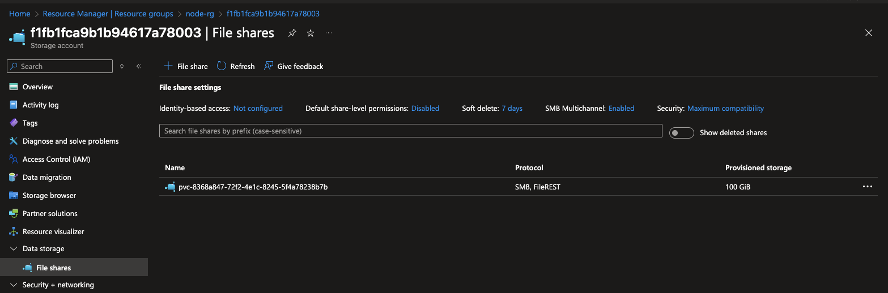
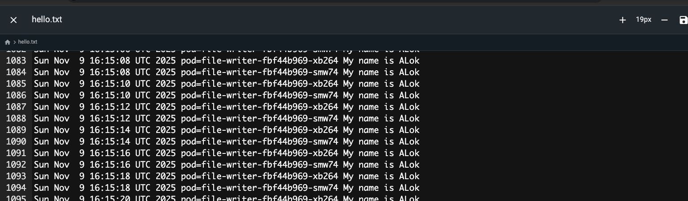
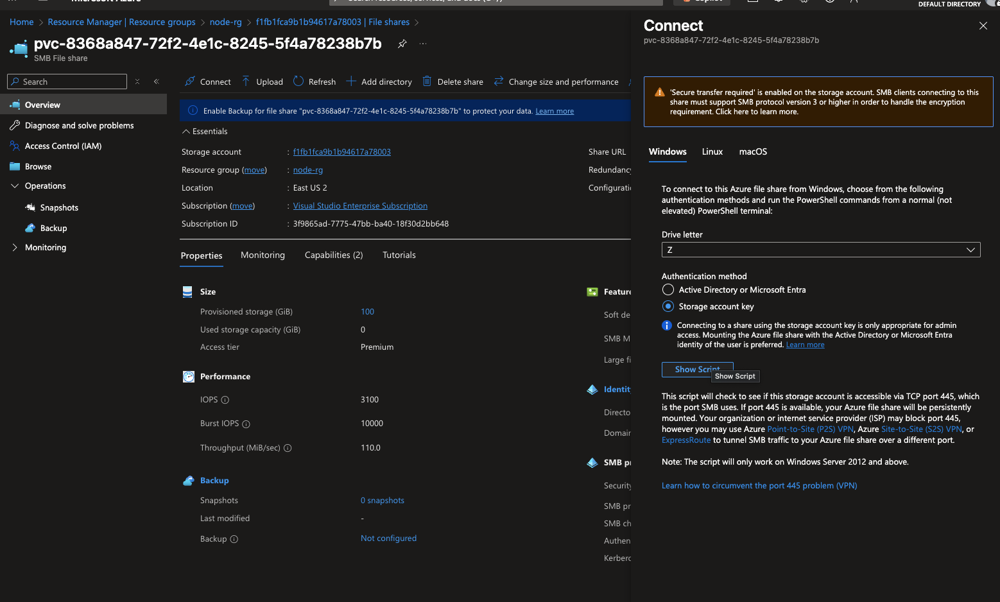
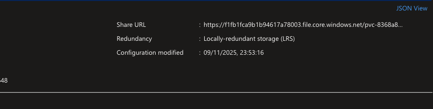
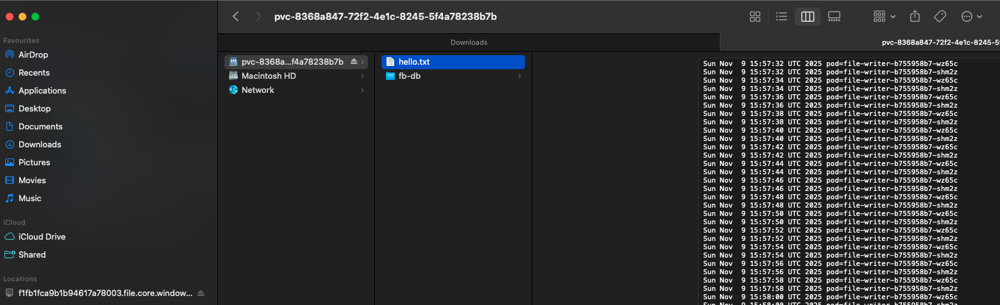

# SMB based file storage 

## Step 0: Create a new namespace
```bash
kubectl create namespace demo-azurefile-smb
```

## Step 1: StorageClass (SMB)


```yaml
# 01-sc-azurefile-premium-smb.yaml
apiVersion: storage.k8s.io/v1
kind: StorageClass
metadata:
  name: azurefile-premium-smb
provisioner: file.csi.azure.com
parameters:
  skuName: Premium_LRS
  protocol: smb
allowVolumeExpansion: true
reclaimPolicy: Delete
volumeBindingMode: Immediate
```

```bash
kubectl apply -f 07-aks-storage/02-file-storage/SMB-based-File-storage/01-sc-azurefile-premium-smb.yaml
kubectl get sc
```
Output
```bash
kubectl get sc
NAME                    PROVISIONER          RECLAIMPOLICY   VOLUMEBINDINGMODE      ALLOWVOLUMEEXPANSION   AGE
azurefile               file.csi.azure.com   Delete          Immediate              true                   9d
azurefile-csi           file.csi.azure.com   Delete          Immediate              true                   9d
azurefile-csi-premium   file.csi.azure.com   Delete          Immediate              true                   9d
azurefile-premium       file.csi.azure.com   Delete          Immediate              true                   9d
azurefile-premium-nfs   file.csi.azure.com   Delete          Immediate              true                   4h6m
azurefile-premium-smb   file.csi.azure.com   Delete          Immediate              true                   83s
default (default)       disk.csi.azure.com   Delete          WaitForFirstConsumer   true                   9d
managed                 disk.csi.azure.com   Delete          WaitForFirstConsumer   true                   9d
managed-csi             disk.csi.azure.com   Delete          WaitForFirstConsumer   true                   9d
managed-csi-premium     disk.csi.azure.com   Delete          WaitForFirstConsumer   true                   9d
managed-premium         disk.csi.azure.com   Delete          WaitForFirstConsumer   true                   9d
```

## Step 2: PVC (SMB share with RWX)
```yaml
# 02-pvc-azurefile-smb.yaml
apiVersion: v1
kind: PersistentVolumeClaim
metadata:
  name: pvc-azurefile-smb
  namespace: demo-azurefile-smb
spec:
  accessModes:
    - ReadWriteMany
  storageClassName: azurefile-premium-smb
  resources:
    requests:
      storage: 10Gi
```

```bash
kubectl apply -f 07-aks-storage/02-file-storage/SMB-based-File-storage/02-pvc-azurefile-smb.yaml
kubectl -n demo-azurefile-smb get pvc
```


```bash
kubectl -n demo-azurefile-smb get pvc
NAME                STATUS   VOLUME                                     CAPACITY   ACCESS MODES   STORAGECLASS            VOLUMEATTRIBUTESCLASS   AGE
pvc-azurefile-smb   Bound    pvc-8368a847-72f2-4e1c-8245-5f4a78238b7b   10Gi       RWX            azurefile-premium-smb   <unset>                 2m53s
```

## Create deployment 

```yaml
# 03-deploy-writer.yaml
apiVersion: apps/v1
kind: Deployment
metadata:
  name: file-writer
  namespace: demo-azurefile-smb
spec:
  replicas: 2
  selector:
    matchLabels:
      app: file-writer
  template:
    metadata:
      labels:
        app: file-writer
    spec:
      containers:
        - name: writer
          image: busybox:1.36
          command: ["/bin/sh", "-c"]
          args:
            - |
              while true; do
                echo "$(date) pod=${HOSTNAME}" >> /mnt/share/hello.txt
                sleep 2
              done
          volumeMounts:
            - name: share
              mountPath: /mnt/share
      volumes:
        - name: share
          persistentVolumeClaim:
            claimName: pvc-azurefile-smb
```

```bash
kubectl apply -f 07-aks-storage/02-file-storage/SMB-based-File-storage/03-deploy-writer.yaml
kubectl -n demo-azurefile-smb get pods -l app=file-writer -o wide
```

```bash
kubectl apply -f 07-aks-storage/02-file-storage/SMB-based-File-storage/02-pvc-azurefile-smb.yaml
persistentvolumeclaim/pvc-azurefile-smb created
alokadhao@192 azure % kubectl -n demo-azurefile-smb get pvc
NAME                STATUS   VOLUME                                     CAPACITY   ACCESS MODES   STORAGECLASS            VOLUMEATTRIBUTESCLASS   AGE
pvc-azurefile-smb   Bound    pvc-8368a847-72f2-4e1c-8245-5f4a78238b7b   10Gi       RWX            azurefile-premium-smb   <unset>                 2m53s
alokadhao@192 azure % clear
alokadhao@192 azure % kubectl apply -f 07-aks-storage/02-file-storage/SMB-based-File-storage/03-deploy-writer.yaml
deployment.apps/file-writer created
alokadhao@192 azure % kubectl -n demo-azurefile-smb get pods -l app=file-writer -o wide
NAME                          READY   STATUS    RESTARTS   AGE   IP            NODE                                NOMINATED NODE   READINESS GATES
file-writer-b755958b7-shm2z   1/1     Running   0          14s   10.244.2.25   aks-nodepool1-11014092-vmss000000   <none>           <none>
file-writer-b755958b7-wz65c   1/1     Running   0          14s   10.244.2.24   aks-nodepool1-11014092-vmss000000   <none>           <none>
alokadhao@192 azure % POD=$(kubectl -n demo-azurefile-smb get pod -l app=file-writer -o jsonpath='{.items[0].metadata.name}')
kubectl -n demo-azurefile-smb exec -it $POD -- tail -n 5 /mnt/share/hello.txt

Sun Nov  9 15:58:02 UTC 2025 pod=file-writer-b755958b7-shm2z
Sun Nov  9 15:58:04 UTC 2025 pod=file-writer-b755958b7-wz65c
Sun Nov  9 15:58:04 UTC 2025 pod=file-writer-b755958b7-shm2z
Sun Nov  9 15:58:06 UTC 2025 pod=file-writer-b755958b7-wz65c
Sun Nov  9 15:58:06 UTC 2025 pod=file-writer-b755958b7-shm2z
```

## A new storage account and in that another File share is created. 



## This one can be connected using Microsoft Azure Storage Explorer


## Create file browser 

```yaml
apiVersion: apps/v1
kind: Deployment
metadata:
  name: filebrowser
  namespace: demo-azurefile
spec:
  replicas: 1
  selector:
    matchLabels:
      app: filebrowser
  template:
    metadata:
      labels:
        app: filebrowser
    spec:
      securityContext:
        runAsUser: 1000
        runAsGroup: 1000
        fsGroup: 1000
        fsGroupChangePolicy: "OnRootMismatch"
      containers:
        - name: fb
          image: filebrowser/filebrowser:latest
          args:
            - --port
            - "8080"
            - --address
            - "0.0.0.0"
            - --root
            - /srv
            - --database
            - /database/filebrowser.db
          ports:
            - containerPort: 8080
          volumeMounts:
            - name: data
              mountPath: /srv
            - name: data
              mountPath: /database
              subPath: fb-db
          # optional: auto-create admin on first run if DB doesn't exist
          lifecycle:
            postStart:
              exec:
                command:
                  - sh
                  - -c
                  - |
                    if [ ! -f /database/filebrowser.db ]; then
                      filebrowser -r /srv config init && \
                      filebrowser -r /srv users add admin admin123 --perm.admin;
                    fi
      volumes:
        - name: data
          persistentVolumeClaim:
            claimName: pvc-azurefile-smb   # <- your Azure Files PVC name
---
apiVersion: v1
kind: Service
metadata:
  name: filebrowser
  namespace: demo-azurefile
spec:
  selector:
    app: filebrowser
  ports:
    - name: http
      port: 8080
      targetPort: 8080
  type: ClusterIP
```

```bash
kubectl apply -f 07-aks-storage/02-file-storage/SMB-based-File-storage/03-deploy-writer.yaml
deployment.apps/file-writer created
alokadhao@192 azure % kubectl -n demo-azurefile-smb get pods -l app=file-writer -o wide
NAME                          READY   STATUS    RESTARTS   AGE   IP            NODE                                NOMINATED NODE   READINESS GATES
file-writer-b755958b7-shm2z   1/1     Running   0          14s   10.244.2.25   aks-nodepool1-11014092-vmss000000   <none>           <none>
file-writer-b755958b7-wz65c   1/1     Running   0          14s   10.244.2.24   aks-nodepool1-11014092-vmss000000   <none>           <none>
alokadhao@192 azure % POD=$(kubectl -n demo-azurefile-smb get pod -l app=file-writer -o jsonpath='{.items[0].metadata.name}')
kubectl -n demo-azurefile-smb exec -it $POD -- tail -n 5 /mnt/share/hello.txt

Sun Nov  9 15:58:02 UTC 2025 pod=file-writer-b755958b7-shm2z
Sun Nov  9 15:58:04 UTC 2025 pod=file-writer-b755958b7-wz65c
Sun Nov  9 15:58:04 UTC 2025 pod=file-writer-b755958b7-shm2z
Sun Nov  9 15:58:06 UTC 2025 pod=file-writer-b755958b7-wz65c
Sun Nov  9 15:58:06 UTC 2025 pod=file-writer-b755958b7-shm2z
```

```bash
kubectl apply -f 07-aks-storage/02-file-storage/SMB-based-File-storage/04-filebrowser.yaml
kubectl get pods -n demo-azurefile
```

Output:-
```bash
kubectl apply -f 07-aks-storage/02-file-storage/SMB-based-File-storage/04-filebrowser.yaml
```

```bash
kubectl logs deploy/filebrowser -n demo-azurefile-smb --tail=50
```

Output:-
```bash
alokadhao@192 azure % kubectl logs deploy/filebrowser -n demo-azurefile-smb --tail=50
2025/11/09 16:08:12 Warning: filebrowser.db can't be found. Initialing in /database/
2025/11/09 16:08:12 Using database: /database/filebrowser.db
2025/11/09 16:08:12 Using config file: /config/settings.json
2025/11/09 16:08:12 Performing quick setup
2025/11/09 16:08:12 User 'admin' initialized with randomly generated password: aylNzJxpwYAHX8Ad
2025/11/09 16:08:12 Listening on [::]:8080

kubectl port-forward -n demo-azurefile-smb deploy/filebrowser 8080:8080
```




## how to connect SMB storage to MAC machine

### GOTO File 



Click on show script 



From Above Image you will get the URL 
Username:- Azure\f1fb1fca9b1b94617a78003 
Password:- you will get in Show Script

username is Azure\<StorageAccountName>

Now in Mac:- GO -> Connect To Server


Provide Username and Password and Connect
 
 


 ```bash
 | **Scenario**                                                               | **Choose** | **Why**                                                          |
| -------------------------------------------------------------------------- | ---------- | ---------------------------------------------------------------- |
| AKS pods running **Linux containers** that need shared writable storage    | 🟢 **NFS** | Simpler, faster, fully POSIX-compliant, doesn’t need credentials |
| You need to share data between **Windows and Linux** systems               | 🟢 **SMB** | Cross-platform, SMB works on both                                |
| Application expects **Windows-style permissions / ACLs**                   | 🟢 **SMB** | SMB supports NTFS ACLs and Active Directory auth                 |
| Cluster is **inside a private VNet only** and security isolation is strict | 🟢 **NFS** | Private VNet-based access, no public endpoint exposure           |
| You need to **mount the share manually from your local machine** (Windows) | 🟢 **SMB** | Easy with `net use` or “Map Network Drive”                       |
| You need to **host large data sets for analytics (Linux workloads)**       | 🟢 **NFS** | Better streaming throughput and I/O parallelism                  |
| You want **AAD integration** (identity-based access)                       | 🟢 **SMB** | SMB supports Azure AD DS / Kerberos authentication               |
```

```bash
| Environment                                | Best Choice |
| ------------------------------------------ | ----------- |
| **Linux-only AKS workloads**               | **NFS**     |
| **Windows or mixed workloads**             | **SMB**     |
| **Private VNet only (no public endpoint)** | **NFS**     |
| **Identity/AAD-based access control**      | **SMB**     |

```