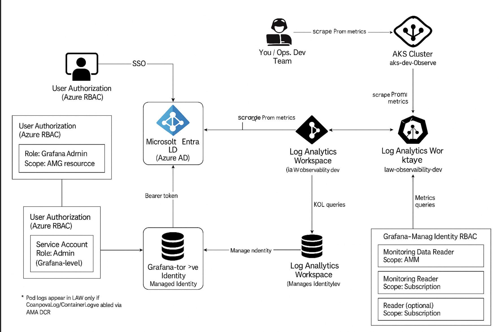
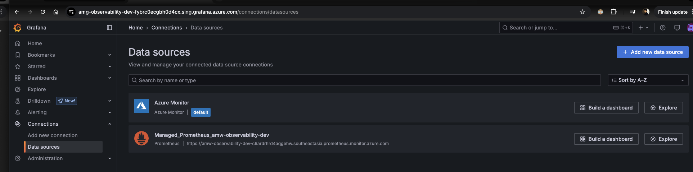
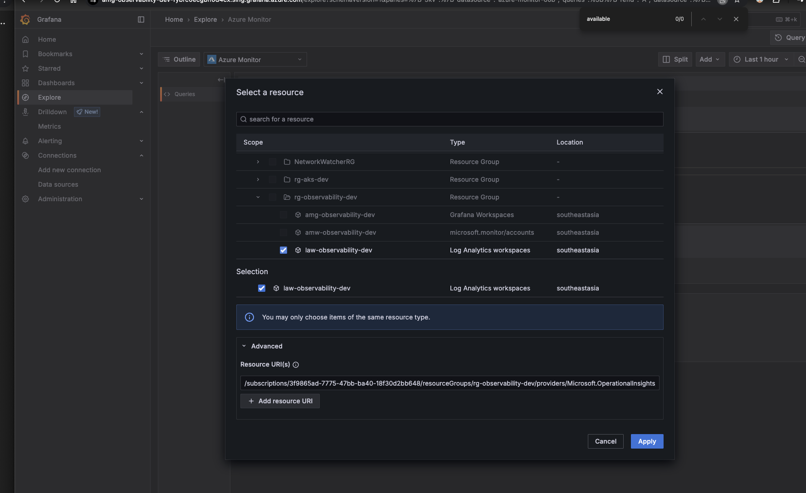
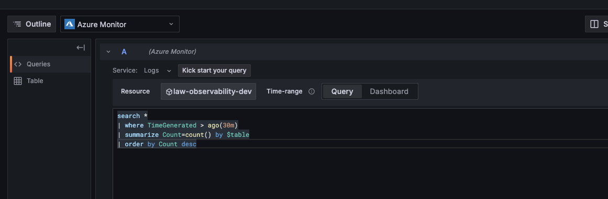
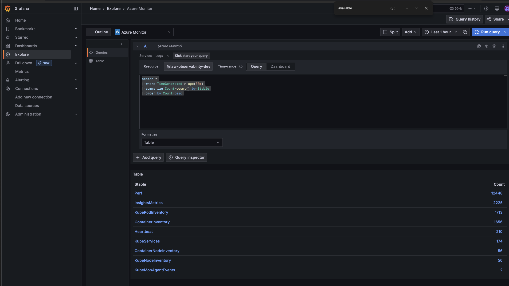
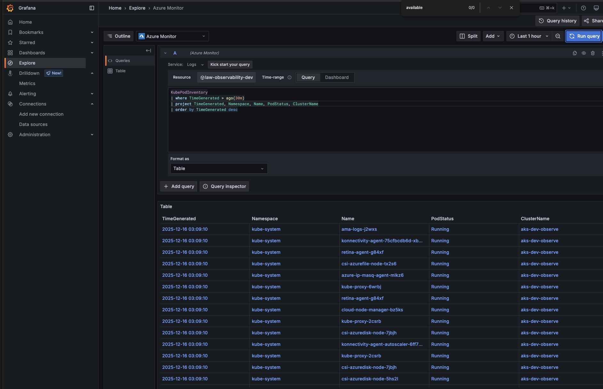
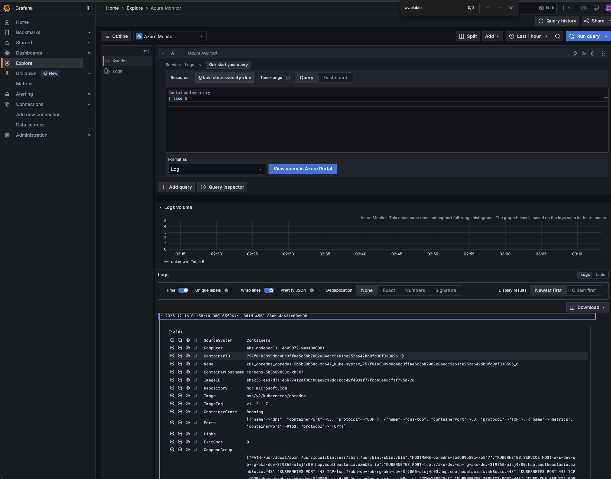

# Architecture



# Set variables (edit these)

```
# Basics
export LOCATION="southeastasia"
export RG="rg-observability-dev"

# Workspaces
export LAW="law-observability-dev"
export AMW="amw-observability-dev"          # Azure Monitor workspace (Prometheus storage)

# Grafana
export AMG="amg-observability-dev"

# AKS
export AKS_RG="rg-aks-dev"
export AKS_NAME="aks-dev-observe"
export AKS_NODE_COUNT=2
export AKS_NODE_SIZE="Standard_D4s_v5"
```

1) Pre-req: ensure Azure CLI supports the needed commands

1A) (Important) Remove aks-preview if installed (AKS monitoring doc requirement)

```
az extension remove --name aks-preview || true
```

1B) Register required resource providers

```
az provider register --namespace Microsoft.ContainerService
az provider register --namespace Microsoft.Insights
az provider register --namespace Microsoft.AlertsManagement
az provider register --namespace Microsoft.Monitor
az provider register --namespace Microsoft.Dashboard

```

2) Create Resource Groups
```
az group create -n "$RG" -l "$LOCATION"
az group create -n "$AKS_RG" -l "$LOCATION"
```

3) Create Log Analytics Workspace (for logs)
```
az monitor log-analytics workspace create \
  -g "$RG" \
  --workspace-name "$LAW" \
  -l "$LOCATION"

```

3.1. Get its resource id:
```
export LAW_ID=$(az monitor log-analytics workspace show -g "$RG" -n "$LAW" --query id -o tsv)
echo "$LAW_ID"

```
Output
```
/subscriptions/3f9865ad-7775-47bb-ba40-18f30d2bb648/resourceGroups/rg-observability-dev/providers/Microsoft.OperationalInsights/workspaces/law-observability-dev
```

4) Create Azure Monitor Workspace (for Managed Prometheus storage)
This is the workspace type used by Azure Monitor managed service for Prometheus. 
```
az monitor account create \
  -g "$RG" \
  -n "$AMW" \
  -l "$LOCATION"
```

4.1 Get its resource id:
```
export AMW_ID=$(az monitor account show -g "$RG" -n "$AMW" --query id -o tsv)
echo "$AMW_ID"
```

Output:-
```
/subscriptions/3f9865ad-7775-47bb-ba40-18f30d2bb648/resourcegroups/rg-observability-dev/providers/microsoft.monitor/accounts/amw-observability-dev
```

5) Create Azure Managed Grafana
```
az grafana create \
  -g "$RG" \
  -n "$AMG"
```

Output:-
```
az grafana create \
  -g "$RG" \
  -n "$AMG"

```

5.1 Get its resource id + principal id (managed identity):
```
export AMG_ID=$(az grafana show -g "$RG" -n "$AMG" --query id -o tsv)
export AMG_PRINCIPAL_ID=$(az grafana show -g "$RG" -n "$AMG" --query identity.principalId -o tsv)

echo "$AMG_ID"
echo "$AMG_PRINCIPAL_ID"
```

Output:-
```
/subscriptions/3f9865ad-7775-47bb-ba40-18f30d2bb648/resourceGroups/rg-observability-dev/providers/Microsoft.Dashboard/grafana/amg-observability-dev
06b5b876-7eaa-4579-a419-3e23b0e7c80b
```

6) Give Grafana permission to read Prometheus metrics in the Azure Monitor Workspace
```
az role assignment create \
  --assignee-object-id "$AMG_PRINCIPAL_ID" \
  --assignee-principal-type ServicePrincipal \
  --role "Monitoring Data Reader" \
  --scope "$AMW_ID"

```

7) Create AKS (managed identity) + enable Managed Prometheus metrics
```
az aks create \
  -g "$AKS_RG" \
  -n "$AKS_NAME" \
  -l "$LOCATION" \
  --node-count "$AKS_NODE_COUNT" \
  --node-vm-size "$AKS_NODE_SIZE" \
  --enable-managed-identity \
  --enable-azure-monitor-metrics \
  --azure-monitor-workspace-resource-id "$AMW_ID" \
  --grafana-resource-id "$AMG_ID" \
  --generate-ssh-keys

```

That --grafana-resource-id links AKS → Grafana in the onboarding flow.

8) Enable Container Logs (AKS → Log Analytics)
```
az aks enable-addons \
  -g "$AKS_RG" \
  -n "$AKS_NAME" \
  --addons monitoring \
  --workspace-resource-id "$LAW_ID"

```

9) Quick validation commands
Check AKS has Prometheus + monitoring enabled
```
az aks show -g "$AKS_RG" -n "$AKS_NAME" -o table

```

Outout
```
azure % az aks get-credentials -g "$AKS_RG" -n "$AKS_NAME" --overwrite-existing

kubectl get pods -n kube-system | egrep "ama-|omsagent|metrics|prom"
Merged "aks-dev-observe" as current context in /Users/alokadhao/.kube/config
ama-logs-j2wxs                                   3/3     Running   0               4m4s
ama-logs-rs-55db4bbb6c-fnxcl                     2/2     Running   0               4m4s
ama-logs-vr5mq                                   3/3     Running   0               4m4s
ama-metrics-878fc69fc-w567m                      2/2     Running   0               7m17s
ama-metrics-878fc69fc-zwvrb                      2/2     Running   0               7m17s
ama-metrics-ksm-698f6dcc7d-mfrsm                 1/1     Running   0               7m17s
ama-metrics-node-cz22t                           2/2     Running   0               7m17s
ama-metrics-node-ztj7t                           2/2     Running   0               7m17s
ama-metrics-operator-targets-6ff5994844-9dlrf    2/2     Running   2 (6m52s ago)   7m17s
metrics-server-66b7768944-r4m72                  2/2     Running   0               10m
metrics-server-66b7768944-ttjlc                  2/2     Running   0               10m
```

Now we’ll finish the end-to-end monitoring by doing these next steps (all via az):

Give Grafana the right RBAC (so it can read Azure metrics + Logs + Prometheus)

Verify Grafana can see the data sources (via API)

Create 1–2 baseline alert rules (via az) so this becomes a real monitoring solution

Now we’ll finish the end-to-end monitoring by doing these next steps (all via az):

Give Grafana the right RBAC (so it can read Azure metrics + Logs + Prometheus)

Verify Grafana can see the data sources (via API)

Create 1–2 baseline alert rules (via az) so this becomes a real monitoring solution

Step 1 — Grant Azure RBAC permissions to Grafana Managed Identity

You already granted Monitoring Data Reader on the Azure Monitor Workspace (AMW) earlier (good).

Now add these:

1A) Let Grafana read Azure resource metrics (platform metrics)

Needed for Azure Monitor metrics (VMs, LB, AppGW, etc.)

```

export SUB_ID=$(az account show --query id -o tsv)

az role assignment create \
  --assignee-object-id "$AMG_PRINCIPAL_ID" \
  --assignee-principal-type ServicePrincipal \
  --role "Monitoring Reader" \
  --scope "/subscriptions/$SUB_ID"
```

1B) Let Grafana query Log Analytics logs
```
az role assignment create \
  --assignee-object-id "$AMG_PRINCIPAL_ID" \
  --assignee-principal-type ServicePrincipal \
  --role "Log Analytics Reader" \
  --scope "$LAW_ID"

```

(Optional but commonly needed) If you want Grafana to browse resources (nice UX for picking resources in panels):

```
az role assignment create \
  --assignee-object-id "$AMG_PRINCIPAL_ID" \
  --assignee-principal-type ServicePrincipal \
  --role "Reader" \
  --scope "/subscriptions/$SUB_ID"

```

Step 2 — Verify Grafana is reachable + list its datasources using az (no UI needed)
2A) Get Grafana endpoint

Output
```
https://amg-observability-dev-fybrc0ecgbh0d4cx.sing.grafana.azure.com
```

2B) Get an AAD token for Grafana API
```
export GRAFANA_TOKEN=$(az account get-access-token \
  --resource "https://grafana.azure.com" \
  --query accessToken -o tsv)

echo "token_length=$(echo -n $GRAFANA_TOKEN | wc -c)"


```

Step 1 — Give your user “Grafana Admin” on the Grafana workspace (RBAC)
1A) Capture Grafana resource id

```
export AMG_ID=$(az grafana show -g "$RG" -n "$AMG" --query id -o tsv)
echo "$AMG_ID"
```

1B) Get your AAD object id

```
export ME_OBJECT_ID=$(az ad signed-in-user show --query id -o tsv)
echo "$ME_OBJECT_ID"

```

1C) Assign Grafana Admin role and editor role to yourself
```
az role assignment create \
  --assignee-object-id "$ME_OBJECT_ID" \
  --assignee-principal-type User \
  --role "Grafana Admin" \
  --scope "$AMG_ID"

az role assignment create \
  --assignee-object-id "$ME_OBJECT_ID" \
  --assignee-principal-type User \
  --role "Grafana Editor" \
  --scope "$AMG_ID"

```

Step 3 — Get token again + call Grafana API
```
export GRAFANA_TOKEN=$(az account get-access-token \
  --resource "https://grafana.azure.com" \
  --query accessToken -o tsv)

echo "token_length=$(echo -n $GRAFANA_TOKEN | wc -c)"

```

Ensure the amg extension is installed/updated
```
az extension add --name amg --upgrade
az extension update --name amg
```
Step 2 — Enable Service Accounts (and API tokens) on Azure Managed Grafana

If service accounts aren’t enabled, token creation will fail. Microsoft supports enabling this via CLI.
```
az grafana update \
  -g "$RG" \
  -n "$AMG" \
  --service-account Enabled
```

Step 3 — Create a Grafana Service Account (Admin)
```
export GRAFANA_SA="sa-automation"

az grafana service-account create \
  -g "$RG" \
  -n "$AMG" \
  --service-account "$GRAFANA_SA" \
  --role Admin

```


Step 4 — Create a Service Account Token (this is what we’ll use to call /api/*)
```
export GRAFANA_SA_TOKEN_NAME="token-automation"

az grafana service-account token create \
  -g "$RG" \
  -n "$AMG" \
  --service-account "$GRAFANA_SA" \
  --token "$GRAFANA_SA_TOKEN_NAME" \
  --time-to-live 7d \
  -o json

```

```
You will only be able to view this token here once. Please save it in a secure place.
{
  "id": 1,
  "key": "glsa_g8yLqoV5DcPOk7OPPB7sMjleunfIFvYY_4bc4a584",
  "name": "token-automation"
}
alokadhao@192 azure % 

export GRAFANA_HTTP_TOKEN="glsa_g8yLqoV5DcPOk7OPPB7sMjleunfIFvYY_4bc4a584"
```

2C) List datasources (should include Azure Monitor)

```
az rest \
  --method get \
  --uri "${GRAFANA_URL%/}/api/datasources" \
  --headers "Authorization=Bearer $GRAFANA_HTTP_TOKEN"

```
Output:-
```
azure % az rest \
  --method get \
  --uri "${GRAFANA_URL%/}/api/datasources" \
  --headers "Authorization=Bearer $GRAFANA_HTTP_TOKEN"

[
  {
    "access": "proxy",
    "basicAuth": false,
    "database": "",
    "id": 1,
    "isDefault": true,
    "jsonData": {
      "azureAuthType": "msi",
      "subscriptionId": "3F9865AD-7775-47BB-BA40-18F30D2BB648"
    },
    "name": "Azure Monitor",
    "orgId": 1,
    "readOnly": false,
    "type": "grafana-azure-monitor-datasource",
    "typeLogoUrl": "public/app/plugins/datasource/azuremonitor/img/logo.jpg",
    "typeName": "Azure Monitor",
    "uid": "azure-monitor-oob",
    "url": "",
    "user": ""
  },
  {
    "access": "proxy",
    "basicAuth": false,
    "database": "",
    "id": 2,
    "isDefault": false,
    "jsonData": {
      "azureCredentials": {
        "authType": "msi"
      },
      "httpMethod": "POST",
      "manageAlerts": false,
      "timeInterval": "30s"
    },
    "name": "Managed_Prometheus_amw-observability-dev",
    "orgId": 1,
    "readOnly": false,
    "type": "prometheus",
    "typeLogoUrl": "public/app/plugins/datasource/prometheus/img/prometheus_logo.svg",
    "typeName": "Prometheus",
    "uid": "amw-observability-dev",
    "url": "https://amw-observability-dev-c6ardrhrd4aqgehw.southeastasia.prometheus.monitor.azure.com",
    "user": ""
  }
]
```

Grafana has both data sources:

Azure Monitor (uid: azure-monitor-oob)

Managed Prometheus (uid: amw-observability-dev) pointing to your AMW Prometheus endpoint

# Step 1 — Test Prometheus query via Grafana API (sanity)

```
export PROM_DS_UID="amw-observability-dev"

az rest \
  --method post \
  --uri "${GRAFANA_URL%/}/api/ds/query" \
  --headers "Authorization=Bearer $GRAFANA_HTTP_TOKEN" "Content-Type=application/json" \
  --body "{
    \"from\": \"now-15m\",
    \"to\": \"now\",
    \"queries\": [
      {
        \"refId\": \"A\",
        \"datasource\": { \"uid\": \"$PROM_DS_UID\" },
        \"expr\": \"up\",
        \"instant\": true
      }
    ]
  }"
```

Step 2 — Run a slightly more “AKS meaningful” query (optional but recommended)
```
az rest \
  --method post \
  --uri "${GRAFANA_URL%/}/api/ds/query" \
  --headers "Authorization=Bearer $GRAFANA_HTTP_TOKEN" "Content-Type=application/json" \
  --body "{
    \"from\": \"now-15m\",
    \"to\": \"now\",
    \"queries\": [
      {
        \"refId\": \"B\",
        \"datasource\": { \"uid\": \"$PROM_DS_UID\" },
        \"expr\": \"count(kube_pod_info)\",
        \"instant\": true
      }
    ]
  }"

```

Output:-
```
 azure % az rest \
  --method post \
  --uri "${GRAFANA_URL%/}/api/ds/query" \
  --headers "Authorization=Bearer $GRAFANA_HTTP_TOKEN" "Content-Type=application/json" \
  --body "{
    \"from\": \"now-15m\",
    \"to\": \"now\",
    \"queries\": [
      {
        \"refId\": \"B\",
        \"datasource\": { \"uid\": \"$PROM_DS_UID\" },
        \"expr\": \"count(kube_pod_info)\",
        \"instant\": true
      }
    ]
  }"

{
  "results": {
    "B": {
      "frames": [
        {
          "data": {
            "values": [
              [
                1765823537782
              ],
              [
                31
              ]
            ]
          },
          "schema": {
            "fields": [
              {
                "config": {
                  "interval": 30000
                },
                "name": "Time",
                "type": "time",
                "typeInfo": {
                  "frame": "time.Time"
                }
              },
              {
                "config": {
                  "displayNameFromDS": "count(kube_pod_info)"
                },
                "labels": {},
                "name": "Value",
                "type": "number",
                "typeInfo": {
                  "frame": "float64"
                }
              }
            ],
            "meta": {
              "custom": {
                "resultType": "vector"
              },
              "executedQueryString": "Expr: count(kube_pod_info)\nStep: 30s",
              "type": "numeric-multi",
              "typeVersion": [
                0,
                1
              ]
            },
            "refId": "B"
          }
        }
      ],
      "status": 200
    }
  }
}
```

Step 3 — Proceed to dashboard import (once Step 1 succeeds)
After Step 1 succeeds, run the dashboard import we prepared earlier:


Step 2 — Recreate a correct dashboard import file (guaranteed)
```
cat > aks-baseline.json <<'JSON'
{
  "dashboard": {
    "uid": "aks-baseline",
    "title": "AKS - Baseline (Managed Prometheus)",
    "timezone": "browser",
    "schemaVersion": 39,
    "version": 1,
    "refresh": "30s",
    "tags": ["aks", "baseline", "prometheus", "amw"],
    "panels": [
      {
        "type": "stat",
        "title": "Total Pods",
        "gridPos": { "x": 0, "y": 0, "w": 6, "h": 5 },
        "targets": [
          { "refId": "A", "expr": "count(kube_pod_info)", "instant": true }
        ]
      },
      {
        "type": "stat",
        "title": "Pods Not Ready",
        "gridPos": { "x": 6, "y": 0, "w": 6, "h": 5 },
        "targets": [
          { "refId": "B", "expr": "sum(kube_pod_status_ready{condition='false'})", "instant": true }
        ]
      },
      {
        "type": "timeseries",
        "title": "Node CPU (avg %)",
        "gridPos": { "x": 0, "y": 5, "w": 12, "h": 7 },
        "targets": [
          { "refId": "C", "expr": "100 - (avg(rate(node_cpu_seconds_total{mode='idle'}[5m])) * 100)" }
        ]
      },
      {
        "type": "timeseries",
        "title": "Pod Restarts (per minute)",
        "gridPos": { "x": 0, "y": 12, "w": 12, "h": 7 },
        "targets": [
          { "refId": "D", "expr": "sum(rate(kube_pod_container_status_restarts_total[1m]))" }
        ]
      }
    ],
    "templating": { "list": [] }
  },
  "folderId": 0,
  "overwrite": true
}
JSON

```


Step 3 — Import dashboard (correct request)

```
az rest \
  --method post \
  --uri "${GRAFANA_URL%/}/api/dashboards/db" \
  --headers "Authorization=Bearer $GRAFANA_HTTP_TOKEN" "Content-Type=application/json" \
  --body @aks-baseline.json

az rest \
  --method post \
  --uri "${GRAFANA_URL%/}/api/dashboards/db" \
  --headers "Authorization=Bearer $GRAFANA_HTTP_TOKEN" "Content-Type=application/json" \
  --body "$(cat aks-baseline.json)"
```

Output:-
```
{
  "folderUid": "",
  "id": 59,
  "slug": "aks-baseline-managed-prometheus",
  "status": "success",
  "uid": "aks-baseline",
  "url": "/d/aks-baseline/aks-baseline-managed-prometheus",
  "version": 1
}
```
Step 4 — Confirm the dashboard exists (az-only)
```

az rest \
  --method get \
  --uri "${GRAFANA_URL%/}/api/search?query=AKS%20-%20Baseline" \
  --headers "Authorization=Bearer $GRAFANA_HTTP_TOKEN"

```


✅ Your Grafana URL
```
https://amg-observability-dev-fybrc0ecgbh0d4cx.sing.grafana.azure.com
```

How login works (important to understand)

Azure Managed Grafana does NOT use Grafana local users.

✔️ Login method

Azure AD (Microsoft Entra ID) only

Same identity you used with az login

RBAC-controlled access

When you open the URL in a browser:

You’ll be redirected to Microsoft login

Sign in with your Azure account

Grafana will check Azure RBAC roles

You already have this role:

Grafana Admin


on this resource:

Microsoft.Dashboard/grafana/amg-observability-dev




---

# Summary Ideinity model
```
Browser → Azure AD → Grafana (RBAC)
CLI / CI → Service Account Token → Grafana API
Grafana → Managed Identity → Azure Monitor / Prometheus
```

To get the logs of container 





## Find out how many tables are present in the log analytics workspace 

First you need to select the log analytics workspace


```
search *
| where TimeGenerated > ago(30m)
| summarize Count=count() by $table
| order by Count desc
```




❌ What is missing

ContainerLog

ContainerLogV2

👉 This means pod stdout/stderr logs are NOT being collected
👉 Only inventory + metrics are enabled

So:

AKS is sending metrics ✅

AKS is sending inventory metadata ✅

AKS is NOT sending container logs ❌

This is very common with AMA if log collection isn’t explicitly enabled.

## Check Inventory 
```
KubePodInventory
| where TimeGenerated > ago(30m)
| project TimeGenerated, Namespace, Name, PodStatus, ClusterName
| order by TimeGenerated desc
```




## Check what columns ContainerInventory actually has

Run either of these in the same Grafana Logs editor:

Option A (best): show schema



