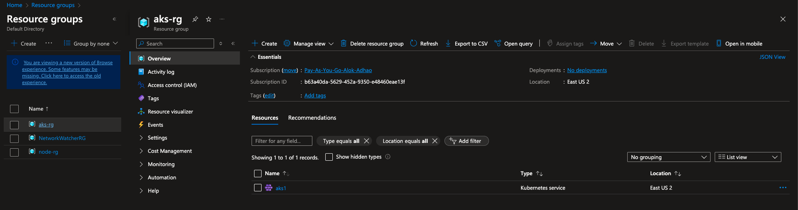
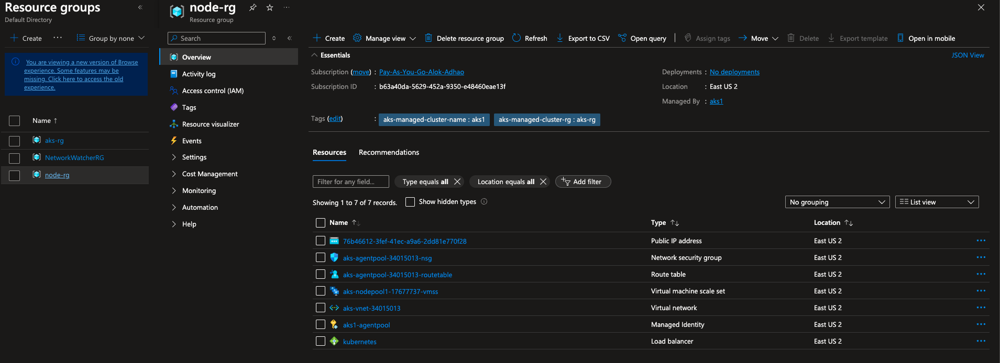
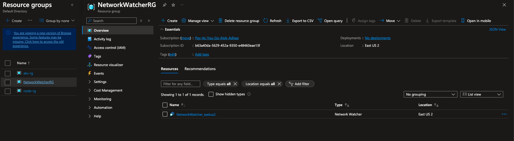
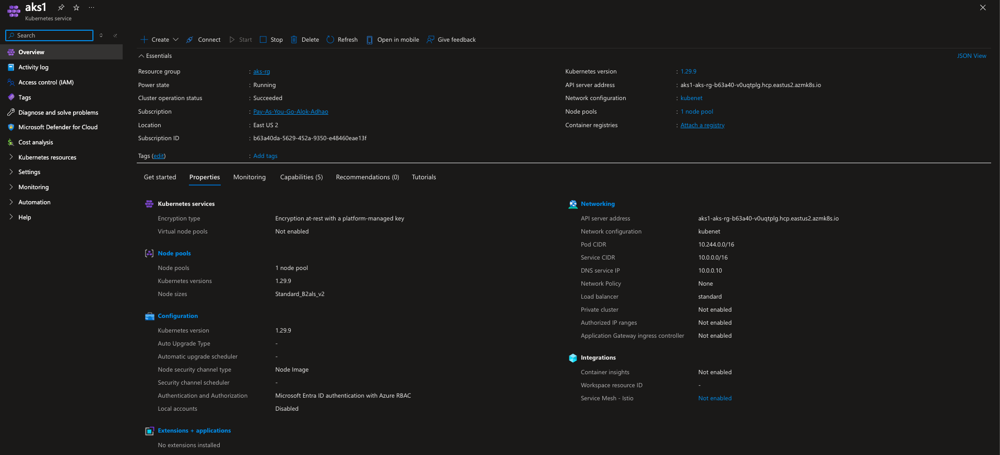

# Create AKS using Azure CLI

## What is AKS
AKS stands for Azure Kubernetes Service. It is a managed Kubernetes service by Microsoft Azure that simplifies deploying, managing, and scaling containerized applications using Kubernetes. AKS handles much of the Kubernetes infrastructure overhead, allowing users to focus on their application workloads rather than managing Kubernetes nodes and clusters.

## Prerequisites to Create AKS Using Azure CLI

To create an **Azure Kubernetes Service (AKS)** cluster, ensure the following prerequisites are met:

1. **Azure Subscription**  
   - You need an active [Azure account](https://azure.microsoft.com/free/) with a subscription to use AKS.

2. **Azure CLI (Command-Line Interface)**  
   - Install the Azure CLI, preferably the latest version, to manage AKS through commands.  
   - [Azure CLI Installation Guide](https://docs.microsoft.com/cli/azure/install-azure-cli)

3. **Kubernetes CLI (kubectl)**  
   - The Kubernetes CLI, `kubectl`, is needed to manage and interact with your AKS cluster.
   - You can install it directly via Azure CLI after logging in:
     ```bash
     az aks install-cli
     ```
3. **az login**  
   - login to azure and select right subscription
     ```
     az login
     ```
4. **create resource group**
    ```
    az group create --name aks-rg --location eastus2
    ```

## Link to find all AZ AKS create options 
[AZ AKS create Documentation](https://learn.microsoft.com/en-us/cli/azure/aks?view=azure-cli-latest#az-aks-create)

The document suggest that there are only 2 mandatory 

```
az aks create --name aks1 \
--resource-group aks-rg \
--tier free \
--aad-tenant-id 4abb5e5e-af15-4a34-b3c2-18f4a9303ee4 \
--aad-admin-group-object-ids 1cf2fc62-c73d-4a81-9635-6fb4187cfa8d \
--enable-aad \
--enable-azure-rbac \
--disable-local-accounts \
--location eastus2 \
--network-plugin kubenet \
--network-policy "none" \
--node-count 1 \
--node-resource-group node-rg \
--node-vm-size Standard_B2als_v2 \
--nodepool-name nodepool1 \
--ssh-key-value ~/.ssh/id_rsa.pub
```

------------
When you specify `--enable-aad`, `--enable-azure-rbac`, and `--disable-local-accounts`, you are configuring identity and access management for the AKS cluster through **Azure AD** and **Azure RBAC**. This setup focuses on securing access at the Kubernetes API level rather than SSH-level access to the nodes.

- **`--enable-aad`**: Integrates Azure Active Directory for authentication.
- **`--enable-azure-rbac`**: Enables Azure RBAC for Kubernetes authorization.
- **`--disable-local-accounts`**: Disables local Kubernetes accounts like `kube-admin`.

------------
If you need SSH-level access to the nodes,to get SSH-level access to the nodes. you can add:
- **`--generate-ssh-keys`**: Automatically generates SSH keys.
- Or specify an existing SSH key with **`--ssh-key-value`**.
> Ensure the file you provide is the public key (typically ending in .pub), not the private key. If you don’t have an SSH key, you can generate one with:

If you do not have RSA ssh key already then you can create it using command 

```
ssh-keygen -t rsa -b 4096
```

This will create 2 files in your ~/.ssh folder 

1. id_rsa -> private file, do not share
2. id_rsa.pub -> public file, for sharing.
-------------

### Why --disable-local-accounts

In the command `az aks get-credentials`, the `--admin` flag is used to retrieve **cluster administrator credentials** for your Azure Kubernetes Service (AKS) cluster.

### Purpose of `--admin`
- **Administrator Access**: When you use `--admin`, it provides credentials with **administrator privileges** on the cluster, **bypassing any Azure Active Directory (AAD) role-based access control (RBAC) that may be set up**.
- **Non-AAD Authenticated Access**: This is useful if you need **direct access** to the cluster that is not governed by AAD authentication.

### Usage Example
```bash
az aks get-credentials --resource-group <Resource-Group-Name> --name <AKS-Cluster-Name> --admin
```

I want to make sure that no one should use --admin and bypass the AAD RBAC, so 

Disable Local Accounts for AKS
Disabling local accounts prevents the creation of a kube-admin account and removes --admin access for all users.

When you create your AKS cluster, use the --disable-local-accounts flag to enforce this:

```bash
az aks create \
   .
   .
   .
  --disable-local-accounts
```
This ensures that all users must authenticate via AAD, and no one can use the --admin flag to bypass AAD and Role-Based Access Control (RBAC).

-------------

### Why --aad-admin-group-object-ids

This parameter defines a list of Azure Active Directory (AAD) group object IDs, granting members of these groups admin-level permissions within the cluster when AAD integration is enabled.

Purpose of --aad-admin-group-object-ids
Grant Administrator Access: Members of the specified AAD groups are granted administrator access to the AKS cluster. This admin access allows them to perform any action within the cluster, bypassing RBAC restrictions that apply to standard users.
Secure Access Management: By specifying AAD group IDs, access to the cluster is managed and secured through Azure AD, streamlining permission management.
Usage Example
When creating a new AKS cluster:

```bash
az aks create \
    .
    .
    .
    --enable-aad \
    --aad-admin-group-object-ids <Group-Object-ID1> <Group-Object-ID2>
```

Important Notes
> Group Object IDs: Replace <Group-Object-ID1> and <Group-Object-ID2> with the actual object IDs of the AAD groups. You can retrieve these IDs from Azure AD in the Azure portal or using the Azure CLI.

> AAD Integration: This parameter requires that AAD integration (--enable-aad) is enabled for the AKS cluster.

# Output:- 

## Main resource group created


## AKS Resource group auto created


## Network watcher created for vnet


## AKS Details:- 


# POST cleanup activity

1. Delete entire resource group and all the component

```
az group delete --name aks-rg --yes --no-wait
```