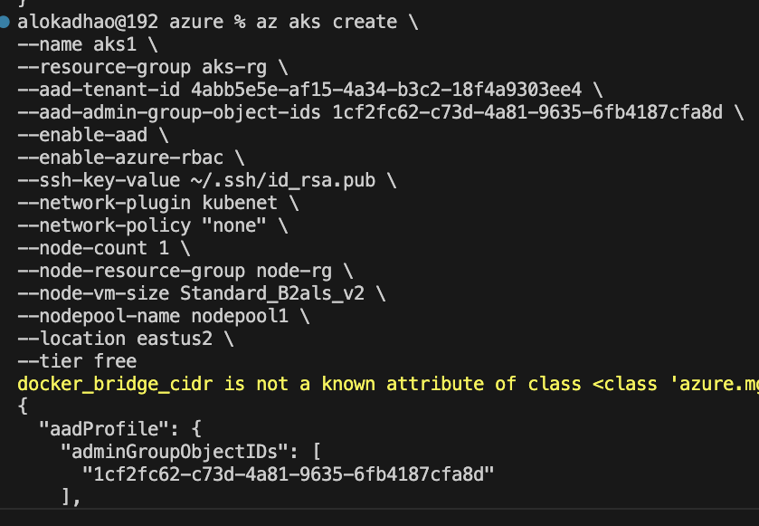
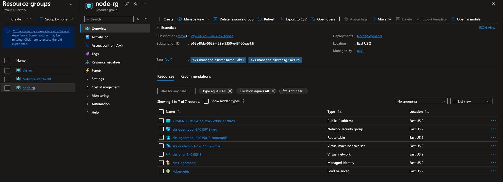
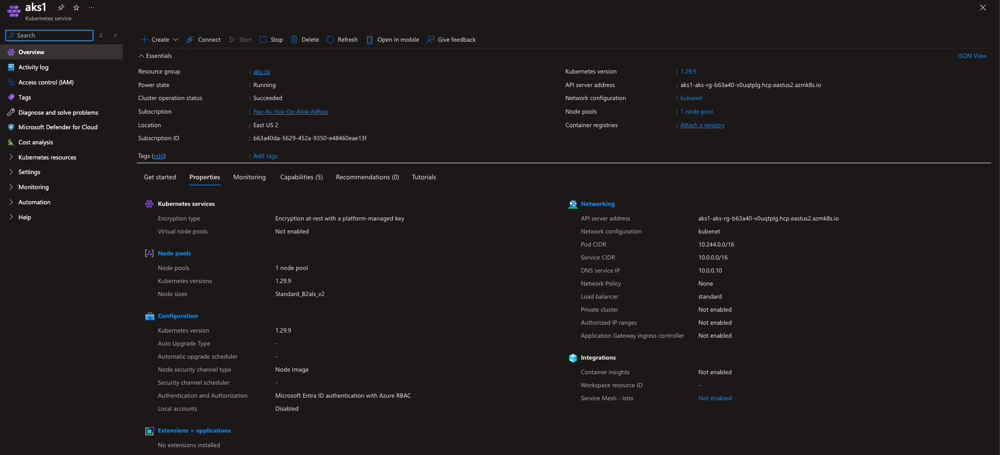
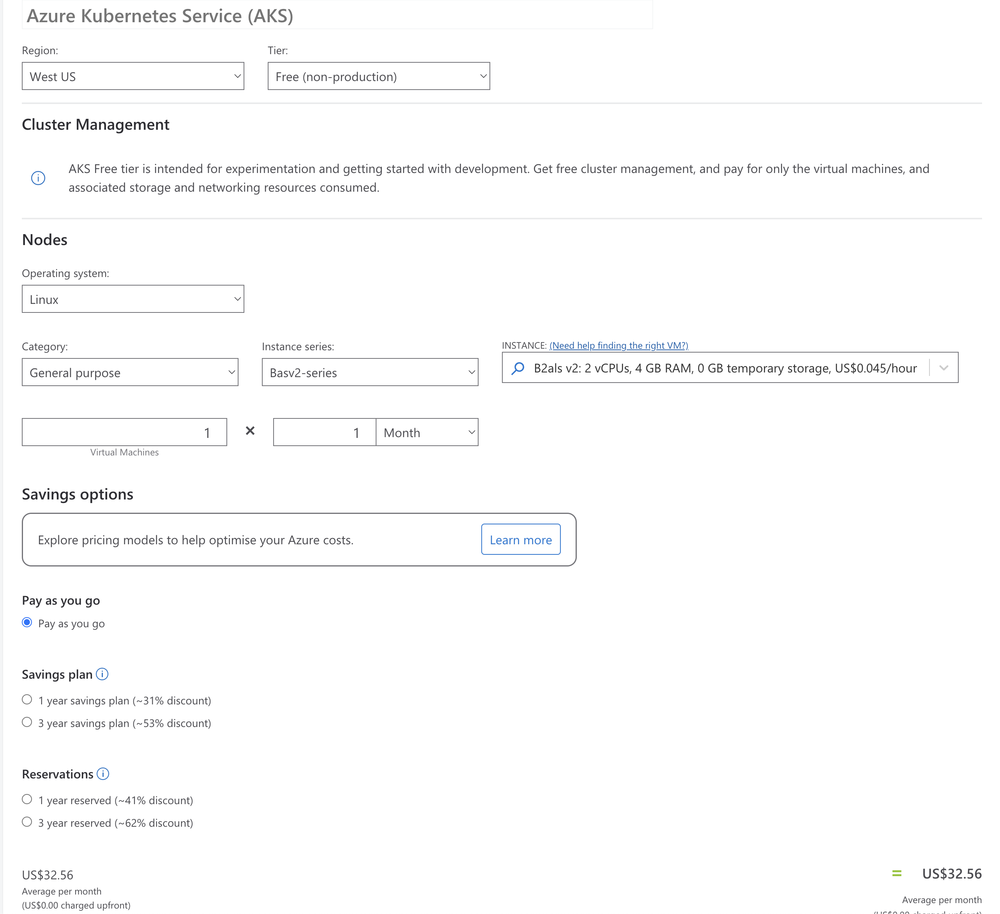
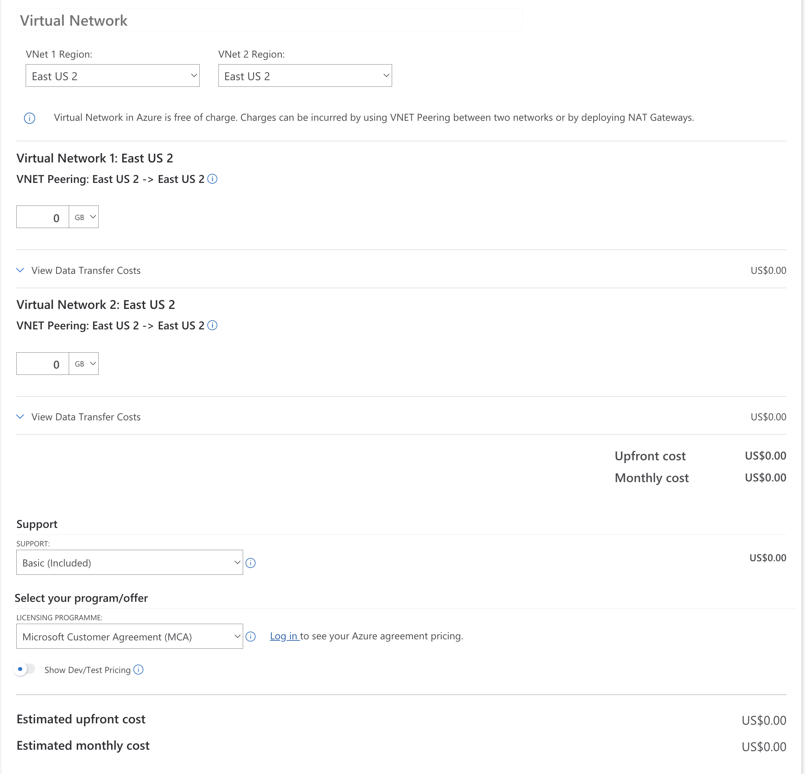
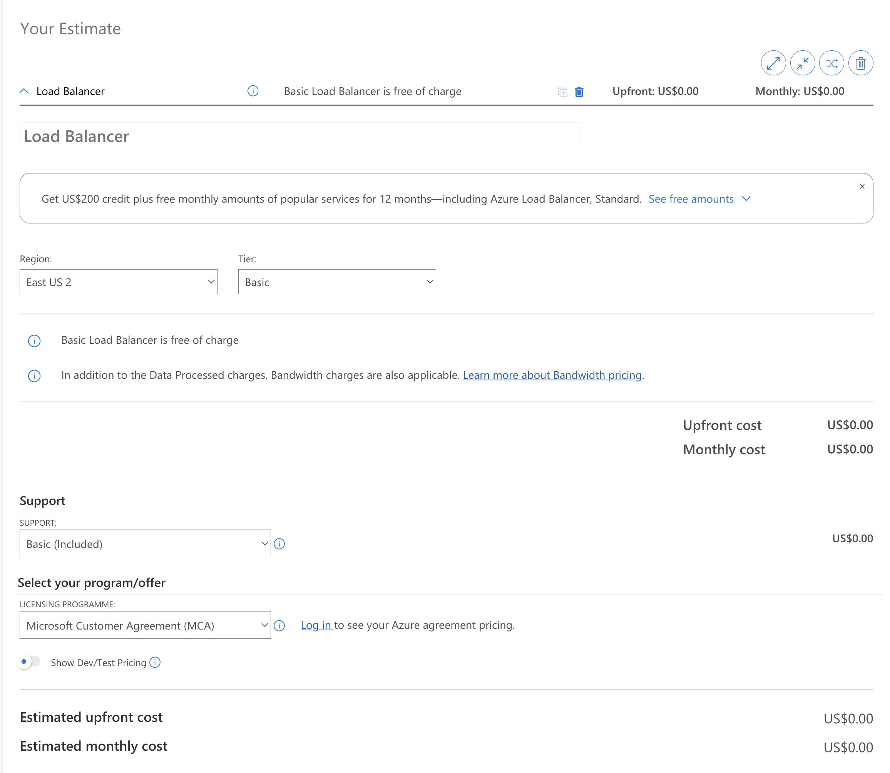
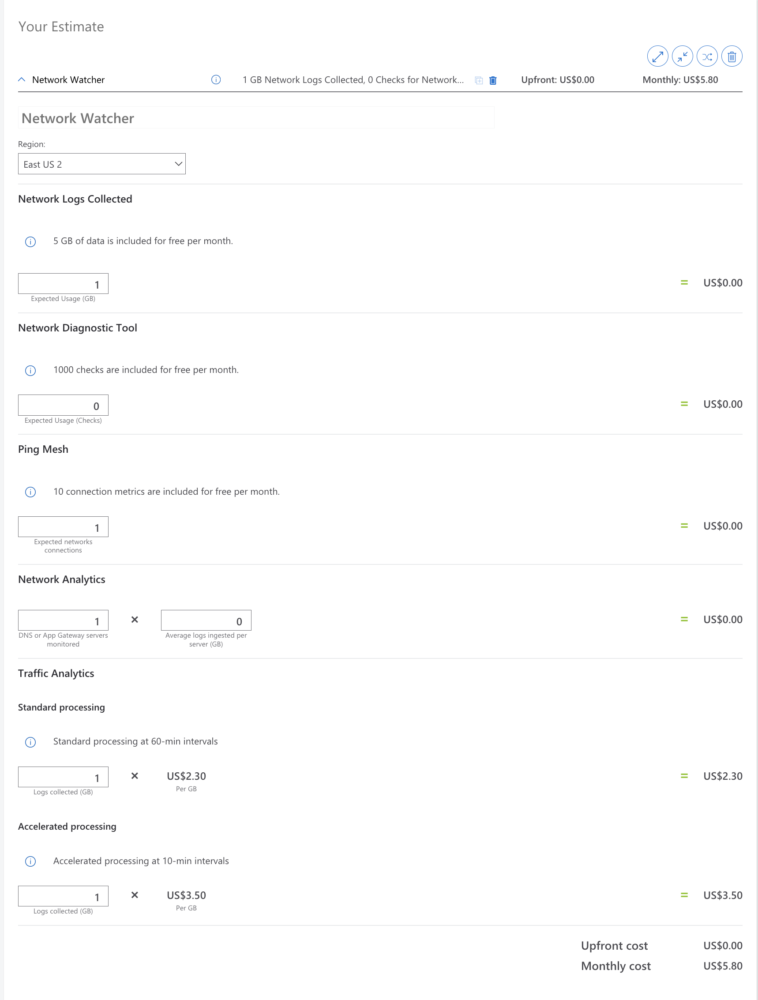

# Create AKS using Azure CLI

## What is AKS
AKS stands for Azure Kubernetes Service. It is a managed Kubernetes service by Microsoft Azure that simplifies deploying, managing, and scaling containerized applications using Kubernetes. AKS handles much of the Kubernetes infrastructure overhead, allowing users to focus on their application workloads rather than managing Kubernetes nodes and clusters.

## Prerequisites to Create AKS Using Azure CLI

To create an **Azure Kubernetes Service (AKS)** cluster, ensure the following prerequisites are met:

1. **Azure Subscription**  
   - You need an active subscription to use AKS.

2. **Azure CLI (Command-Line Interface)**  
   - Install the Azure CLI, preferably the latest version, to manage AKS through commands.  
   - [Azure CLI Installation Guide](https://docs.microsoft.com/cli/azure/install-azure-cli)

3. **Kubernetes CLI (kubectl)**  
   - The Kubernetes CLI, `kubectl`, is needed to manage and interact with your AKS cluster.
   - You can install it directly via Azure CLI after logging in:
     ```bash
     az aks install-cli
     ```
3. **az login**  
   - login to azure and select right subscription
     ```
     az login
     ```
4. **Create Resource Group**
    ```
    az group create --name aks-rg --location eastus2
    ```
# Create AKS 
## Command - with required parameters

```
az aks create \
/* AKS required parameters */
--name aks1 \
--resource-group aks-rg
```
## Add parameters for AKS authentication and authorization
```
az aks create \
/* AKS required parameters */
--name aks1 \
--resource-group aks-rg \

/* AKS authentication and authorization */
--aad-tenant-id 4abb5e5e-af15-4a34-b3c2-18f4a9303ee4 \
--aad-admin-group-object-ids 1cf2fc62-c73d-4a81-9635-6fb4187cfa8d \
--enable-aad \
--enable-azure-rbac \
--disable-local-accounts
--ssh-key-value ~/.ssh/id_rsa.pub
```

------------
- **`--enable-aad`**: Integrates Azure Active Directory for authentication.
- **`--enable-azure-rbac`**: Enables Azure RBAC for Kubernetes authorization.
- **`--disable-local-accounts`**: Disables local Kubernetes accounts like `kube-admin`.

you are configuring **identity and access management** for the AKS cluster through **Azure AD** and **Azure RBAC**.
This setup focuses on securing access at the Kubernetes API level rather than SSH-level access to the nodes.

------------
SSH-level access to the nodes
- **`--ssh-key-value`** specify an existing SSH key with.
   > Ensure the file you provide is the public key (typically ending in .pub), not the private key. \
   If you do not have RSA ssh key already then you can create it using command 
   ```
   ssh-keygen -t rsa -b 4096
   ```
   This will create 2 files in your ~/.ssh folder 
   1. id_rsa -> private file, do not share
   2. id_rsa.pub -> public file, for sharing.

- **`--generate-ssh-keys`**: Automatically generates SSH keys.\

-------------

### --disable-local-accounts

   ```bash
   az aks get-credentials --resource-group <Resource-Group-Name> --name <AKS-Cluster-Name> --admin
   ```



In the command `az aks get-credentials`, the `--admin` flag is used to retrieve\
 **cluster administrator credentials** for your Azure Kubernetes Service (AKS) cluster.

### Purpose of `--admin`
- **Administrator Access**: When you use `--admin`, it provides credentials with **administrator privileges** on the cluster, **bypassing any Azure Active Directory (AAD) role-based access control (RBAC) that may be set up**.

- **Non-AAD Authenticated Access**: This is useful if you need **direct access** to the cluster that is not governed by AAD authentication.

#### Disable Local Accounts for AKS
Disabling local accounts prevents the creation of a kube-admin account and removes --admin access for all users. \
use the --disable-local-accounts flag to enforce this:

```bash
az aks create \
   .
   .
   .
  --disable-local-accounts
```


This ensures that all users must authenticate via AAD, and no one can use the --admin flag to bypass AAD and Role-Based Access Control (RBAC).

-------------

### --aad-admin-group-object-ids

This parameter defines a list of Azure Active Directory (AAD) group object IDs,\
Granting members of these groups Administrator Access permissions within the cluster \
when AAD integration is enabled.

```bash
az aks create \
    .
    .
    .
    --enable-aad \
    --aad-admin-group-object-ids <Group-Object-ID1> <Group-Object-ID2>
```
> AAD Integration: This parameter requires that AAD integration (--enable-aad) is enabled for the AKS cluster.
 

## Add Parameters for AKS networking
```
az aks create \
/* AKS required parameters */
--name aks1 \
--resource-group aks-rg \
/* AKS authentication and authorization */
--aad-tenant-id 4abb5e5e-af15-4a34-b3c2-18f4a9303ee4 \
--aad-admin-group-object-ids 1cf2fc62-c73d-4a81-9635-6fb4187cfa8d \
--enable-aad \
--enable-azure-rbac \
--disable-local-accounts
--ssh-key-value ~/.ssh/id_rsa.pub

/* Parameters for AKS networking */
--network-plugin kubenet \
--network-policy "none"
```

## Add Parameters for AKS nodepool
```
az aks create \
/* AKS required parameters */
--name aks1 \
--resource-group aks-rg \
/* AKS authentication and authorization */
--aad-tenant-id 4abb5e5e-af15-4a34-b3c2-18f4a9303ee4 \
--aad-admin-group-object-ids 1cf2fc62-c73d-4a81-9635-6fb4187cfa8d \
--enable-aad \
--enable-azure-rbac \
--disable-local-accounts
--ssh-key-value ~/.ssh/id_rsa.pub
/* Parameters for AKS networking */
--network-plugin kubenet \
--network-policy "none"

/* Parameters for AKS nodepool */
--node-count 1 \
--node-resource-group node-rg \
--node-vm-size Standard_B2als_v2 \
--nodepool-name nodepool1
```

## Add general paramerter
```
az aks create \
/* AKS required parameters */
--name aks1 \
--resource-group aks-rg \
/* AKS authentication and authorization */
--aad-tenant-id 4abb5e5e-af15-4a34-b3c2-18f4a9303ee4 \
--aad-admin-group-object-ids 1cf2fc62-c73d-4a81-9635-6fb4187cfa8d \
--enable-aad \
--enable-azure-rbac \
--disable-local-accounts
--ssh-key-value ~/.ssh/id_rsa.pub
/* Parameters for AKS networking */
--network-plugin kubenet \
--network-policy "none"
/* Parameters for AKS nodepool */
--node-count 1 \
--node-resource-group node-rg \
--node-vm-size Standard_B2als_v2 \
--nodepool-name nodepool1

/* Parameters for AKS general */
--tier free \
--location eastus2
```

## Complete command to create AKS
```
az aks create \
--name aks1 \
--resource-group aks-rg \
--aad-tenant-id 4abb5e5e-af15-4a34-b3c2-18f4a9303ee4 \
--aad-admin-group-object-ids 1cf2fc62-c73d-4a81-9635-6fb4187cfa8d \
--enable-aad \
--enable-azure-rbac \
--disable-local-accounts \
--ssh-key-value ~/.ssh/id_rsa.pub \
--network-plugin kubenet \
--network-policy "none" \
--node-count 1 \
--node-resource-group node-rg \
--node-vm-size Standard_B2als_v2 \
--nodepool-name nodepool1 \
--location eastus2 \
--tier free
```
# Output:- 

## Main resource group created


## AKS Resource group auto created


## Network watcher created for vnet


## AKS Details:- 


# POST cleanup activity

1. Delete entire resource group and all the component

```
az group delete --name aks-rg --yes --no-wait
```

# Pricing


Here’s a Markdown table summarizing the Azure Public IP costs:

| **Resource Group**       | **Resource Name**                     | **Type**                   | **Location** | **Cost (Estimated)/Month USD** |
|--------------------------|---------------------------------------|----------------------------|--------------|-----------------------|
| aks-rg                    | aks1                                  | Kubernetes service         | East US 2   | Free   |
| node-rg                   | 76b46612-3fef-41ec-a9a6-2dd81e770f28 | Public IP address          | East US 2    | $2.63  |
| node-rg                   | aks-agentpool-34015013-nsg           | Network security group     | East US 2    | Free   |
| node-rg                   | aks-agentpool-34015013-routetable    | Route table                | East US 2    | Free   |
| node-rg                   | aks-nodepool1-176777737-vmss         | Virtual machine scale set  | East US 2    | $32.56 |
| node-rg                   | aks-vnet-34015013                    | Virtual network            | East US 2    | Free   |
| node-rg                   | aks1-agentpool                       | Managed Identity           | East US 2    | Free   |
| node-rg                   | kubernetes                           | Load balancer              | East US 2    | Free   |
| NetworkWatcherRG          | NetworkWatcher_eastus2               | Network Watcher            | East US 2    | $05.80 |
| Total                     |                                      |                            |              | $41.00 |

Azure cost calculator for VMSS of AKS


Azure VNET cost


Load Balancer Cost 


Network watcher cost 
https://azure.microsoft.com/en-us/pricing/details/network-watcher/

Calculator 


