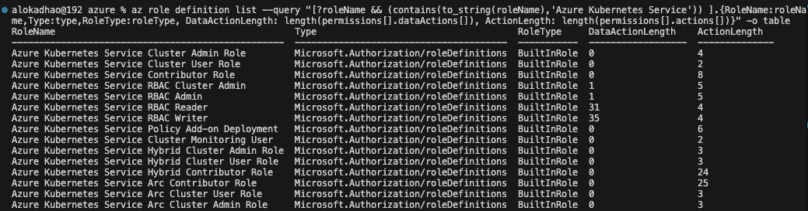
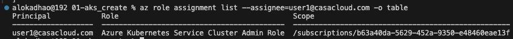
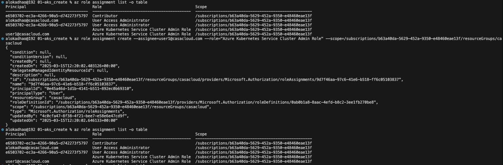
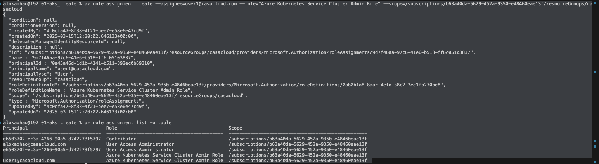
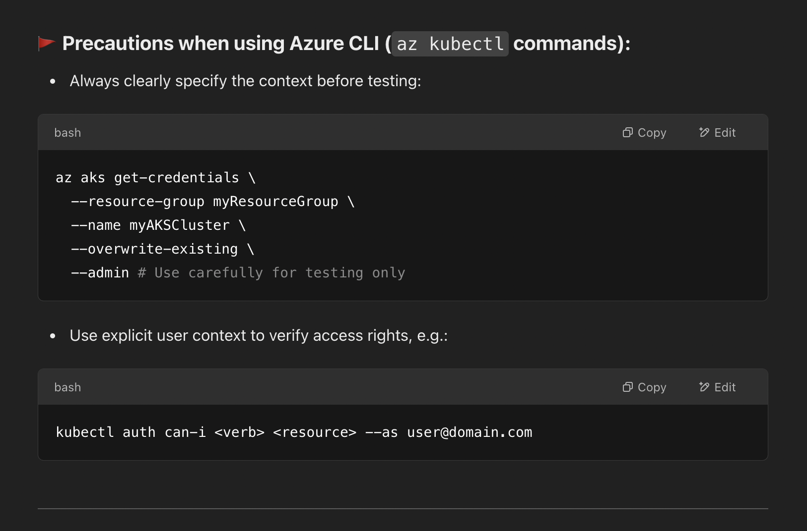

# Azure RBAC

## Process to switch user and get latest context in CLI 
1. Remove the kube config 

```
rm ~/.kube/config
```

2. Pull configuration file for new user 

```
az aks get-credentials \
--resource-group resource-group-4 \
--name aks1 \
--overwrite-existing
```

3. Convert the file for kubelogin 

```
kubelogin convert-kubeconfig -l azurecli
```

#### combined code 
```
rm ~/.kube/config
az aks get-credentials \
--resource-group resource-group-4 \
--name aks1 \
--overwrite-existing
kubelogin convert-kubeconfig -l azurecli
```

## Command to List All Role Definitions
```
az role definition list -o table
```

## Count total available roles 
```
az role definition list --query "length(@)"
```

## Get roles related to Storage account 
### First list a sample permission to understand the structure of role json to create below query 
```
az role definition list --name  "Storage Blob Data Reader"
```

## Filter specific resource type roles and list DataAction, ActionLength
```
az role definition list --query "[?roleName && (contains(to_string(roleName),'Storage'))].{RoleName:roleName,Type:type,RoleType:roleType}" -o table

az role definition list --query "[?roleName && (contains(to_string(roleName),'Storage')) ].{RoleName:roleName,Type:type,RoleType:roleType, PLength: length(permissions)}" -o table

az role definition list --query "[?roleName && (contains(to_string(roleName),'Storage')) ].{RoleName:roleName,Type:type,RoleType:roleType, DataActionLength: length(permissions[].dataActions[])}" -o table
```
## Storage Account Roles - with Data Action and Action length
```
az role definition list --query "[?roleName && (contains(to_string(roleName),'Storage')) ].{RoleName:roleName,Type:type,RoleType:roleType, DataActionLength: length(permissions[].dataActions[]), ActionLength: length(permissions[].actions[])}" -o table
```


# Kubernetes Roles - with Data Action and Action length
```
az role definition list --query "[?roleName && (contains(to_string(roleName),'Azure Kubernetes Service')) ].{RoleName:roleName,Type:type,RoleType:roleType, DataActionLength: length(permissions[].dataActions[]), ActionLength: length(permissions[].actions[])}" -o table
```
Output:


## Command to List Actions for a Role
```
az role definition list --name "<RoleName>" --query "[].permissions[].actions[]" -o table
```

## Count total permissions 
```
az role definition list --query "[].permissions[].{Actions:actions, DataActions:dataActions}" --output json | jq -r '.[] | .Actions[], .DataActions[]' | wc -l
```

> Now You know what role to give, Let see whome to give.

# USER 
## List Users in Microsoft Entra
```
az ad user list --output table
```

## Show details of perticiular User 
```
az ad user show --id <user-principal-name>
```

## Create a new user

```
az ad user create \
    --display-name "user1" \
    --user-principal-name user1@casacloud.com \
    --password StrongP@ssword123 \
    --mail-nickname "user.01"

Output:-

{
  "@odata.context": "https://graph.microsoft.com/v1.0/$metadata#users/$entity",
  "businessPhones": [],
  "displayName": "user1",
  "givenName": null,
  "id": "ddee9558-ff3c-45d0-9aa5-39b9a0c47d99",
  "jobTitle": null,
  "mail": null,
  "mobilePhone": null,
  "officeLocation": null,
  "preferredLanguage": null,
  "surname": null,
  "userPrincipalName": "user1@casacloud.com"
}

```

## Login using the user 
```
az login --username user1@casacloud.com --password StrongP@ssword123 --allow-no-subscriptions 
```
## SET RBAC roles for user
```
az role assignment create \
  --assignee <user-email-or-object-id> \
  --role "Azure Kubernetes Service Cluster Admin Role" \
  --scope $(az aks show --resource-group <resource-group-name> --name <aks-cluster-name> --query id -o tsv)
```

## List RBAC of a user
```
az role assignment list --assignee=user1@casacloud.com -o table
OUTPUT:-


```



## Reassigning same role to user with same scope, it will not readd
```
alokadhao@192 01-aks_create % az role assignment list -o table 
Principal                             Role                                         Scope
------------------------------------  -------------------------------------------  ---------------------------------------------------
e6503702-ec3a-4266-90a5-d742273f5797  Contributor                                  /subscriptions/b63a40da-5629-452a-9350-e48460eae13f
alokadhao@casacloud.com               User Access Administrator                    /subscriptions/b63a40da-5629-452a-9350-e48460eae13f
e6503702-ec3a-4266-90a5-d742273f5797  User Access Administrator                    /subscriptions/b63a40da-5629-452a-9350-e48460eae13f
                                      Azure Kubernetes Service Cluster Admin Role  /subscriptions/b63a40da-5629-452a-9350-e48460eae13f
user1@casacloud.com                   Azure Kubernetes Service Cluster Admin Role  /subscriptions/b63a40da-5629-452a-9350-e48460eae13f
alokadhao@192 01-aks_create % az role assignment create --assignee=user1@casacloud.com --role="Azure Kubernetes Service Cluster Admin Role" --scope=/subscriptions/b63a40da-5629-452a-9350-e48460eae13f
{
  "condition": null,
  "conditionVersion": null,
  "createdBy": "4c0cfa47-8f38-4f21-bee7-e58e6e47cd9f",
  "createdOn": "2025-03-15T11:16:52.986766+00:00",
  "delegatedManagedIdentityResourceId": null,
  "description": null,
  "id": "/subscriptions/b63a40da-5629-452a-9350-e48460eae13f/providers/Microsoft.Authorization/roleAssignments/5c95f532-e30b-40e7-a896-a0754e5af7f8",
  "name": "5c95f532-e30b-40e7-a896-a0754e5af7f8",
  "principalId": "0e45a46d-1d1b-4141-b511-892ec0b69310",
  "principalName": "user1@casacloud.com",
  "principalType": "User",
  "roleDefinitionId": "/subscriptions/b63a40da-5629-452a-9350-e48460eae13f/providers/Microsoft.Authorization/roleDefinitions/0ab0b1a8-8aac-4efd-b8c2-3ee1fb270be8",
  "roleDefinitionName": "Azure Kubernetes Service Cluster Admin Role",
  "scope": "/subscriptions/b63a40da-5629-452a-9350-e48460eae13f",
  "type": "Microsoft.Authorization/roleAssignments",
  "updatedBy": "4c0cfa47-8f38-4f21-bee7-e58e6e47cd9f",
  "updatedOn": "2025-03-15T11:16:52.986766+00:00"
}
alokadhao@192 01-aks_create % az role assignment list -o table                                                                                                                                         
Principal                             Role                                         Scope
------------------------------------  -------------------------------------------  ---------------------------------------------------
e6503702-ec3a-4266-90a5-d742273f5797  Contributor                                  /subscriptions/b63a40da-5629-452a-9350-e48460eae13f
alokadhao@casacloud.com               User Access Administrator                    /subscriptions/b63a40da-5629-452a-9350-e48460eae13f
e6503702-ec3a-4266-90a5-d742273f5797  User Access Administrator                    /subscriptions/b63a40da-5629-452a-9350-e48460eae13f
                                      Azure Kubernetes Service Cluster Admin Role  /subscriptions/b63a40da-5629-452a-9350-e48460eae13f
user1@casacloud.com                   Azure Kubernetes Service Cluster Admin Role  /subscriptions/b63a40da-5629-452a-9350-e48460eae13f
```


```
alokadhao@192 01-aks_create % az role assignment create --assignee=user1@casacloud.com --role="Azure Kubernetes Service Cluster Admin Role" --scope=/subscriptions/b63a40da-5629-452a-9350-e48460eae13f/resourceGroups/casacloud
{
  "condition": null,
  "conditionVersion": null,
  "createdBy": "4c0cfa47-8f38-4f21-bee7-e58e6e47cd9f",
  "createdOn": "2025-03-15T12:20:02.646133+00:00",
  "delegatedManagedIdentityResourceId": null,
  "description": null,
  "id": "/subscriptions/b63a40da-5629-452a-9350-e48460eae13f/resourceGroups/casacloud/providers/Microsoft.Authorization/roleAssignments/9d7f46aa-97c6-41e6-b518-ff6c05103837",
  "name": "9d7f46aa-97c6-41e6-b518-ff6c05103837",
  "principalId": "0e45a46d-1d1b-4141-b511-892ec0b69310",
  "principalName": "user1@casacloud.com",
  "principalType": "User",
  "resourceGroup": "casacloud",
  "roleDefinitionId": "/subscriptions/b63a40da-5629-452a-9350-e48460eae13f/providers/Microsoft.Authorization/roleDefinitions/0ab0b1a8-8aac-4efd-b8c2-3ee1fb270be8",
  "roleDefinitionName": "Azure Kubernetes Service Cluster Admin Role",
  "scope": "/subscriptions/b63a40da-5629-452a-9350-e48460eae13f/resourceGroups/casacloud",
  "type": "Microsoft.Authorization/roleAssignments",
  "updatedBy": "4c0cfa47-8f38-4f21-bee7-e58e6e47cd9f",
  "updatedOn": "2025-03-15T12:20:02.646133+00:00"
}
alokadhao@192 01-aks_create % az role assignment list -o table
Principal                             Role                                         Scope
------------------------------------  -------------------------------------------  ---------------------------------------------------
e6503702-ec3a-4266-90a5-d742273f5797  Contributor                                  /subscriptions/b63a40da-5629-452a-9350-e48460eae13f
alokadhao@casacloud.com               User Access Administrator                    /subscriptions/b63a40da-5629-452a-9350-e48460eae13f
e6503702-ec3a-4266-90a5-d742273f5797  User Access Administrator                    /subscriptions/b63a40da-5629-452a-9350-e48460eae13f
                                      Azure Kubernetes Service Cluster Admin Role  /subscriptions/b63a40da-5629-452a-9350-e48460eae13f
user1@casacloud.com                   Azure Kubernetes Service Cluster Admin Role  /subscriptions/b63a40da-5629-452a-9350-e48460eae13f
```



### User reqire Azure Role 'USER ACCESS ADMINISTRATOR' to run this query.
```
az role assignment create \
--assignee user1@casacloud.com \
--role "Azure Kubernetes Service Cluster Admin Role" \
--scope /subscriptions/b63a40da-5629-452a-9350-e48460eae13f
```

# Delete User
# This query require Microsoft Entra role "User Administraator"
```
az ad user delete --id user1@casacloud.com
```

# --admin role can do 



# override the context evertime you switch user

```
az aks get-credentials \
  --resource-group RESOURCE_GROUP \
  --name CLUSTER_NAME \
  --overwrite-existing
```

```
az aks get-credentials \
  --resource-group resource-group-4 \
  --name aks1 \
  --overwrite-existing
```