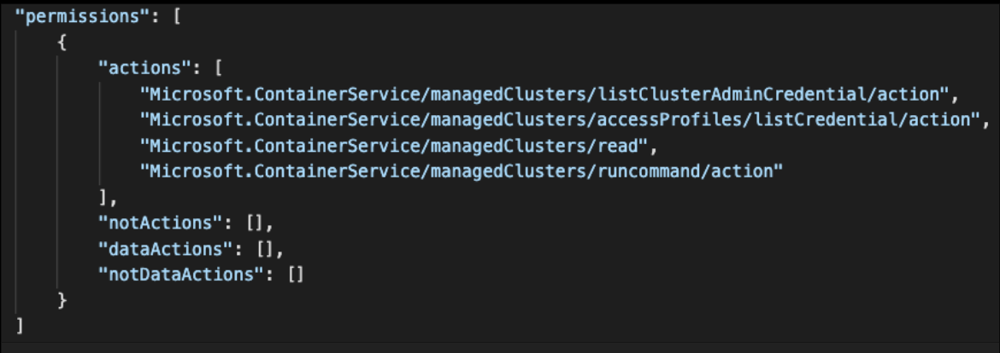
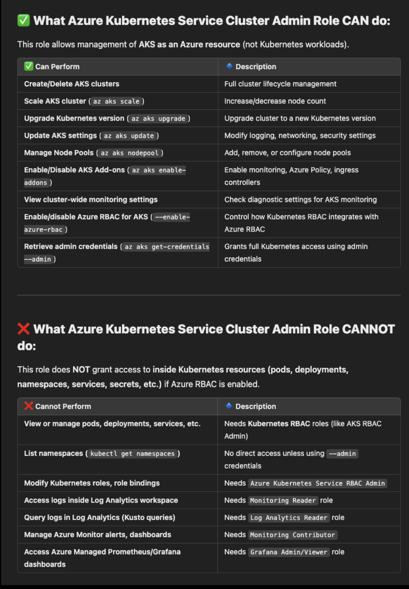
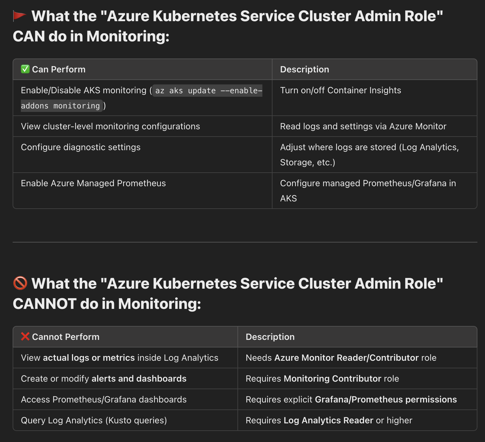
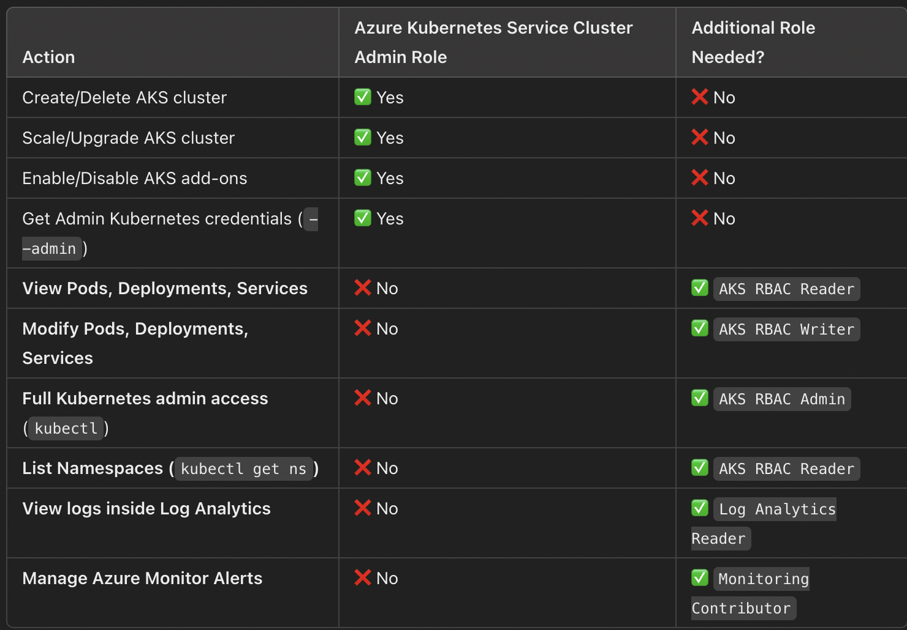

# Azure Kubernetes Service Cluster Admin Role

## What Does --admin Do?
1. Retrieves cluster administrator credentials.
2. Bypasses Kubernetes RBAC restrictions.
3. Grants full access to all Kubernetes resources (nodes, workloads, configurations, secrets).
4. Uses a client certificate for authentication instead of Azure AD.
5. Allows users to run kubectl commands without additional Kubernetes RoleBindings.

## Difference between ClusterAdmin User and default clusterUsers

| **Feature**                         | **Default (`clusterUser`)** | **With `--admin`** |
|--------------------------------------|----------------------------|-------------------|
| **Authentication Type**              | Azure AD Token | Client Certificate |
| **Requires Kubernetes RBAC?**        | ✅ Yes | ❌ No (Bypasses RBAC) |
| **Can View Pods, Deployments, Nodes?** | ❌ No (Unless RBAC is assigned) | ✅ Yes (Full access) |
| **Can Modify Cluster Resources?**    | ❌ No (RBAC-controlled) | ✅ Yes |
| **Can Assign Kubernetes RoleBindings?** | ❌ No | ✅ Yes |
| **Can Run Cluster Management Commands?** | ❌ No | ✅ Yes |

Permissions List







### Additional role required for ..


### Key Takeaways:
1. Azure Kubernetes Service Cluster Admin Role is for managing AKS infrastructure (not workloads inside Kubernetes).
2. If you need inside Kubernetes access (kubectl access to pods, namespaces, deployments), you must assign AKS-specific RBAC roles (RBAC Admin, RBAC Writer, RBAC Reader).
3. Monitoring & Log Access needs separate roles (Monitoring Reader, Log Analytics Reader, Monitoring Contributor).

| NO  | Capability                                      | ✅ Can Cluster Admin Role Do This? | ❌ Cannot Do (Needs Additional Role) |
|----|------------------------------------------------|---------------------------------|---------------------------------|
| 1  | Access Kubernetes Cluster                     | ✅ Yes                         | ❌ No additional role needed |
| 2  | Configure Cluster Autoscaling                 | ✅ Yes                         | ❌ No additional role needed |
| 3  | Access and Debug Nodes                        | ✅ Yes                         | ❌ No additional role needed |
| 4  | Manage Persistent Volumes (PVs) & Storage Classes | ✅ Yes                    | ❌ No (Inside Kubernetes needs RBAC) |
| 5  | Access Monitoring & Diagnostics               | ✅ Yes                         | ❌ No (Viewing logs needs Log Analytics Reader) |
| 6  | Access Cluster Health                         | ✅ Yes                         | ❌ No additional role needed |
| 7  | Enable and Manage Kubernetes Add-ons         | ✅ Yes                         | ❌ No additional role needed |
| 8  | Backup and Restore Workloads                  | ✅ Yes (Limited)               | ❌ No (Needs RBAC for Kubernetes resources) |
| 9  | Manage Cluster Upgrades                      | ✅ Yes                         | ❌ No additional role needed |
| 10 | Manage Cluster Certificates                  | ✅ Yes                         | ❌ No additional role needed |
| 11 | Manage Kubernetes Resources                   | ❌ No                          | ✅ Needs AKS RBAC Admin |
| 12 | Assign RBAC Roles in Cluster                  | ❌ No                          | ✅ Needs AKS RBAC Admin |
| 13 | Manage Namespaces                             | ❌ No                          | ✅ Needs AKS RBAC Admin |
| 14 | Deploy and Manage Applications                | ❌ No                          | ✅ Needs AKS RBAC Writer |
| 15 | Scale Workloads                               | ❌ No                          | ✅ Needs AKS RBAC Writer |
| 16 | Access Kubernetes Secrets                     | ❌ No                          | ✅ Needs AKS RBAC Admin |
| 17 | Manage Network Policies                       | ❌ No                          | ✅ Needs AKS RBAC Admin |
| 18 | Manage Ingress Controllers                   | ❌ No                          | ✅ Needs AKS RBAC Admin |
| 19 | Install Helm Charts                           | ❌ No                          | ✅ Needs AKS RBAC Admin |
| 20 | Manage Configurations                         | ❌ No                          | ✅ Needs AKS RBAC Admin |
| 21 | Apply Admission Controllers                   | ❌ No                          | ✅ Needs AKS RBAC Admin |
| 22 | Manage Cluster Roles & Service Accounts      | ❌ No                          | ✅ Needs AKS RBAC Admin |
| 23 | Configure Kubernetes Logging                 | ❌ No                          | ✅ Needs Log Analytics Reader |
| 24 | Manage Kubernetes Resource Quotas            | ❌ No                          | ✅ Needs AKS RBAC Admin |
| 25 | Modify Resource Labels & Annotations         | ❌ No                          | ✅ Needs AKS RBAC Admin |
| 26 | Use Kubernetes Debugging Tools               | ❌ No                          | ✅ Needs AKS RBAC Admin |
| 27 | Deploy Multi-Tenancy Configurations          | ❌ No                          | ✅ Needs AKS RBAC Admin |
| 28 | Use External Tools for CI/CD                 | ❌ No                          | ✅ Needs AKS RBAC Admin |
| 29 | Manage Custom Metrics & Monitoring           | ❌ No                          | ✅ Needs AKS RBAC Admin |
| 30 | Configure Node Affinity & Taints             | ❌ No                          | ✅ Needs AKS RBAC Admin |

```
alokadhao@192 01-aks_create % kubectl get clusterroles       
Error from server (Forbidden): clusterroles.rbac.authorization.k8s.io is forbidden: User "user1@casacloud.com" cannot list resource "clusterroles" in API group "rbac.authorization.k8s.io" at the cluster scope: User does not have access to the resource in Azure. Update role assignment to allow access.
alokadhao@192 01-aks_create % kubectl get roles              
Error from server (Forbidden): roles.rbac.authorization.k8s.io is forbidden: User "user1@casacloud.com" cannot list resource "roles" in API group "rbac.authorization.k8s.io" in the namespace "default": User does not have access to the resource in Azure. Update role assignment to allow access.
```
