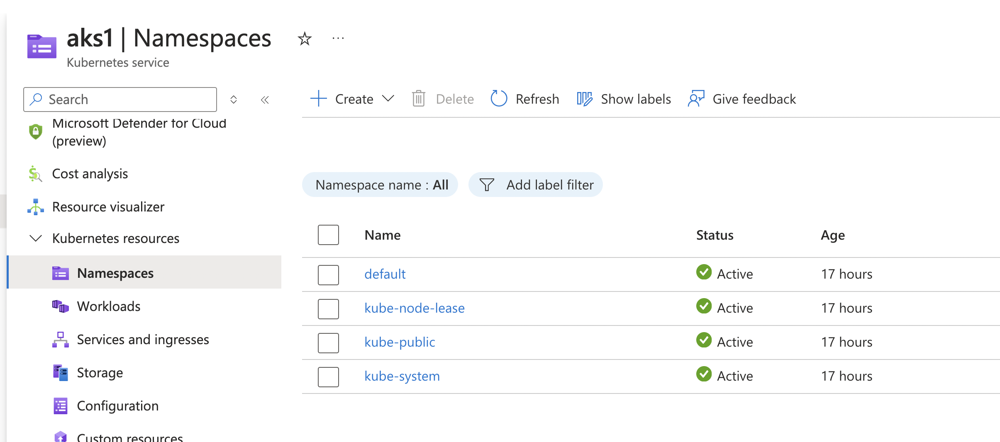
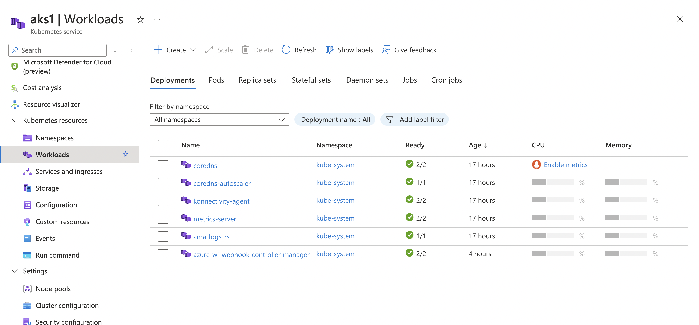
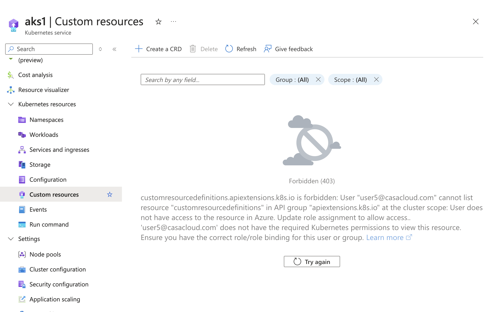
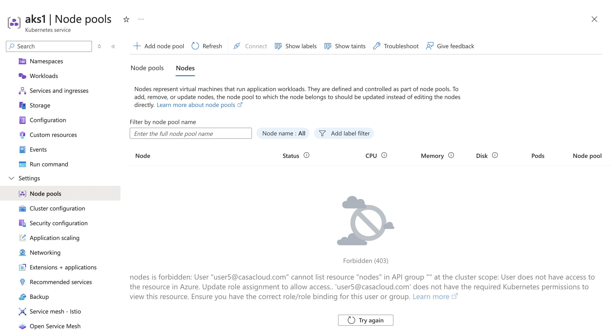

# Azure Kubernetes Service RBAC Reader

# Permissions:-

```
"permissions": [
    {
        "actions": [
            "Microsoft.Authorization/*/read",
            "Microsoft.Resources/subscriptions/operationresults/read",
            "Microsoft.Resources/subscriptions/read",
            "Microsoft.Resources/subscriptions/resourceGroups/read"
        ],
        "notActions": [],
        "dataActions": [
            "Microsoft.ContainerService/managedClusters/apps/controllerrevisions/read",
            "Microsoft.ContainerService/managedClusters/apps/daemonsets/read",
            "Microsoft.ContainerService/managedClusters/apps/deployments/read",
            "Microsoft.ContainerService/managedClusters/apps/replicasets/read",
            "Microsoft.ContainerService/managedClusters/apps/statefulsets/read",
            "Microsoft.ContainerService/managedClusters/autoscaling/horizontalpodautoscalers/read",
            "Microsoft.ContainerService/managedClusters/batch/cronjobs/read",
            "Microsoft.ContainerService/managedClusters/batch/jobs/read",
            "Microsoft.ContainerService/managedClusters/configmaps/read",
            "Microsoft.ContainerService/managedClusters/discovery.k8s.io/endpointslices/read",
            "Microsoft.ContainerService/managedClusters/endpoints/read",
            "Microsoft.ContainerService/managedClusters/events.k8s.io/events/read",
            "Microsoft.ContainerService/managedClusters/events/read",
            "Microsoft.ContainerService/managedClusters/extensions/daemonsets/read",
            "Microsoft.ContainerService/managedClusters/extensions/deployments/read",
            "Microsoft.ContainerService/managedClusters/extensions/ingresses/read",
            "Microsoft.ContainerService/managedClusters/extensions/networkpolicies/read",
            "Microsoft.ContainerService/managedClusters/extensions/replicasets/read",
            "Microsoft.ContainerService/managedClusters/limitranges/read",
            "Microsoft.ContainerService/managedClusters/metrics.k8s.io/pods/read",
            "Microsoft.ContainerService/managedClusters/metrics.k8s.io/nodes/read",
            "Microsoft.ContainerService/managedClusters/namespaces/read",
            "Microsoft.ContainerService/managedClusters/networking.k8s.io/ingresses/read",
            "Microsoft.ContainerService/managedClusters/networking.k8s.io/networkpolicies/read",
            "Microsoft.ContainerService/managedClusters/persistentvolumeclaims/read",
            "Microsoft.ContainerService/managedClusters/pods/read",
            "Microsoft.ContainerService/managedClusters/policy/poddisruptionbudgets/read",
            "Microsoft.ContainerService/managedClusters/replicationcontrollers/read",
            "Microsoft.ContainerService/managedClusters/resourcequotas/read",
            "Microsoft.ContainerService/managedClusters/serviceaccounts/read",
            "Microsoft.ContainerService/managedClusters/services/read"
        ],
        "notDataActions": []
    }
]
```

## ✅ What It Can Do
| **Capability** | **✅ Allowed?** | **Reason (Based on Permissions)** |
|---------------|----------------|----------------------------------|
| **Read Azure Authorization Policies** | ✅ Yes | `Microsoft.Authorization/*/read` |
| **View Azure Subscription Details** | ✅ Yes | `Microsoft.Resources/subscriptions/read` |
| **View Resource Groups** | ✅ Yes | `Microsoft.Resources/subscriptions/resourceGroups/read` |
| **View AKS Cluster Subscription Operations** | ✅ Yes | `Microsoft.Resources/subscriptions/operationresults/read` |
| **View Deployments, ReplicaSets, StatefulSets** | ✅ Yes | `Microsoft.ContainerService/managedClusters/apps/deployments/read` |
| **View DaemonSets and ControllerRevisions** | ✅ Yes | `Microsoft.ContainerService/managedClusters/apps/daemonsets/read` |
| **View Horizontal Pod Autoscalers** | ✅ Yes | `Microsoft.ContainerService/managedClusters/autoscaling/horizontalpodautoscalers/read` |
| **View CronJobs and Jobs** | ✅ Yes | `Microsoft.ContainerService/managedClusters/batch/cronjobs/read` |
| **View ConfigMaps and Endpoints** | ✅ Yes | `Microsoft.ContainerService/managedClusters/configmaps/read` |
| **View Events and Logs** | ✅ Yes | `Microsoft.ContainerService/managedClusters/events.k8s.io/events/read` |
| **View Namespaces** | ✅ Yes | `Microsoft.ContainerService/managedClusters/namespaces/read` |
| **View Ingress Controllers and Network Policies** | ✅ Yes | `Microsoft.ContainerService/managedClusters/extensions/ingresses/read` |
| **View Pods and Persistent Volume Claims (PVCs)** | ✅ Yes | `Microsoft.ContainerService/managedClusters/pods/read` |
| **View Service Accounts and Services** | ✅ Yes | `Microsoft.ContainerService/managedClusters/serviceaccounts/read` |

## ❌ What It CANNOT Do
| **Capability** | **❌ Not Allowed?** | **Reason (Missing Permissions)** |
|---------------|--------------------|----------------------------------|
| **Modify Azure RBAC Roles (Assign Permissions)** | ❌ No | No `Microsoft.Authorization/roleAssignments/write` permission. |
| **Manage Other Azure Resources (Non-AKS)** | ❌ No | No `Microsoft.Resources/*` write permissions. |
| **Delete or Modify Resource Groups** | ❌ No | Only `read` permission for resource groups. |
| **Modify Deployments, Pods, or Services** | ❌ No | No `Microsoft.ContainerService/managedClusters/apps/deployments/write` permission. |
| **Delete Kubernetes Resources** | ❌ No | No `Microsoft.ContainerService/managedClusters/*/delete` permission. |
| **Create Namespaces in Kubernetes** | ❌ No | No `Microsoft.ContainerService/managedClusters/namespaces/write` permission. |
| **Modify Network Policies or Ingress Controllers** | ❌ No | No `Microsoft.ContainerService/managedClusters/networking.k8s.io/networkpolicies/write` permission. |
| **Modify ConfigMaps or Persistent Volume Claims (PVCs)** | ❌ No | No `Microsoft.ContainerService/managedClusters/configmaps/write` permission. |
| **Modify Kubernetes Resource Quotas** | ❌ No | No `Microsoft.ContainerService/managedClusters/resourcequotas/write` permission. |

## 📌 Summary
| **Category** | **✅ Can Do?** | **❌ Cannot Do?** |
|-------------|--------------|------------------|
| **View Azure Authorization & Resources** | ✅ Yes | ❌ Cannot modify RBAC or resource groups. |
| **View Kubernetes Workloads (Pods, Deployments, Namespaces)** | ✅ Yes (Read-Only) | ❌ Cannot modify or delete workloads. |
| **View Network Policies & Ingress Controllers** | ✅ Yes | ❌ Cannot create or modify network configurations. |
| **Monitor Cluster Health & Events** | ✅ Yes | ❌ Cannot change monitoring settings. |
| **Modify Kubernetes Resources (Inside Cluster)** | ❌ No | Needs additional role for Kubernetes management. |


## Login test 
```
alokadhao@192 01-aks_create % az aks get-credentials \
--resource-group resource-group-4 \
--name aks1 \
--overwrite-existing
Merged "aks1" as current context in /Users/alokadhao/.kube/config
alokadhao@192 01-aks_create % kubelogin convert-kubeconfig -l azurecli
alokadhao@192 01-aks_create % kubectl get nodes
Error from server (Forbidden): nodes is forbidden: User "user5@casacloud.com" cannot list resource "nodes" in API group "" at the cluster scope: User does not have access to the resource in Azure. Update role assignment to allow access.
alokadhao@192 01-aks_create % kubectl get pods 
No resources found in default namespace.
alokadhao@192 01-aks_create % kubectl get deployments 
No resources found in default namespace.
```








```
alokadhao@192 01-aks_create % kubectl get clusterroles
Error from server (Forbidden): clusterroles.rbac.authorization.k8s.io is forbidden: User "user5@casacloud.com" cannot list resource "clusterroles" in API group "rbac.authorization.k8s.io" at the cluster scope: User does not have access to the resource in Azure. Update role assignment to allow access.
alokadhao@192 01-aks_create % kubectl get roles       
Error from server (Forbidden): roles.rbac.authorization.k8s.io is forbidden: User "user5@casacloud.com" cannot list resource "roles" in API group "rbac.authorization.k8s.io" in the namespace "default": User does not have access to the resource in Azure. Update role assignment to allow access.
```